> 以上参考 https://gitee.com/zhangfaquan_java/Kafka，结合黑马的视频和一些博客，只做学习使用

# 消息队列介绍

## 优点

1. 解耦

   （类似Spring的IOC）

   - 允许你独立的扩展或修改两边的处理过程，只要确保它们遵守同样的接口约束。

2. 可恢复性

   - 系统的一部分组件失效时，不会影响到整个系统。消息队列降低了进程间的耦合度，所以即使一个处理消息的进程挂掉，加入队列中的消息仍然可以在系统恢复后被处理。

3. 缓冲

   - 有助于控制和优化数据流经过系统的速度， 解决生产消息和消费消息的处理速度不一致的情况。

4. 灵活性 & 峰值处理能力

   （削峰）

   - 在访问量剧增的情况下，应用仍然需要继续发挥作用，但是这样的突发流量并不常见。如果为以能处理这类峰值访问为标准来投入资源随时待命无疑是巨大的浪费。使用消息队列能够使关键组件顶住突发的访问压力，而不会因为突发的超负荷的请求而完全崩溃。

5. 异步通信

   - 很多时候，用户不想也不需要立即处理消息。消息队列提供了异步处理机制，允许用户把一个消息放入队列，但并不立即处理它。想向队列中放入多少消息就放多少，然后在需要的时候再去处理它们。


## 消息队列的消费模式

### 点对点模式（queue模式）

**一对一，消费者主动拉取数据，消息收到后消息清除**

消息生产者生产消息发送到Queue中，然后消息消费者从Queue中取出并且消费消息。消息被消费以后， queue 中不再有存储，所以消息消费者不可能消费到已经被消费的消息。Queue 支持存在多个消费者，但是对一个消息而言，只会有一个消费者可以消费。

ActiveMq的队列就是使用的这种模式。


### 发布/订阅模式

**一对多，消费者消费数据之后不会清除消息**

消息生产者（发布）将消息发布到 topic 中，同时有多个消息消费者（订阅）消费该消息。和点对点方式不同，发布到 topic 的消息会被所有订阅者消费。

订阅发布模式又分为两种，一种是由客户端主动拉取数据，另一种是由服务端推送数据。

kafka采用的是客户端主动拉取数据的这种方式。


**服务端推送的缺点：**

push（推）模式很难适应消费速率不同的消费者，因为消息发送速率是由 broker 决定的。它的目标是尽可能以最快速度传递消息，但是这样很容易造成 consumer 来不及处理消息，典型的表现就是拒绝服务以及网络拥塞。而 pull 模式则可以根据 consumer 的消费能力以适当的速率消费消息。


**客户端主动拉取的缺点：**

客户端需要使用一个长轮询去询问服务端是否有新消息，有可能造成资源浪费，因为哪怕消息队列中没有新消息，客户端也会去询问。针对这一点，Kafka 的消费者在消费数据时会传入一个时长参数 timeout，如果当前没有数据可供消费，consumer 会等待一段时间之后再返回，这段时长即为 timeout。


# Kafka介绍

Kafka是最初由Linkedin公司开发，支持分区的（partition）、多副本的（replica），基于zookeeper协 调的分布式消息系统。它的最大的特性就是可以实时的处理大量数据以满足各种需求场景：比如基于hadoop的批处理系 统、低延迟的实时系统、Storm/Spark流式处理引擎，web/nginx日志、访问日志，消息服务等等，用scala语言编写， Linkedin于2010年贡献给了Apache基金会并成为顶级开源 项目。

Kafka采用**发布/订阅模式**的**消息队列**（Message Queue）。

Kafka借鉴了JMS规范的思想，但是确并没有完全遵循JMS规范。

# Kafka的使用场景

日志收集：一个公司可以用Kafka收集各种服务的log，通过kafka以统一接口服务的方式开放给各种 consumer，例如hadoop、Hbase、Solr等。

消息系统：解耦生产者和消费者、缓存消息等。

用户活动跟踪：Kafka经常被用来记录web用户或者app用户的各种活动，如浏览网页、搜索、点击等活动，这 些活动信息被各个服务器发布到kafka的topic中，然后订阅者通过订阅这些topic来做实时的监控分析，或者装载到 hadoop、数据仓库中做离线分析和挖掘。

运营指标：Kafka也经常用来记录运营监控数据。包括收集各种分布式应用的数据，生成各种操作的集中反馈，比如报警和报告。


# 术语解释

| 名称          | 解释                                                         |
| ------------- | ------------------------------------------------------------ |
| Broker        | 消息中间件处理节点（kafka进程），一个Kafka节点就是 一个broker，一个或者多个Broker可以组 成一个Kafka集群。一个 broker可以容纳多个 topic。 |
| Topic         | Kafka根据topic对消息进行归类，发布到 Kafka集群的每条消息都需要指定一个topic。对于每一个Topic，下面可以有多个分区(Partition)日志文件 |
| Producer      | 消息生产者，向Broker发送消息的客户端。                       |
| Consumer      | 消息消费者，从Broker读取消息的客户端。                       |
| ConsumerGroup | 每个Consumer属于一个特定的Consumer Group，消费者组内每个消费者负责消费不同分区的数据，一个分区只能由一个组内消费者消费；消费者组之间互不影响，消费者组是逻辑上的一个订阅者。即一条消息可以被多个不同的 Consumer Group消费，但是一个 Consumer Group中只能有一个Consumer 能够消费该消息。 |
| Partition     | 物理上的概念，为了实现扩展性，**一个非常大的 topic 可以分布到多个 broker上，一个 topic 可以分为多个 partition**，**每个 partition 是一个有序的队列**。这些队列中的message按顺序添加到一个叫做commit log的文件中。每个partition中的消息都有一个唯一的编号，称之为offset，用来唯一标识某个分区中的message，但是不同的 partition中的message的offset可能是相同的。 |
| Replica       | 副本（Replication），为保证集群中的某个节点发生故障时， 该节点上的 partition 数据不丢失，且 Kafka仍然能够继续工作， Kafka 提供了副本机制，一个 topic 的每个分区都有若干个副本，一个 leader 和若干个 follower。某个主题的副本数指的是某个broker中它的某个分区leader 加上其他broker中这个leader的follwer 的数量。**注意副本数不能超过实例数量。** |
| Leader        | 每个主题多个副本的“主”，生产者发送数据的对象，以及消费者消费数据的对象都是 leader。 |
| Follower      | 每个主题多个副本中的“从”，实时从 leader 中同步数据，保持和 leader 数据的同步。 leader 发生故障时，某个 Follower 会成为新的 leader。 |
| ISR           | 和 leader 保持同步的副本（含leader）集合。                   |
| OSR           | 不和 leader 保持同步的 follower 集合。                       |
| AR            | 所有的副本集合。AR = ISR + OSR                               |
| Controller    | Kafka核心总控制器。在Kafka集群中会有一个或者多个broker，其中有一个broker会被选举为控制器（Kafka Controller），它负责管理整个 集群中所有分区和副本的状态。作用：1、当某个分区的leader副本出现故障时，由控制器负责为该分区选举新的leader副本。2、当检测到某个分区的ISR集合发生变化时，由控制器负责通知所有broker更新其元数据信息。3、当某个topic增加分区数量时，由控制器负责分区的重新分配。 |
| offset        | 消息的偏移量，每条消息都有对应的offset。一般情况下按照顺序逐条消费commit log中的消息，当然可以通过指定offset来重复消费某些消息， 或者跳过某些消息。 |


# Kafka架构

服务端(brokers)和客户端(producer、consumer)之间通信通过TCP协议来完成。


**消费者组的作用**

提高消费能力。例如：上图中第一个组里有A 和 B 两个消费者，A处理TopicA的Partition 0分区，而TopicA的 Partition1由B处理。如果只有消费者A，没有消费组，那么TopicA的 Partition0和Partition1都会由消费者A处理。

一般来说，消费者数和同一个主题的分区数相等时是最好的。

同一个消费组当中只能消费一条消息


**zk作用**

**存储kafka集群信息**。只要多个kafka进程连的是同一个zk集群，那么他们就可以构建成一个集群。

0.9版本之前，zk中记录了每个消费者关闭时的消息偏移量（消费到了那条记录），这样消费者一旦重启就可以继续消费。

0.9版本之后（包括0.9），**消费者关闭时的消息偏移量存储在了kafka中**（kafka会创建Topic用来保存这些偏移量）。


# kafka 基本说明

## 磁盘存储优势

kafka 在设计的时候，采用文件追加的方式写入消息，即只能在日志文件的尾部追加新的消息，并且不允许修改已经写入的消息，这种方式属于典型的顺序写入此判断的操作，就算是 kafka 使用磁盘作为存储介质，实现的吞吐量也非常可观

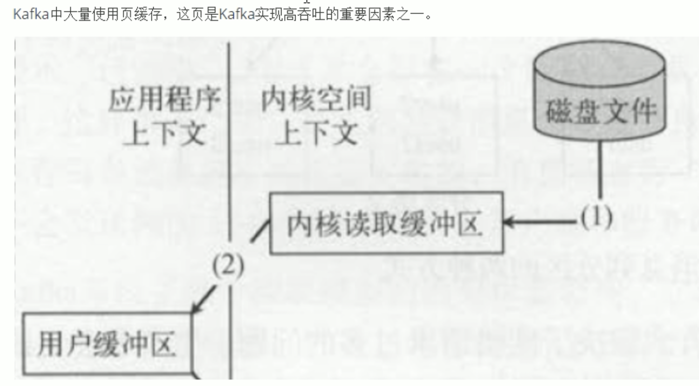


# Kafka工作流程

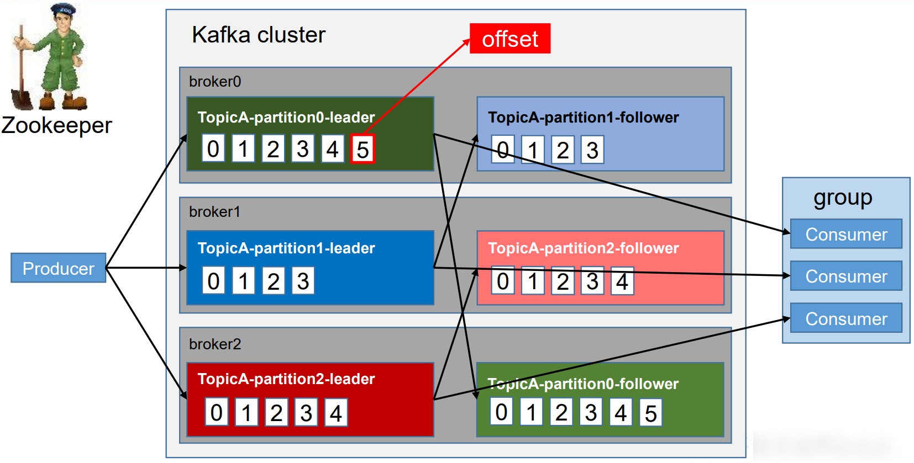

每个 partition 对应数个分区存储目录，分区目录中存在者log文件，**该 log 文件中存储的就是 producer 生产的数据**。Producer 生产的数据会被不断追加到该 log 文件末端，且每条数据都有自己的 offset。消费者组中的每个消费者，都会实时记录自己 消费到了哪个 offset，以便出错恢复时，从上次的位置继续消费。


# 数据可靠性保证


参考：https://mp.weixin.qq.com/s/t53nP5ETGqBNmlxS-4_4sA

## 消息发送流程


消息发送流程如下：


> 1）首先我们要知道一点就是 Producer 端是直接与 Broker 中的 Leader Partition 交互的，所以在 Producer 端初始化中就需要通过 Partitioner 分区器从 Kafka 集群中获取到相关 Topic 对应的 Leader Partition 的元数据 。
>
> 2）待获取到 Leader Partition 的元数据后直接将消息发送过去。
>
> 3）Kafka Broker 对应的 Leader Partition 收到消息会先写入 Page Cache，定时刷盘进行持久化（顺序写入磁盘）。
>
> \4) Follower Partition 拉取 Leader Partition 的消息并保持同 Leader Partition 数据一致，待消息拉取完毕后需要给 Leader Partition 回复 ACK 确认消息。
>
> 5）待 Kafka Leader 与 Follower Partition 同步完数据并收到所有 ISR 中的 Replica 副本的 ACK 后，Leader Partition 会给 Producer 回复 ACK 确认消息。


## 消息丢失

### 生产者丢失

根据上图以及消息发送流程可以得出：Producer 端为了提升发送效率，减少IO操作，发送数据的时候是将多个请求合并成一个个 **RecordBatch**，并将其封装转换成 **Request** 请求「**异步**」将数据发送出去（也可以按时间间隔方式，达到时间间隔自动发送），**所以 Producer 端消息丢失更多是因为消息根本就没有发送到 Kafka Broker 端**。

导致 Producer 端消息没有发送成功有以下原因：

- **网络原因：**由于网络抖动导致数据根本就没发送到 Broker 端。
- **数据原因：**消息体太大超出 Broker 承受范围而导致 Broker 拒收消息。


> 在 Kafka Producer 端的 acks 默认配置为1， 默认级别是 at least once 语义, 并不能保证 exactly once 语义。

既然 Producer 端发送数据有 ACK 机制, 那么这里就可能会丢数据的**!!!**

- **acks = 0：**由于发送后就自认为发送成功，这时如果发生网络抖动， Producer 端并不会校验 ACK 自然也就丢了，且无法重试。

  

- **acks = 1：**消息发送 Leader Parition 接收成功就表示发送成功，这时只要 Leader Partition 不 Crash 掉，就可以保证 Leader Partition 不丢数据，但是如果 Leader Partition 异常 Crash 掉了， Follower Partition 还未同步完数据且没有 ACK，这时就会丢数据。

  

- **acks = -1 或者 all：** 消息发送需要等待 ISR 中 Leader Partition 和 所有的 Follower Partition 都确认收到消息才算发送成功, 可靠性最高, 但也不能保证不丢数据,比如当 ISR 中只剩下 Leader Partition 了, 这样就变成 acks = 1 的情况了。


### Broker 端丢失

接下来我们来看看 Broker 端持久化存储丢失场景， 对于不了解 Broker 的读者们，可以先看看 [**聊聊 Kafka Broker 那点事**](http://mp.weixin.qq.com/s?__biz=Mzg3MTcxMDgxNA==&mid=2247488847&idx=1&sn=fe2dace4ebf39001062fa331711606ba&chksm=cefb3c7ef98cb5689c91b02edb345cc75751ae7e2daf27d8de9a47f9ecc3eedaf3551eead037&scene=21#wechat_redirect)，数据存储过程如下图所示：


Kafka Broker 集群接收到数据后会将数据进行持久化存储到磁盘，为了提高吞吐量和性能，采用的是「**异步批量刷盘的策略**」，也就是说按照一定的消息量和间隔时间进行刷盘。首先会将数据存储到 「**PageCache**」 中，至于什么时候将 Cache 中的数据刷盘是由「**操作系统**」根据自己的策略决定或者调用 fsync 命令进行强制刷盘，如果此时 Broker 宕机 Crash 掉，且选举了一个落后 Leader Partition 很多的 Follower Partition 成为新的 Leader Partition，那么落后的消息数据就会丢失。

​        


既然 Broker 端消息存储是通过异步批量刷盘的，那么这里就可能会丢数据的**!!!**


- 由于 Kafka 中并没有提供「**同步刷盘**」的方式，所以说从单个 Broker 来看还是很有可能丢失数据的。
- kafka 通过「**多 Partition （分区）多 Replica（副本）机制」**已经可以最大限度的保证数据不丢失，如果数据已经写入 PageCache 中但是还没来得及刷写到磁盘，此时如果所在 Broker 突然宕机挂掉或者停电，极端情况还是会造成数据丢失。


### 消费端丢失

接下来我们来看看 Consumer 端消费数据丢失场景，对于不了解 Consumer 的读者们，可以先看看 [**聊聊 Kafka Consumer 那点事**](http://mp.weixin.qq.com/s?__biz=Mzg3MTcxMDgxNA==&mid=2247488851&idx=1&sn=987824e5ba607e2e33ae0c64adb77d84&chksm=cefb3c62f98cb574d3932d5898dd1da3c20772e1d1885fc90d9b9f4bb5cdf8f34d4e0c7ff7ad&scene=21#wechat_redirect), 我们先来看看消费流程：


> 1）Consumer 拉取数据之前跟 Producer 发送数据一样, 需要通过订阅关系获取到集群元数据, 找到相关 Topic 对应的 Leader Partition 的元数据。
>
> 2）然后 Consumer 通过 Pull 模式主动的去 Kafka 集群中拉取消息。
>
> 3）在这个过程中，有个消费者组的概念（**不了解的可以看上面链接文章**），多个 Consumer 可以组成一个消费者组即 Consumer Group，每个消费者组都有一个Group-Id。同一个 Consumer Group 中的 Consumer 可以消费同一个 Topic 下不同分区的数据，但是不会出现多个 Consumer 去消费同一个分区的数据。
>
> 4）拉取到消息后进行业务逻辑处理，待处理完成后，会进行 ACK 确认，即提交 Offset 消费位移进度记录。
>
> 5）最后 Offset 会被保存到 Kafka Broker 集群中的 **__consumer_offsets** 这个 Topic 中，且每个 Consumer 保存自己的 Offset 进度。 

根据上图以及消息消费流程可以得出消费主要分为两个阶段：


- 获取元数据并从 Kafka Broker 集群拉取数据。

  

- 处理消息，并标记消息已经被消费，提交 Offset 记录。

​            


既然 Consumer 拉取后消息最终是要提交 Offset， 那么这里就可能会丢数据的**!!!**

- 可能使用的「**自动提交 Offset 方式**」


- 拉取消息后「**先提交 Offset，后处理消息**」，如果此时处理消息的时候异常宕机，由于 Offset 已经提交了,  待 Consumer 重启后，会从之前已提交的 Offset 下一个位置重新开始消费， 之前未处理完成的消息不会被再次处理，对于该 Consumer 来说消息就丢失了。

  

- 拉取消息后「**先处理消息，在进行提交 Offset**」， 如果此时在提交之前发生异常宕机，由于没有提交成功 Offset， 待下次 Consumer 重启后还会从上次的 Offset 重新拉取消息，不会出现消息丢失的情况， 但是会出现重复消费的情况，这里只能业务自己保证幂等性。    


## 消费丢失解决方案

### 生产者解决

**4.1.1 更换调用方式：**


弃用调用发后即焚的方式，使用带回调通知函数的方法进行发送消息，即 **Producer.send(msg, callback)**, 这样一旦发现发送失败， 就可以做针对性处理。

```java
Future<RecordMetadata> send(ProducerRecord<K, V> record, Callback callback);

public Future<RecordMetadata> send(ProducerRecord<K, V> record, Callback callback) {       
  // intercept the record, which can be potentially modified; this method does not throw exceptions 
  	ProducerRecord<K, V> interceptedRecord = this.interceptors == null ? record : 	
  this.interceptors.onSend(record);        
  	return doSend(interceptedRecord, callback);

}
```


（1）网络抖动导致消息丢失，Producer 端可以进行重试。

（2）消息大小不合格，可以进行适当调整，符合 Broker 承受范围再发送。

通过以上方式可以保证最大限度消息可以发送成功。


***\*4.1.2 ACK 确认机制：\****

该参数代表了对**"已提交"**消息的定义。

需要将 **request.required.acks 设置为 -1/ all**，-1/all 表示有多少个副本 Broker 全部收到消息，才认为是消息提交成功的标识。

针对 **acks = -1/ all** , 这里有两种非常典型的情况：

**（1）数据发送到 Leader Partition， 且所有的 ISR 成员全部同步完数据， 此时，Leader Partition 异常 Crash 掉，那么会选举新的 Leader Partition，数据不会丢失， 如下图所示****：**


**（2）数据发送到 \**Leader Partition\**，部分 ISR 成员同步完成，此时 Leader Partition 异常 Crash， 剩下的 Follower Partition 都可能被选举成新的 Leader Partition，会给 Producer 端发送失败标识， 后续会重新发送数据，数据可能会重复， 如下图所示：**


因此通过上面分析，我们还需要通过其他参数配置来进行保证：


**replication.factor >= 2**

**min.insync.replicas > 1**


### Broker 端

这是 Broker 端的配置，下面会详细介绍。

***\*4.1.3 重试次数 retries：\****

该参数表示 Producer 端发送消息的重试次数。

需要将 retries 设置为大于0的数， 在 Kafka 2.4 版本中默认设置为Integer.MAX_VALUE。另外如果需要保证发送消息的顺序性，配置如下：

```
retries = Integer.MAX_VALUE
max.in.flight.requests.per.connection = 1
```

这样 Producer 端就会一直进行重试直到 Broker 端返回 ACK 标识，同时只有一个连接向 Broker 发送数据保证了消息的顺序性。


**4.1.4 重试时间 retry.backoff.ms**

该参数表示消息发送超时后**两次重试之间的间隔时间**，避免无效的频繁重试，默认值为100ms, **推荐设置为300ms**。

在剖析 Broker 端丢失场景的时候， 我们得出其是通过「**异步批量刷盘**」的策略，先将数据存储到 「**PageCache**」，再进行异步刷盘， 由于没有提供 「**同****步刷盘**」策略， 因此 Kafka 是通过「**多分区多副本**」的方式来最大限度的保证数据不丢失。

我们可以通过以下参数配合来保证：


**4.2.1** **unclean.leader.election.enable**

该参数表示**有哪些 Follower 可以有资格被选举为 Leader** , 如果一个 Follower 的数据落后 Leader 太多，那么一旦它被选举为新的 Leader， 数据就会丢失，因此我们要将其设置为false，防止此类情况发生。


**4.2.2 replication.factor**

该参数表示分区副本的个数。建议设置 ***\*replication.factor >=3\****, 这样如果 Leader 副本异常 Crash 掉，Follower 副本会被选举为新的 Leader 副本继续提供服务。


**4.2.3 min.insync.replicas**

该参数表示消息至少要被写入成功到 ISR 多少个副本才算**"已提交"，**建议设置***\**\*min.insync.replicas > 1,\*\**\*** 这样才可以提升消息持久性，保证数据不丢失。

另外我们还需要确保一下 **replication.factor > min.insync.replicas**, 如果相等，只要有一个副本异常 Crash 掉，整个分区就无法正常工作了，因此推荐设置成： **replication.factor = min.insync.replicas +1**, 最大限度保证系统可用性。


### Consumer 端解决

在剖析 Consumer 端丢失场景的时候，我们得出其拉取完消息后是需要提交 Offset 位移信息的，因此为了不丢数据，正确的做法是：**拉取数据、 业务逻辑处理、提交消费 Offset 位移信息。**

这样不会导致消息丢失，但是可能会重复就是了

我们还需要设置参数 **enable.auto.commit = false, 采用手动提交位移的方式。**

另外对于消费消息重复的情况，业务自己保证幂等性, **保证只成功消费一次即可**。


## 副本数据同步策略

为保证集群中的某个节点发生故障时， 该节点上的 partition 数据不丢失，且 Kafka仍然能够继续工作， Kafka 提供了副本机制，一个 topic 的每个partition都有若干个副本，一个 leader 和若干个 follower。


## ISR

（副本的集合）设想以下情景：leader 收到数据，所有 follower 都开始同步数据， 但有一个 follower，因为某种故障，迟迟不能与 leader 进行同步，那 leader 就要一直等下去， 直到它完成同步，才能发送 ack。这个问题怎么解决呢？

解决方案：

Leader 维护一个动态的 in-sync replica set (ISR)，意为和 leader 保持同步的副本（含leader）集合。**当 ISR 中的 follower 完成数据的同步之后，leader 就会给 follower 发送 ack**。如果 follower 长时间未向 leader 同步数据 ， 则该 follower 将被踢出 ISR (因为太慢了，不希望她拖慢速度，故移除)， 该时间阈值由 replica.lag.time.max.ms 参数设定。**Leader 发生故障之后，controller就会从 parititon 的 replicas 列表中取出第一个broker作为leader，当然这个broker需要也同时存在于ISR列表里。**

**那么问题来了，这个ISR是由leader维护，leader挂了ISR怎么办呢？所以Kafka会在ZK中存储这个ISR！**


## Exactly Once

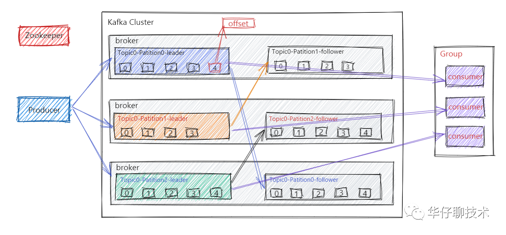


> 1）首先当 Producer 向 Broker 发送数据后，会进行 commit，如果 commit 成功，由于 Replica 副本机制的存在，则意味着消息不会丢失，但是 Producer 发送数据给 Broker 后，遇到网络问题而造成通信中断，那么 Producer 就无法准确判断该消息是否已经被提交（commit），这就可能造成 at least once 语义。
>
> 2）在 Kafka 0.11.0.0 之前， 如果 Producer 没有收到消息 commit 的响应结果，它只能重新发送消息，确保消息已经被正确的传输到 Broker，重新发送的时候会将消息再次写入日志中；而在 0.11.0.0 版本之后， Producer 支持幂等传递选项，保证重新发送不会导致消息在日志出现重复。为了实现这个, Broker 为 Producer 分配了一个ID，并通过每条消息的序列号进行去重。也支持了类似事务语义来保证将消息发送到多个 Topic 分区中，保证所有消息要么都写入成功，要么都失败，这个主要用在 Topic 之间的 exactly once 语义。
>
> **其中启用幂等传递的方法配置**：enable.idempotence = true。
>
> **启用事务支持的方法配置**：设置属性 transcational.id = "指定值"。
>
> 3）从 Consumer 角度来剖析, 我们知道 Offset 是由 Consumer 自己来维护的, 如果 Consumer 收到消息后更新 Offset， 这时 Consumer 异常 crash 掉， 那么新的 Consumer 接管后再次重启消费，就会造成 at most once 语义（消息会丢，但不重复）。
>
> 4) 如果 Consumer 消费消息完成后, 再更新 Offset， 如果这时 Consumer crash 掉，那么新的 Consumer 接管后重新用这个 Offset 拉取消息， 这时就会造成 at least once 语义（消息不丢，但被多次重复处理）。


**总结：**默认 Kafka 提供 「**at least once**」语义的消息传递，允许用户通过在处理消息之前保存 Offset 的方式提供 「**at most once**」 语义。如果我们可以自己实现消费幂等，理想情况下这个系统的消息传递就是严格的「**exactly once**」, 也就是保证不丢失、且只会被精确的处理一次，但是这样是很难做到的。


Exactly Once 解决的是**单次会话单个分区里的数据重复问题**。例如：因为网络波动导致的消息重试发送情况。

将服务器的 ACK 级别设置为-1，可以保证 Producer 到 Server 之间不会丢失数据，即 At Least Once 语义。相对的，将服务器 ACK 级别设置为 0，可以保证生产者每条消息只会被发送一次，即 At Most Once 语义。

At Least Once 可以保证数据不丢失，但是不能保证数据不重复；相对的，At Least Once 可以保证数据不重复，但是不能保证数据不丢失。但是，对于一些非常重要的信息，比如说 交易数据，下游数据消费者要求**数据既不重复也不丢失**，即 Exactly Once 语义。在 0.11 版本以前的 Kafka，对此是无能为力的，只能保证数据不丢失，在下游消费者对数据做全局去重。对于多个下游应用的情况，每个都需要单独做全局去重，这就对性能造成了很大影响。

0.11 版本的 Kafka，引入了一项重大特性：**幂等性**。所谓的幂等性就是指 Producer 不论向 Server 发送多少次重复数据，Server 端都只会持久化一条。幂等性结合 At Least Once 语 义，就构成了 Kafka 的 Exactly Once 语义。即：
At Least Once + 幂等性 = Exactly Once

要启用幂等性，只需要将 Producer 的参数中 enable.idompotence 设置为 true 即可（开启幂等性后ack默认置为-1）。

Kafka 的幂等性实现其实就是将原来下游需要做的去重放在了数据上游。**开启幂等性的 Producer 在初始化的时候会被分配一个 PID，发往同一 Partition 的消息会附带 Sequence Number。而 Broker 端会对 <PID, Partition, SeqNumber> （这个其实就是主键）做缓存，当具有相同主键的消息提交时，Broker 只会持久化一条，所以说kafka自己就做了幂等性的操作**

但是**生产者重启它的 PID 就会变化，所以幂等性只能解决单次会话单个分区里的数据重复问题**，即幂等性无法保证跨分区跨会话的 Exactly Once。


## HW 和 LEO

查看《Kafka-原理分析.md》中的 HW 和 LEO 一节。

HW ：High Water 最高水位，标识了一个特定的 offset, 消费者只能拉取到这个 offset 之前的消息

LEO：Log End Offset 数据日志文件结束偏移量，记录了该副本底层日志（log）中下一条消息的位移值，比如LEO=10,表示该副本保存了10条消息，位移值范围为 [0, 9]

涉及到副本同步原理 https://blog.csdn.net/madongyu1259892936/article/details/99596335

为什么需要有短板效应？
想象一下，Leader 有100数据，Follower 1只有80条，Follower 2能力较差，只有50条同步过来了。由于每个副本的LEO偏移量肯定不一样，用户消费如果根据长板来看，直接消费Leader的100，Leader挂掉，换成Follower 1继续服务，重复发了80～100的20条重复数据，Follower 1忽然又挂掉，换成Follower 2继续服务，又消费一对重复数据，这明显是很恶心的事情。而短板机制，就能够限制住用户只能消费50，毕竟大家都是同个学校的同学，肯定要相互理解相互帮扶才行～
同步复制要求所有能工作的Follower副本都复制完，这条消息才会被确认为成功提交，这种复制方式影响了性能。而在异步复制的情况下， follower副本异步地从leader副本中复制数据，数据只要被leader副本写入就被认为已经成功提交。在这种情况下，如果follower副本都没有复制完而落后于leader副本，如果突然leader副本宕机，则会造成数据丢失。Kafka使用这种ISR的方式有效的权衡了数据可靠性与性能之间的关系。
原文链接：https://blog.csdn.net/whiteBearClimb/article/details/111479791


# 高效读写数据

## 顺序写磁盘

Kafka 的 producer 生产数据，要写入到 log 文件中，写的过程是一直追加到文件末端， **为顺序写**。官网有数据表明，同样的磁盘，顺序写能到 600M/s，而随机写只有 100K/s。这与磁盘的机械机构有关，顺序写之所以快，是因为其省去了大量磁头寻址的时间。


## 零拷贝


# Kafka部署

Kafka官方下载地址：http://kafka.apache.org/downloads

包名说明：以 kafka_2.12-2.8.0.tgz 为例，2.12指的是Scala版本，2.8.0是kafka版本。

## 目录介绍

- bin

  kafka-topics.sh：操作主题

  kafka-consumer-perf-test.sh：消费者基准测试

  kafka-producer-perf-test：生产者基准测试

  kafka-console-producer.sh：kafka提供的用于测试的生产者

  kafka-console-consumer.sh：kafka提供的用于测试的消费者者

- config

  server.properties：kafka配置文件

  consumer.properties：kafka消费者的配置文件，用于kafka-consumer-perf-test.sh脚本执行的配置文件

  producer.properties：kafka生产者的配置文件，用于 kafka-console-producer.sh 脚本执行的配置文件

server.properties文件中的 log.dirs 指定了kafka数据的存储路径，主题数据就是存储在这个目录下。主题的存储格式是：主题名-分区号。（注意副本也是存储在这个目录下，且格式一致。）

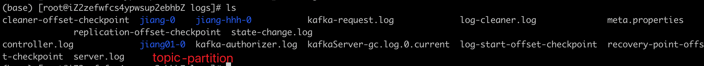

日志文件目录（logs）中的 server.log 就是kafka的程序运行日志。

## 配置文件解析

https://kafka.apache.org/11/documentation.html#brokerconfigs

```properties
#broker 的全局唯一编号，不能重复
broker.id=0

# 这两个配置默认被注释。他们都可以用来配置kafka实例运行地址。默认端口是9092。区别是listeners只支持内网，advertised.listeners支持内外网区分。例如：1、在公司搭建的 kafka 集群，只有内网中的服务可以用，这种情况下，只需要用 listeners 就行。2、在 docker 中或者 在类似阿里云主机上部署 kafka 集群，这种情况下是 需要用到 advertised_listeners。
# 监听器列表——用逗号分隔的uri列表，我们要监听的uri和监听器名称。如果侦听器名称不是安全协议，则还必须设置listener.security.protocol.map。指定主机名为0.0.0.0，与所有接口绑定。保留主机名为空以绑定到默认接口。合法监听列表示例:PLAINTEXT://myhost:9092,SSL://:9091 CLIENT://0.0.0.0:9092,REPLICATION://localhost:9093
listeners=PLAINTEXT://192.168.136.151:9092
advertised.listeners=PLAINTEXT://192.168.136.151:9092

#删除 topic 功能使能
delete.topic.enable=true
#处理网络请求的线程数量
num.network.threads=3
#用来处理磁盘 IO 的现成数量
num.io.threads=8
#发送套接字的缓冲区大小
socket.send.buffer.bytes=102400
#接收套接字的缓冲区大小
socket.receive.buffer.bytes=102400
#请求套接字的缓冲区大小
socket.request.max.bytes=104857600
#kafka 数据存储路径。kafka程序的运行日志文件存储在logs目录下
log.dirs=/usr/local/kafka_2.12-2.8.0/kafka-logs
#topic 在当前 broker 上的分区个数
num.partitions=1
#用来恢复和清理 data 下数据的线程数量
num.recovery.threads.per.data.dir=1
#segment 文件保留的最长时间，超时将被删除
log.retention.hours=168
#配置连接 Zookeeper 集群地址，默认为localhost:2181
zookeeper.connect=hadoop102:2181,hadoop103:2181,hadoop104:2181
# 服务器接受单个消息的最大大小，默认1000012约为976.6KB
message.max.bytes=1000012

```


## 安装

注意要使用kafka需要先启动zk

Kafka部署以要部署三台机子为例，下面展示一台机子的部署过程，其他机子都是照抄：

1、上传并解压安装包

```sh
#上传压缩包到该目录 /usr/local
tar -zxvf kafka_2.12-2.8.0.tgz
```

2、修改配置文件 kafka_2.12-2.8.0/config/server.properties

```sh
vim kafka_2.12-2.8.0/config/server.properties

# 1、修改broker.id分别为0，1，2
# 2、修改log.dirs为/usr/local/kafka_2.12-2.8.0/kafka-logs，如果是单机伪集群的部署方式，那么可以指向各自的kafka家目录。
# 3、配置zookeeper.connect。
# 4、如果是单机伪集群的部署方式，那么需要配置 listeners 为PLAINTEXT://192.168.136.151:9092, PLAINTEXT://192.168.136.151:9093, PLAINTEXT://192.168.136.151:9094
```


## 启动

1、启动zk。

2、启动kafka

```sh
# 方式一
kafka-server-start.sh [-daemon] server.properties

# 方式二
nohup kafka_2.12-2.8.0/bin/kafka-server-start.sh kafka_2.12-2.8.0/config/server.properties &
```

server.properties的配置路径是一个强制的参数，­daemon表示以后台进程运行。


## 停止

```sh
kafka_2.12-2.8.0/bin/kafka-server-stop.sh
```


# Kafka 集群

在同一个机器上的话，就是将kafka拷贝，然后再修改server.properties里面的broker.id, logs, listeners（保证ip和端口至少有一个不一样）,其他无需改变

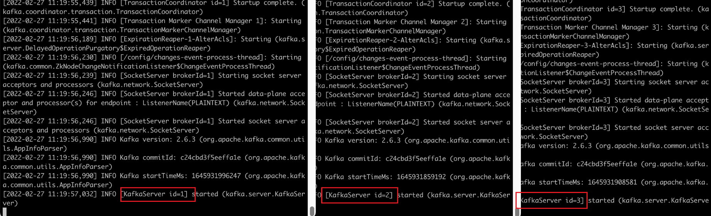


创建3分区3副本集

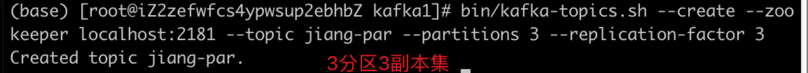

查看对应的描述

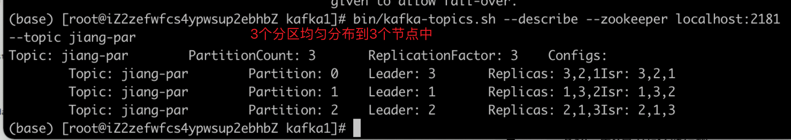

## 分区重新分配


更改分区大小

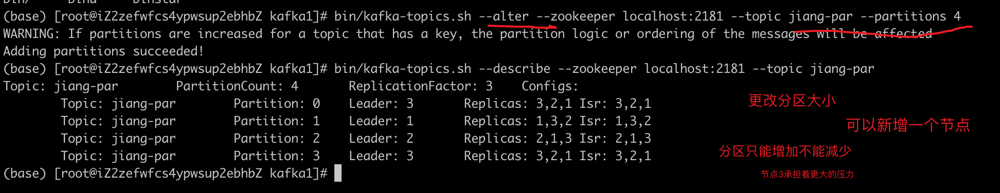

可见节点3需要承受更大的压力，不均衡，若新增节点，那么新增的节点并不会感知到原有的，因此还是节点2承受更大的压力，可以采用kafka_partition_reassignment.sh进行重新分配

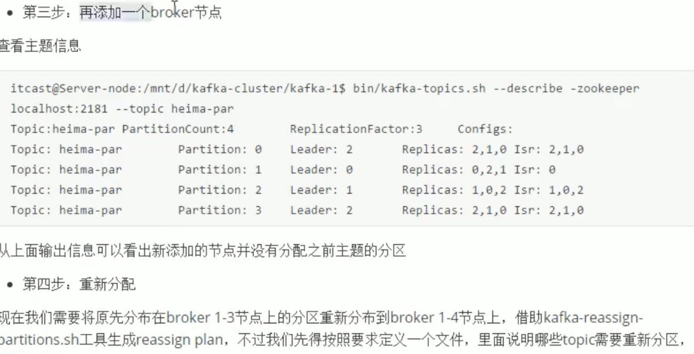

重新分配分区：https://blog.csdn.net/forrest_ou/article/details/79141391

# Kafka常用脚本命令

以下所有的命令都有一些附加的选项；当我们不携带任何参数运行命令的时候，将会显示出这个命令的详细用法。

## C

**创建 topic**

```sh
kafka_2.12-2.8.0/bin/kafka-topics.sh --zookeeper localhost:2181 --create --replication-factor 2 -partitions 3 --topic first

# 或者
kafka_2.12-2.8.0/bin/kafka-topics.sh --bootstrap-server localhost:9092 --create --replication-factor 2 -partitions 3 --topic first
```


--zookeeper 指定zk地址

--topic 定义 topic 名

--replication-factor 定义副本数 

--partitions 定义分区数


除了通过手工的方式创建Topic，当producer发布一个消息到某个指定的Topic，这个Topic如果不存在，就会自动创建。


**发送消息**

```sh
kafka_2.12-2.8.0/bin/kafka-console-producer.sh --broker-list localhost:9092 --topic first
```

上面这条命令执行后会出现交互命令行，用来发送消息。

--broker-list： kafka broker列表


## R

bootstrap-servers指的是目标集群的服务器地址，这个和broker-list功能是一样的，只不过我们在console producer要求用后者。

broker-list为老的，笔者更贴近于的说法是：忘了改了或者是懒得改了，认为这样没有必要。

https://blog.51cto.com/u_15127513/2682947

**查看当前服务器中的所有 topic**

```sh
kafka_2.12-2.8.0/bin/kafka-topics.sh --bootstrap-server localhost:9092 --list

# 或者
kafka_2.12-2.8.0/bin/kafka-topics.sh --zookeeper localhost:2181 --list
```

--zookeeper 指定zk地址

--bootstrap-server 指定kafka服务端地址


**查看某个 Topic 的详情**

```sh
kafka_2.12-2.8.0/bin/kafka-topics.sh --zookeeper localhost:2181 --describe --topic first
```

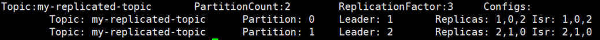

- leader节点负责给定partition的所有读写请求。
- replicas 表示某个partition在哪几个broker上存在备份。不管这个几点是不是”leader“，甚至这个节点挂了，也会列出。 
- isr 是replicas的一个子集，它只列出当前还存活着的，并且已同步备份了对应分区的leader数据的节点。isr中含leader节点。


**消费消息**

```sh
# 该指令只适用于0.9之前的版本（不含0.9）
kafka_2.12-2.8.0/bin/kafka-console-consumer.sh --zookeeper localhost:2181 --topic first

# 或者
kafka_2.12-2.8.0/bin/kafka-console-consumer.sh --bootstrap-server localhost:9092 --topic first

# 获取某个主题下的所有消息(包括历史消息)。
kafka_2.12-2.8.0/bin/kafka-console-consumer.sh --bootstrap-server localhost:9092 --from-beginning --topic first
```

--from-beginning：会把主题中以往所有的数据都读取出来。


**查看组名**

```sh
bin/kafka‐consumer‐groups.sh ‐‐bootstrap‐server 192.168.0.60:9092 ‐‐list
```


**查看消费者的消费偏移量**

```sh
bin/kafka‐consumer‐groups.sh ‐‐bootstrap‐server 192.168.0.60:9092 ‐‐describe ‐‐group testGroup
```

通过这个可以查看消费者的消费偏移量。

current-offset、log-end-offset 和 lag ，分别表示当前消费偏移量，结束的偏移量(HW)，落后消费的消息数。


**消费多主题**

```sh
bin/kafka‐console‐consumer.sh ‐‐bootstrap‐server 192.168.0.60:9092 ‐‐whitelist "test|test‐2"
```


**单播消费**

一条消息只能被某一个消费者消费的模式，类似queue模式，只需让所有消费者在同一个消费组里即可 分别在两个客户端执行如下消费命令，然后往主题里发送消息，结果只有一个客户端能收到消息

```sh
bin/kafka‐console‐consumer.sh ‐‐bootstrap‐server 192.168.0.60:9092 ‐-consumer‐property group.id=testGroup ‐‐topic test
```

‐-consumer‐property group.id=testGroup 指定消费者组。


**多播消费**

一条消息能被多个消费者消费的模式，类似publish-subscribe模式费，针对Kafka**同一条消息只能被同一个消费组下的某一个消 费者消费**的特性，要实现多播只要保证这些消费者属于不同的消费组即可。我们再增加一个消费者，该消费者属于testGroup-2消费 组，结果两个客户端都能收到消息。

```sh
bin/kafka‐console‐consumer.sh ‐‐bootstrap‐server 192.168.0.60:9092 ‐-consumer‐property group.id=testGroup ‐‐topic test

bin/kafka‐console‐consumer.sh ‐‐bootstrap‐server 192.168.0.60:9092 ‐‐consumer‐property group.id=testGroup‐2 ‐‐topic test
```


## U

**添加分区(目前kafka不支持减少分区)**

```sh
kafka_2.12-2.8.0/bin/kafka-topics.sh --zookeeper
localhost:2181 --alter --topic first --partitions 6
```


## D

**删除 topic**

```sh
kafka_2.12-2.8.0/bin/kafka-topics.sh --zookeeper localhost:2181 --delete --topic first
```

**需要 server.properties 中设置 delete.topic.enable=true 否则只是标记删除，在重启 Kafka server 后删除。**


# zk节点说明

- /brocker/ids

  记录了所有的kafka实例信息。

- /consumers

  该路径下存储了消费者组列表，节点名为消费者组名，如果一个消费者在启动时没有指定消费者，那么kafka会为它创建一个消费者组，例如：console-consumer-70850。

- /consumers/消费者组名

  offsets就保存在这个路径下。

- /consumers/消费者组名/offsets

  该路径下存储了消费者提交了哪些topic的offset。

- /consumers/消费者组名/offsets/topic

  该路径下存储了消费者提交了某个topic的某些的分区的offset

- /consumers/消费者组名/offsets/topic/分区

  存储该消费者组在该分区下的offset值。


Kafka集群的一些重要信息都记录在ZK中，比如集群的所有代理节点、主题的所有分区、分区的副本信息(副本集(AR)、主副本(leader)、同步的副本集(ISR))。外部事件会更新ZK的数据，ZK中的数据一旦发生变化，controller都要做出不同的相应处理。

# Maven坐标

```xml
<!--kafka客户端-->
<dependency>
    <groupId>org.apache.kafka</groupId>
    <artifactId>kafka-clients</artifactId>
    <version>2.8.0</version>
</dependency>

<!--对接log4j2日志框架-->
<dependency>
    <groupId>org.apache.logging.log4j</groupId>
    <artifactId>log4j-slf4j-impl</artifactId>
    <version>2.11.1</version>
</dependency>
```


# API 使用

## 生产者和消费者配置项

### 生产者配置

https://kafka.apache.org/11/documentation.html#producerconfigs

| 配置项                                       | 描述                                                         | 默认值                                    |
| -------------------------------------------- | ------------------------------------------------------------ | ----------------------------------------- |
| ProducerConfig.BOOTSTRAP_SERVERS_CONFIG      | 配置brocker地址，如果是集群最好配置多个机器的地址，因为如果只配置了一个broker而它又宕机了，那么就连无法连上kafka集群。多个broker地址以逗号分隔。 |                                           |
| ProducerConfig.ACKS_CONFIG                   | 配置生产者的应答机制。                                       | 1                                         |
| ProducerConfig.RETRIES_CONFIG                | 失败重试次数，重试能保证消息发送的可靠性，但是也可能造成消息重复发送，比如网络抖动，所以需要在接收者那 边做好消息接收的幂等性处理 | 0                                         |
| ProducerConfig.RETRY_BACKOFF_MS_CONFIG       | 失败重试间隔                                                 | 100ms                                     |
| ProducerConfig.BUFFER_MEMORY_CONFIG          | 设置本地缓冲区大小。发送消息时消息会先发送到本地缓冲区，可以提高消息发送性能。 | 33554432byte，即32MB                      |
| ProducerConfig.BATCH_SIZE_CONFIG             | 设置批量发送消息的大小。kafka本地线程会从缓冲区取数据，批量发送到broker | 16384byte，即16kb                         |
| ProducerConfig.LINGER_MS_CONFIG              | 设置消息发送最大延迟。一般设置100毫秒左右。即如果100毫秒内，某个batch不满足设定的批量发送大小，那么这个batch也会被发送出去。 | 0，即消息必须立即被发送，但这样会影响性能 |
| ProducerConfig.VALUE_SERIALIZER_CLASS_CONFIG | 把发送的key从指定类型序列化为字节数组                        |                                           |
| ProducerConfig.VALUE_SERIALIZER_CLASS_CONFIG | 把发送消息value从指定类型序列化为字节数组                    |                                           |


### 消费者配置

https://kafka.apache.org/11/documentation.html#consumerconfigs

| 配置项                                         | 描述                                                         | 默认值       |
| ---------------------------------------------- | ------------------------------------------------------------ | ------------ |
| ConsumerConfig.BOOTSTRAP_SERVERS_CONFIG        | 配置brocker地址，如果是集群最好配置多个机器的地址，因为如果只配置了一个broker而它又宕机了，那么就连无法连上kafka集群。多个broker地址以逗号分隔。 |              |
| ConsumerConfig.GROUP_ID_CONFIG                 | 设置消费者组                                                 |              |
| ConsumerConfig.ENABLE_AUTO_COMMIT_CONFIG       | 设置是否自动提交offset                                       | true         |
| ConsumerConfig.AUTO_OFFSET_RESET_CONFIG        | 重置offset，可选值：[latest, earliest, none]                 | latest       |
| ConsumerConfig.AUTO_COMMIT_INTERVAL_MS_CONFIG  | 自动提交offset的间隔时间                                     | 60 * 1000 ms |
| ConsumerConfig.HEARTBEAT_INTERVAL_MS_CONFIG    | 心跳间隔时间，服务端broker通过心跳确认consumer是否故障，如果发现故障，就会通过心跳下发 **rebalance** 的指令给其他的consumer通知他们进行rebalance操作，这个时间可以稍微短一点。 | 3000ms       |
| ConsumerConfig.SESSION_TIMEOUT_MS_CONFIG       | 设置服务端broker多久感知不到一个consumer心跳就认为他故障了。 | 10s          |
| ConsumerConfig.MAX_POLL_INTERVAL_MS_CONFIG     | 如果两次poll操作间隔超过了这个时间，broker就会认为这个consumer处理能力太弱， 会将其踢出消费组，将分区分配给别的consumer消费。 | 300000ms     |
| ConsumerConfig.KEY_DESERIALIZER_CLASS_CONFIG   | 把发送的key从指定类型序列化为字节数组                        |              |
| ConsumerConfig.VALUE_DESERIALIZER_CLASS_CONFIG | 把发送消息value从指定类型序列化为字节数组                    |              |
| fetch.max.wait.ms                              | 指定了消费者读取时最长等待时间，从而避免长时间阻塞           |              |
| fetch.min.bytes                                | 允许消费者制定从 broker 读取消息时最小的数据量。当消费者从 broker 读取消息时，如果数据量小于这个阈值，broker会等待直到有足够多的数据然后才返回给消费者，对于写入量不高的主题来说，可以减少broker 和消费者的压力，因为减少了往返时间；而对于有大量消费者的主题来说，可以明显减轻 broker 压力 | 1            |
| max.partition.fetch.bytes                      | 每个分区返回的最多字节数，默认1M，kafkaConsumer.poll()返回记录列表时，每个分区的记录字节数最多为1M。如果一个主题有20个分区，同时有5个消费者，每个消费者需要4M的空间处理消息，实际情况会设置更多空间，这样当存在消费者宕机时，其他消费者可以承担更多的分区 | 1M           |


## ProducerRecord

```java
// 指定发送分区
public ProducerRecord(String topic, Integer partition, K key, V value) {
    this(topic, partition, null, key, value, null);
}

// 未指定发送分区，具体发送的分区计算公式：hash(key)%partitionNum
public ProducerRecord(String topic, K key, V value) {
    this(topic, null, null, key, value, null);
}

// 未指定发送分区
public ProducerRecord(String topic, V value) {
    this(topic, null, null, null, value, null);
}
```


## Producer

### 生产流程解析

字符串序列化器，整型、字节数组序列化器

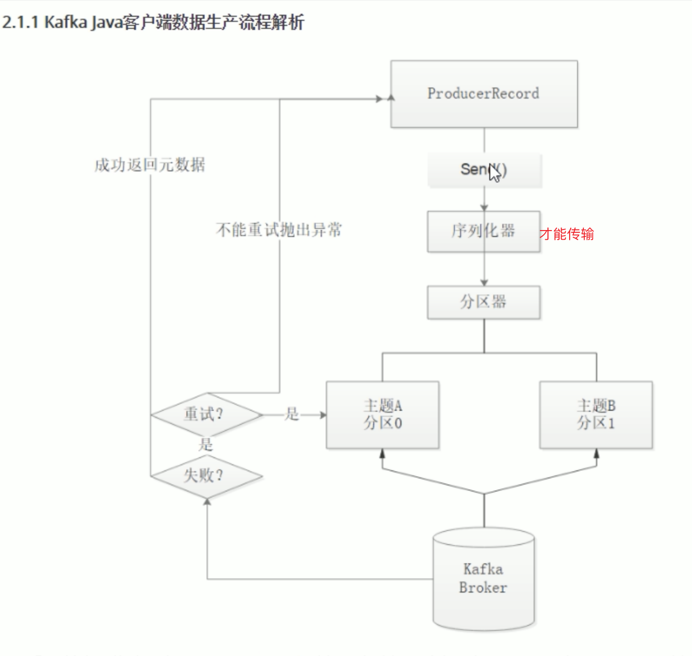

发送的时候会将消息进行序列化，因为涉及到了 TCP 传输

```java
// 带回调的异步发送
public Future<RecordMetadata> send(ProducerRecord<K, V> record, Callback callback);

// 不带回调异步发送
public Future<RecordMetadata> send(ProducerRecord<K, V> record) {
    return send(record, null);
}

// 同步发送可以借助 Future.get() 实现，还可以使用 CountDownLatch 等方式来实现。
```


### 同步方式生产消息

**同步发送的意思就是，一条消息发送之后，会阻塞当前线程，直至返回 ack。** 由于 send 方法返回的是一个 Future 对象，根据 Futrue 对象的特点，我们也可以实现同 步发送的效果，只需在调用 Future 对象的 get 方发即可。

```java
import org.apache.kafka.clients.producer.KafkaProducer;
import org.apache.kafka.clients.producer.ProducerRecord;
import org.apache.kafka.clients.producer.RecordMetadata;
import org.slf4j.Logger;
import org.slf4j.LoggerFactory;

import java.util.Properties;
import java.util.concurrent.ExecutionException;
import java.util.concurrent.Future;

/**
 * 生产100个消息，消息内容为1-100（不含100）
 */
public class ProductDemo {

    private static final Logger logger = LoggerFactory.getLogger(ProductDemo.class);

    public static void main(String[] args) throws ExecutionException, InterruptedException {

        KafkaProducer<String, String> kafkaProducer = null;
        try {
          
            // 1、创建用于连接kafka的配置。
            Properties props = new Properties();
          
            // 指定kafka集群地址
            props.put("bootstrap.servers", "192.168.136.151:9092");
            // 指定acks模式，acks可取值1（默认值，消息写入leader后就返回应答，不等待副本同步。），0（不考虑任何的应答，即不考虑消息是否丢失），all（保证消息不丢失，其实就是当消息同步到主题分区的ISR副本中之后再返回值给生产者。）
            props.put("acks", "all");
            props.put("key.serializer", "org.apache.kafka.common.serialization.StringSerializer");
            props.put("value.serializer", "org.apache.kafka.common.serialization.StringSerializer");

             // 设置 key 序列化器
            // prop.put("key.serializer", "org.apache.kafka.common.serialization.StringSerializer");
            // prop.put(ProducerConfig.KEY_SERIALIZER_CLASS_CONFIG, StringSerializer.class.getName());

            // 设置重试次数
            // prop.put(ProducerConfig.RETRIES_CONFIG, 10);
            // 设置值序列化器
            //  props.put(ProducerConfig.VALUE_SERIALIZER_CLASS_CONFIG, StringSerializer.class.getName());
            // 设置集群地址
            // props.put("bootstrap.servers", brokerList);

            // 自定义分区的使用
            // props.put(ProducerConfig.PARTITIONER_CLASS_CONFIG, )
            // 自定义拦截器的使用
            // props.put(ProducerConfig.INTERCEPTOR_CLASSES_CONFIG, ProducerInterceptorPrefix.class.getName());

            //
            props.put(ProducerConfig.ACKS_CONFIG, "0");
            // 重试次数
             props.put("retries", 1);
          
             // 设置批次大小，单位：字节
             props.put("batch.size", 16384);
             // 等待时间
             props.put("linger.ms", 1);
             // 设置 RecordAccumulator 缓冲区大小，单位：字节
             props.put("buffer.memory", 33554432);

            // 2、创建生产者
            kafkaProducer = new KafkaProducer<String, String>(props);

            // 3、发送消息
            for (int i = 0; i < 100; i++) {
                // 构建消息，注意消息的泛型要和生产者定义的泛型一致。
                ProducerRecord<String, String> producerRecord = new ProducerRecord<String, String>("first", null, String.valueOf(i));
                Future<RecordMetadata> res = kafkaProducer.send(producerRecord);

                // 阻塞，等待服务端的返回消息, send使用独立的线程
                RecordMetadata recordMetadata = res.get();
                logger.info("{} 写入成功", i);
            }
        } finally {
            // 4、关闭生产者
            if (kafkaProducer != null)
                kafkaProducer.close();
        }
    }
}
```


### 异步带回调方式生产消息

回调函数会在 producer 收到 ack 时调用，为异步调用，该方法有两个参数，分别是 RecordMetadata 和 Exception，如果 Exception 为 null，说明消息发送成功，如果 Exception 不为 null，说明消息发送失败。

注意：消息发送失败会自动重试，不需要我们在回调函数中手动重试。

```java
package com.example.demo;

import org.apache.kafka.clients.producer.KafkaProducer;
import org.apache.kafka.clients.producer.ProducerRecord;
import org.apache.kafka.clients.producer.RecordMetadata;
import org.slf4j.Logger;
import org.slf4j.LoggerFactory;

import java.util.Properties;
import java.util.concurrent.ExecutionException;

public class ProductDemo2 {

    private static final Logger logger = LoggerFactory.getLogger(ProductDemo2.class);

    public static void main(String[] args) throws ExecutionException, InterruptedException {

        KafkaProducer<String, String> kafkaProducer = null;
        try {
            // 1、创建用于连接kafka的配置。
            Properties props = new Properties();
            // 指定kafka集群地址
            props.put(ProducerConfig.BOOTSTRAP_SERVERS_CONFIG, "192.168.136.151:9092");
            // 指定acks模式，acks可取值1（默认值），0（不考虑消息是否丢失），all（保证消息不丢失，其实就是当消息同步到主题分区的副本中之后再返回值给生产者。）
            props.put("acks", "all");
            props.put("key.serializer", "org.apache.kafka.common.serialization.StringSerializer");
            props.put("value.serializer", "org.apache.kafka.common.serialization.StringSerializer");

            // 2、创建生产者
            kafkaProducer = new KafkaProducer<String, String>(props);

            // 3、发送消息
            for (int i = 0; i < 100; i++) {
                // 构建消息，注意消息的泛型要和生产者定义的泛型一致。
                ProducerRecord<String, String> producerRecord = new ProducerRecord<String, String>("test", null, String.valueOf(i));
                kafkaProducer.send(producerRecord, (RecordMetadata metadata, Exception e)->{
                    // 回调函数，该方法会在 Producer 收到 ack 时调用，为异步调用
                    // 写入kafka成功返回的是RecordMetadata，写入kafka失败返回的是Exception
                    // 如果异常为null，则代表发送成功。
                    // 注意：消息发送失败会自动重试，不需要我们在回调函数中手动重试。
                    if (e == null) {
                        String topic = metadata.topic();
                        long offset = metadata.offset();
                        int partition = metadata.partition();
                        logger.info("topic: {}, offset: {}, partition: {}", topic, offset, partition);
                        return;
                    }
                    logger.error("生产消息失败，出现异常");
                });
            }
        } finally {
            // 4、关闭生产者
            if (kafkaProducer != null)
                kafkaProducer.close();
        }
    }
}
```


## Consumer

### 订阅主题

```java
// 指定主题
public void subscribe(Collection<String> topics);

// 指定主题并设置监听事件
public void subscribe(Collection<String> topics, ConsumerRebalanceListener listener);

// 正则匹配
public void subscribe(Pattern pattern);
```


### 设置offset

```java
//将指定分区partition的offset重置到offset
void seek(TopicPartition partition, long offset);

//将指定分区partition的offset重置到offset,并带有一些自定义的字符串元数据信息metadata
void seek(TopicPartition partition, OffsetAndMetadata offsetAndMetadata);

//将多个分区partitions的offset重置到分区开头
void seekToBeginning(Collection<TopicPartition> partitions);

//将多个分区partitions的offset重置到分区末尾
void seekToEnd(Collection<TopicPartition> partitions);
```


### 获取offset

```java
//获取多个分区的分区开始位移
Map<TopicPartition, Long> beginningOffsets(Collection<TopicPartition> partitions);

//在指定时间内获取多个分区的分区开始位移
Map<TopicPartition, Long> beginningOffsets(Collection<TopicPartition> partitions, Duration timeout);

//获取多个分区的分区末尾位移
Map<TopicPartition, Long> endOffsets(Collection<TopicPartition> partitions);

//在指定时间内获取多个分区的分区末尾位移
Map<TopicPartition, Long> endOffsets(Collection<TopicPartition> partitions, Duration timeout);

//根据时间戳获取指定时间戳之后的消息位移
Map<TopicPartition, OffsetAndTimestamp> offsetsForTimes(Map<TopicPartition, Long> timestampsToSearch);

//指定时间内根据时间戳获取指定时间戳之后的消息位移
Map<TopicPartition, OffsetAndTimestamp> offsetsForTimes(Map<TopicPartition, Long> timestampsToSearch, Duration timeout);
```


### 消费指定分区

```java
// 消费topicName的0分区
consumer.assign(Arrays.asList(new TopicPartition(topicName, 0)));
```


### 分区从头消费

从分区的offset为0处开始消费。（从头消费分区）

```java
// topicName的0分区从头消费
consumer.assign(Arrays.asList(new TopicPartition(topicName, 0)));
consumer.seekToBeginning(Arrays.asList(new TopicPartition(topicName, 0)));
```


### 指定offset消费

```java
// topicName的0分区从offset为10处开始消费。
consumer.seek(new TopicPartition(topicName, 0), 10);
```


### 从指定时间开始消费

```java
// 从半小时前开始消费
Map<TopicPartition, Long> map = new HashMap<>();
List<PartitionInfo> topicPartitions = kafkaConsumer.partitionsFor("first");
long time = new Date().getTime() - 1000 * 60 * 30;
topicPartitions.forEach(partitionInfo -> {
    map.put(new TopicPartition("first", partitionInfo.partition()), time);
});
Map<TopicPartition, OffsetAndTimestamp> parMap = kafkaConsumer.offsetsForTimes(map);
parMap.forEach((k, v)->{
    long offset = v.offset();
    System.out.println("partition: "+ k.partition() + ", offset: "+ offset);
    if (v != null) {
        //没有这行代码会导致下面的报错信息
        kafkaConsumer.assign(Arrays.asList(k));
        kafkaConsumer.seek(k, offset);
    }
});
```


### 例子

```java
//  1、创建用于连接kafka的配置。
Properties props = new Properties();
props.put("bootstrap.servers", "192.168.136.151:9092");
// 配置消费者组，将若干个消费者组织到一起，，共同消费kafka中的topic数据。
props.put("group.id", "test");
// 开启自动提交
props.put(ConsumerConfig.ENABLE_AUTO_COMMIT_CONFIG, "true");
// 配置自动提交的时间间隔
props.put("auto.commit.interval.ms", "1000");

props.put("key.deserializer", "org.apache.kafka.common.serialization.StringDeserializer");
props.put("value.deserializer", "org.apache.kafka.common.serialization.StringDeserializer");

// 2、创建Kafka消费者
KafkaConsumer<String, String> kafkaConsumer = new KafkaConsumer<String, String>(props);


// 3
String topicName = "first";

// 指定要消费的主题，分区自动分配。
//kafkaConsumer.subscribe(Arrays.asList("first"));

// 消费topicName的0分区
//consumer.assign(Arrays.asList(new TopicPartition(topicName, 0)));

// topicName的0分区从头消费
//consumer.assign(Arrays.asList(new TopicPartition(topicName, 0)));
//consumer.seekToBeginning(Arrays.asList(new TopicPartition(topicName, 0)));

// topicName的0分区从offset为10处开始消费。
consumer.seek(new TopicPartition(topicName, 0), 10);

// 从半小时前开始消费
//        Map<TopicPartition, Long> map = new HashMap<>();
//        List<PartitionInfo> topicPartitions = kafkaConsumer.partitionsFor("first");
//        long time = new Date().getTime() - 1000 * 60 * 30;
//        topicPartitions.forEach(partitionInfo -> {
//            map.put(new TopicPartition("first", partitionInfo.partition()), time);
//        });
//        Map<TopicPartition, OffsetAndTimestamp> parMap = kafkaConsumer.offsetsForTimes(map);
//        parMap.forEach((k, v)->{
//            long offset = v.offset();
//            System.out.println("partition: "+ k.partition() + ", offset: "+ offset);
//            if (v != null) {
//                //没有这行代码会导致下面的报错信息
//                kafkaConsumer.assign(Arrays.asList(k));
//                kafkaConsumer.seek(k, offset);
//            }
//        });

// 4、拉取数据
while(true) {
    ConsumerRecords<String, String> records = kafkaConsumer.poll(Duration.ofSeconds(5));

    records.forEach(record->{
        // 获取主题
        String topic = record.topic();

        // 获取offset, 这条消息处于kafka分区中的哪个位置
        long offset = record.offset();

        // 获取key 和 value
        String key = record.key();
        String value = record.value();

        logger.info("topic: {}, offset: {}, key: {}, value: {}", topic, offset, key, value);
    });
}
```


```java
public class ConsumerFastStart {

    private static final String brokerList = "182.xxxxx:9092";

    private static final String topic = "jiang";

    private static final String groupId = "group.demo";

    public static void main(String[] args) {
        Properties properties = new Properties();
        // 消费端为反序列化
//        properties.put("key.deserializer", "org.apache.kafka.common.serialization.StringDeserializer");
        properties.put(ConsumerConfig.KEY_DESERIALIZER_CLASS_CONFIG, StringSerializer.class.getName());
//        properties.put("value.deserializer", "org.apache.kafka.common.serialization.StringDeserializer");
        properties.put(ConsumerConfig.VALUE_DESERIALIZER_CLASS_CONFIG, StringDeserializer.class.getName());
//        properties.put("bootstrap.servers", brokerList);
        properties.put(ConsumerConfig.BOOTSTRAP_SERVERS_CONFIG, brokerList);
//        properties.put("group.id", groupId);
        properties.put(ConsumerConfig.GROUP_ID_CONFIG, groupId);
        KafkaConsumer<String, String> consumer = new KafkaConsumer<>(properties);

        // 订阅主题，可以订阅多个
        consumer.subscribe(Collections.singletonList(topic));
        // 正则表达式匹配
        consumer.subscribe(Pattern.compile("jiang*"));

        // 分区
        consumer.assign(Arrays.asList(new TopicPartition(topic, 0))); // 那么只会消费分区 0 的消息
        while (true) {
          // 提交数据
            ConsumerRecords<String, String> records = consumer.poll(Duration.ofMillis(1000));
            for (ConsumerRecord<String, String> record : records) {
                System.out.println(record.value());
            }
        }
    }
}
```


### 自动提交offset

Kafka 提供了自动提交 offset 的功能。这种方式让消费者来管理位移，应用本身不需要显示操作，当enable.auto.commit=true，那么消费者会在poll方法调用后每隔5秒（auto.commit.interval.ms）提交一次位移，和很多其他操作一样，自动提交也是由 poll() 方法驱动的，在调用 poll 时，消费者判断是否到达提交时间，如果是则提交上一次 poll 返回的最大位移

这种方式可能会导致消息重复消费，假如某个消息 poll 之后，应用正在处理消息，3秒后，kafka 进行了重平衡，那么由于没有更新位移导致重平衡后这部分消息重复消费

自动提交 offset 的相关参数：

- enable.auto.commit：是否开启自动提交 offset 功能。
- auto.commit.interval.ms：自动提交 offset 的时间间隔。

```java
import org.apache.kafka.clients.consumer.ConsumerRecords;
import org.apache.kafka.clients.consumer.KafkaConsumer;
import org.slf4j.Logger;
import org.slf4j.LoggerFactory;

import java.time.Duration;
import java.util.Arrays;
import java.util.Properties;

public class ConsumerDemo {

    private static final Logger logger = LoggerFactory.getLogger(ConsumerDemo.class);

    public static void main(String[] args) {
        //  1、创建用于连接kafka的配置。
        Properties props = new Properties();
        props.put("bootstrap.servers", "192.168.136.151:9092");
        // 配置消费者组，将若干个消费者组织到一起，，共同消费kafka中的topic数据。
        props.put("group.id", "test");
        // 开启自动提交
        props.put(ConsumerConfig.ENABLE_AUTO_COMMIT_CONFIG, "true");
        // 配置自动提交的时间间隔
        props.put("auto.commit.interval.ms", "1000");

        props.put("key.deserializer", "org.apache.kafka.common.serialization.StringDeserializer");
        props.put("value.deserializer", "org.apache.kafka.common.serialization.StringDeserializer");

        // 2、创建Kafka消费者
        KafkaConsumer<String, String> kafkaConsumer = new KafkaConsumer<String, String>(props);

        // 3、订阅要消费的主题
        kafkaConsumer.subscribe(Arrays.asList("first"));

        // 4、拉取数据
        while(true) {
            ConsumerRecords<String, String> records = kafkaConsumer.poll(Duration.ofSeconds(5));

            records.forEach(record->{
                // 获取主题
                String topic = record.topic();

                // 获取offset, 这条消息处于kafka分区中的哪个位置
                long offset = record.offset();

                // 获取key 和 value
                String key = record.key();
                String value = record.value();

                logger.info("topic: {}, offset: {}, key: {}, value: {}", topic, offset, key, value);
            });
        }
    }
}
```


### 手动提交

虽然自动提交 offset 十分简介便利，但由于其是基于时间提交的，开发人员难以把握 offset 提交的时机。因此 Kafka 还提供了手动提交 offset 的 API。

手动提交 offset 的方法有两种：分别是 commitSync（同步提交）和 commitAsync（异步 提交）。两者的相同点是，**都会将本次 poll 的一批数据最高的偏移量提交**；不同点是， **commitSync 阻塞当前线程，一直到提交成功，并且会自动失败重试（由不可控因素导致， 也会出现提交失败）；而 commitAsync 则没有失败重试机制。**


#### 同步提交 offset

关闭自动提交，使用 commitSync 方法提交offset。

```java
//  1、创建用于连接kafka的配置。
Properties props = new Properties();
props.put("bootstrap.servers", "192.168.136.151:9092");
// 配置消费者组，将若干个消费者组织到一起，，共同消费kafka中的topic数据。
props.put("group.id", "test");
// 关闭自动提交
props.put(ConsumerConfig.ENABLE_AUTO_COMMIT_CONFIG, "false");
props.put("key.deserializer", "org.apache.kafka.common.serialization.StringDeserializer");
props.put("value.deserializer", "org.apache.kafka.common.serialization.StringDeserializer");

// 2、创建Kafka消费者
KafkaConsumer<String, String> kafkaConsumer = new KafkaConsumer<>(props);

// 3、订阅要消费的主题
kafkaConsumer.subscribe(Arrays.asList("first"));

// 4、拉取数据
while(true) {
    ConsumerRecords<String, String> records = kafkaConsumer.poll(Duration.ofSeconds(5));

    records.forEach(record->{
        // 获取主题
        String topic = record.topic();

        // 获取offset, 这条消息处于kafka分区中的哪个位置
        long offset = record.offset();

        // 获取key 和 value
        String key = record.key();
        String value = record.value();

        logger.info("topic: {}, offset: {}, key: {}, value: {}", topic, offset, key, value);
    });

    // 同步提交，当前线程会被阻塞。
    kafkaConsumer.commitSync();
}
```


#### 异步提交 offset

关闭自动提交，使用 commitAsync 方法提交offset。

```java
//  1、创建用于连接kafka的配置。
Properties props = new Properties();
props.put("bootstrap.servers", "192.168.136.151:9092");
// 配置消费者组，将若干个消费者组织到一起，，共同消费kafka中的topic数据。
props.put("group.id", "test");
// 关闭自动提交
props.put(ConsumerConfig.ENABLE_AUTO_COMMIT_CONFIG, "false");
props.put("key.deserializer", "org.apache.kafka.common.serialization.StringDeserializer");
props.put("value.deserializer", "org.apache.kafka.common.serialization.StringDeserializer");

// 2、创建Kafka消费者
KafkaConsumer<String, String> kafkaConsumer = new KafkaConsumer<>(props);

// 3、订阅要消费的主题
kafkaConsumer.subscribe(Arrays.asList("first"));

// 4、拉取数据
while(true) {
    ConsumerRecords<String, String> records = kafkaConsumer.poll(Duration.ofSeconds(5));

    records.forEach(record->{
        // 获取主题
        String topic = record.topic();

        // 获取offset, 这条消息处于kafka分区中的哪个位置
        long offset = record.offset();

        // 获取key 和 value
        String key = record.key();
        String value = record.value();

        logger.info("topic: {}, offset: {}, key: {}, value: {}", topic, offset, key, value);
    });

    // 异步提交
    kafkaConsumer.commitAsync(new OffsetCommitCallback() {
        @Override
        public void onComplete(Map<TopicPartition,
                                OffsetAndMetadata> offsets, Exception exception) {
            if (exception != null) {
                System.err.println("Commit failed for" +
                        offsets);
            }
        }
    });
}
```


重新消费一个主题

消费者换组并配置ConsumerConfig.AUTO_OFFSET_RESET_CONFIG为earliest


offset保存与读取问题

consumer启动时会获取一次offset，而后在自己的内存中进行维护。


## 分区器、序列化器、拦截器

执行顺序：拦截器、序列化器、分区器

### 自定义 Interceptor

#### Producer 拦截器

Producer 拦截器(interceptor)是在 Kafka 0.10 版本被引入的，主要用于实现 clients 端的定 制化控制逻辑。

对于 producer 而言，interceptor 使得用户在消息发送前以及 producer 回调逻辑前有机会 对消息做一些定制化需求，比如修改消息等。同时，producer 允许用户指定多个 interceptor 按序作用于同一条消息从而形成一个拦截链(interceptor chain)。Intercetpor 的实现接口是 org.apache.kafka.clients.producer.ProducerInterceptor，其定义的方法包括：

- configure(configs)：获取配置信息和初始化数据时调用。
- onSend(ProducerRecord)：**该方法封装进 KafkaProducer.send 方法中，即它运行在用户主线程中**。Producer 确保**在消息被序列化以及计算分区前**调用该方法。用户可以在该方法中对消息做任何操作，但最好保证不要修改消息所属的 topic 和分区，否则会影响目标分区的计算。
- onAcknowledgement(RecordMetadata, Exception)：该方法会在消息从 RecordAccumulator 成功发送到 Kafka Broker 之后，或者在发送过程中失败时调用。**并且通常都是在 producer 回调逻辑触发之前**。onAcknowledgement 运行在 producer 的 IO 线程中，因此不要在该方法中放入很重的逻辑，否则会拖慢 producer 的消息 发送效率。
- close：关闭 interceptor，主要用于执行一些资源清理工作。

interceptor 可能被运行在多个线程中，因此在具体实现时用户需要自行确保 线程安全。另外倘若指定了多个 interceptor，则 producer 将按照指定顺序调用它们，并且每个 interceptor 可能抛出的异常记录会捕获到错误日志中而非向上传递。这在使用过程中 要特别留意。


案例

实现一个简单的双 interceptor 组成的拦截链。第一个 interceptor 会在消息发送前将时间 戳信息加到消息 value 的最前部；第二个 interceptor 会在消息发送后更新成功发送消息数或 失败发送消息数。

```java
public class TimeInterceptor implements ProducerInterceptor<String, String> {


    @Override
    public ProducerRecord<String, String> onSend(ProducerRecord<String, String> record) {
        // 创建一个新的 record，把时间戳写入消息体的最前部
        return new ProducerRecord<>(record.topic(),
                record.partition(), record.timestamp(), record.key(),
                System.currentTimeMillis() + "," +
                        record.value());

    }

    @Override
    public void onAcknowledgement(RecordMetadata metadata, Exception exception) {

    }

    @Override
    public void close() {

    }

    @Override
    public void configure(Map<String, ?> configs) {

    }
}
```


```java
public class CounterInterceptor implements ProducerInterceptor<String, String> {

    private volatile AtomicInteger errorCounter = new AtomicInteger(0);
    private volatile AtomicInteger successCounter = new AtomicInteger(0);

    @Override
    public ProducerRecord<String, String> onSend(ProducerRecord<String, String> record) {
        return record;
    }

    @Override
    public void onAcknowledgement(RecordMetadata metadata, Exception exception) {
        // 统计成功和失败的次数
        if (exception == null) {
            successCounter.incrementAndGet();
        } else {
            errorCounter.incrementAndGet();
        }
    }

    @Override
    public void close() {
        // 保存结果
        System.out.println("Successful sent: " + successCounter.get());
        System.out.println("Failed sent: " + errorCounter.get());
    }

    @Override
    public void configure(Map<String, ?> configs) {

    }
}
```


```java
public class TestInterceptor {

    public static void main(String[] args) {
        // 1 设置配置信息
        Properties props = new Properties();
        props.put("bootstrap.servers", "192.168.136.151:9092");
        props.put("acks", "all");
        props.put("retries", 3);
        props.put("batch.size", 16384);
        props.put("linger.ms", 1);
        props.put("buffer.memory", 33554432);
        props.put("key.serializer",
                "org.apache.kafka.common.serialization.StringSerializer");
        props.put("value.serializer",
                "org.apache.kafka.common.serialization.StringSerializer");
        // 2 构建拦截链
        List<String> interceptors = new ArrayList<>();
        interceptors.add("com.example.demo.TimeInterceptor");
        interceptors.add("com.example.demo.CounterInterceptor");
      
      	// 多个拦截链
        props.put(ProducerConfig.INTERCEPTOR_CLASSES_CONFIG, interceptors);
        String topic = "first";
        Producer<String, String> producer = new
                KafkaProducer<>(props);
        // 3 发送消息
        for (int i = 0; i < 10; i++) {
            ProducerRecord<String, String> record = new
                    ProducerRecord<>(topic, "message" + i);
            producer.send(record);
        }
        // 4 一定要关闭 producer，这样才会调用 interceptor 的 close 方法
        producer.close();
    }
}
```

注： 一定要关闭 producer，这样才会调用 interceptor 的 close 方法
        producer.close();


#### Consumer Interceptor

在消费到消息或者提交消息位移时进行的一些定制化的操作

对消费消息设置一个有效期的属性，如果某条消息在既定的时间窗口内无法到达，就视为无效，不需要再被处理

```java
public class ConsumerIntercepter implements ConsumerInterceptor {


    @Override
    public ConsumerRecords<String, String> onConsume(ConsumerRecords records) {

        System.out.println("before: " + records);
        long now = System.currentTimeMillis();
        Map<TopicPartition, List<ConsumerRecord<String, String>>> map = new HashMap<>();

        Set<TopicPartition> partitions = records.partitions();
        for (TopicPartition partition : partitions) {
            List<ConsumerRecord<String, String>> tpRecords = records.records(partition);
            List<ConsumerRecord<String, String>> newTpRecords = new ArrayList<>();
            for (ConsumerRecord<String, String> record : tpRecords) {
                if (now - record.timestamp() < 3000) {
                    newTpRecords.add(record);
                }
            }

            if (!newTpRecords.isEmpty()) {
                map.put(partition, newTpRecords);
            }
        }

        return null;
    }

    @Override
    public void close() {

    }

    @Override
    public void onCommit(Map offsets) {

    }

    @Override
    public void configure(Map<String, ?> configs) {

    }
}

```


### 自定义分区器

本身 Kafka 有自己的分区策略，如果未指定就会使用默认的分区策略，kafka 根据传递消息的 key 来进行分区的分配，hash(key) % numPartitions。如果 key 相同的话，会分配到统一分区

源代码org.apache.kafka.clients.producer.Partitioner.DefaultPartitioner

```java
    public int partition(String topic, Object key, byte[] keyBytes, Object value, byte[] valueBytes, Cluster cluster,
                         int numPartitions) {
        if (keyBytes == null) {
            return stickyPartitionCache.partition(topic, cluster);
        }
        // hash the keyBytes to choose a partition
        return Utils.toPositive(Utils.murmur2(keyBytes)) % numPartitions;
    }

// stickyPartitionCache.partition
    public int partition(String topic, Cluster cluster) {
        Integer part = indexCache.get(topic);
        if (part == null) {
            return nextPartition(topic, cluster, -1);
        }
        return part;
    }

    public int nextPartition(String topic, Cluster cluster, int prevPartition) {
        List<PartitionInfo> partitions = cluster.partitionsForTopic(topic);
        Integer oldPart = indexCache.get(topic);
        Integer newPart = oldPart;
        // Check that the current sticky partition for the topic is either not set or that the partition that 
        // triggered the new batch matches the sticky partition that needs to be changed.
        if (oldPart == null || oldPart == prevPartition) {
            List<PartitionInfo> availablePartitions = cluster.availablePartitionsForTopic(topic);
            if (availablePartitions.size() < 1) {
                Integer random = Utils.toPositive(ThreadLocalRandom.current().nextInt());
                newPart = random % partitions.size();
            } else if (availablePartitions.size() == 1) {
                newPart = availablePartitions.get(0).partition();
            } else {
                while (newPart == null || newPart.equals(oldPart)) {
                    int random = Utils.toPositive(ThreadLocalRandom.current().nextInt());
                    newPart = availablePartitions.get(random % availablePartitions.size()).partition();
                }
            }
            // Only change the sticky partition if it is null or prevPartition matches the current sticky partition.
            if (oldPart == null) {
                indexCache.putIfAbsent(topic, newPart);
            } else {
                indexCache.replace(topic, prevPartition, newPart);
            }
            return indexCache.get(topic);
        }
        return indexCache.get(topic);
    }
```


```java
// 第一种
kafkaProducer.send(new ProducerRecord<String, String>("testpart",1,"0","value"+i));

 

第二种自定义分区

public class KafkaCustomPartitioner implements Partitioner {

   @Override
   public void configure(Map<String, ?> configs) {
   }
  
   @Override
   public int partition(String topic, Object arg1, byte[] keyBytes, Object arg3, byte[] arg4, Cluster cluster) {
      List<PartitionInfo> partitions = cluster.partitionsForTopic(topic);
      int partitionNum = partitions.size();
      int partition = random.nextInt(partitionNum);
       return partition;
   }

   @Override
   public void close() {
   }
}


// 在生产者那里添加属性
properties.put(ProducerConfig.PARTITIONER_CLASS_CONFIG,"com.jiang.KafkaCustomPartitioner");
```


分区策略：https://blog.csdn.net/zuodaoyong/article/details/104383117

# 重点

topic的**分区数只能增加不能减少**，因为kafka只提供了分区增加时的处理方式，而没有提供删除分区时分区中数据的处理方式。

某个主题的副本数指的是某个实例中它的某个分区leader 加上其他实例中对应那个实例的主题分区的follwer 的数量。（以上图为例：topicA的副本数=broker1的topicA的分区1的Leader+broker2中的topicA的分区1的follower=2）

副本数不能超过实例数量。

kafka以日志形式存储消息。

0.9版本之后，消息偏移量存储在了kafka的消费者偏移主题中（主题名：__consumer_offsets），即存储在了日志目录中。

消息偏移量主题，具有50个分区，分布在不同的实例上，没有副本，文件名格式为 __consumer_offsets-分区。即如果有3个实例那么kafka会尽量均匀（分区数量）且有序（轮询，例如：broker1存储分区1，broker2存储分区2......）的在每个实例上存储分区。

生产者可以往一个不存在的主题发送消息，kafka会自动创建这个主题，**分区数和副本数默认都是1**，可以在service.properties中配置。

**ISR队列由leader维护，同时kafka在zk中存储了ISR，保证了leader挂了之后也能正常运行。ISR在zk中的主要存储路径/brokers/topics。**

log的partitions分布在kafka集群中不同的broker上，每个broker可以请求备份其他broker上partition上的数据。kafka 集群支持配置一个partition备份的数量。

leader处理所有的针对这个partition的读写请求，而followers被动复制leader的结果。如果这个leader失效了，其中 的一个follower将会自动的变成新的leader。

消费者提交消费位移时提交的是当前消费到的最新消息的 offset+1。

生产者客户端使用2个线程来处理，分别是main线程和send线程。即发送消息是使用独立线程来执行的。


# Kafka基准测试

基准测试是一种测量和评估软件性能指标的活动。

Kafka Producer基准测试工具kafka-producer-perf-test 参数介绍：

1. --topic 指定topic
2. --num-records	指定生产数据量（默认5000w）
3. --throughtput	指定吞吐量，用于限流（-1代表不指定）
4. --record-size   指定每条记录的大小（单位size）
5. --producer-props key=value 指定producer配置
6. ack  用于设置生产者生产数据到kafka中时，kafka会以什么样的方式返回，acks可取值1（默认值），0（不考虑消息是否丢失），all（保证消息不丢失，其实就是当消息同步到主题分区的副本中之后再返回值给生产者。）


Kafka Consumer 基准测试工具kafka-consumer-perf-test 参数介绍：

1. --topic 指定topic
2. --threads 指定线程数
3. --messages 指定总共要消费的数据条数
4. --broker-list kafka broker列表
5. --fetch-size 每次拉取的数据大小


## 基于1个分区1个副区的基准测试

测试步骤：

1. 启动kafka集群。
2. 创建具有1个分区1个副区的topic。
3. 同时运行生产者、消费者基准测试程序。

创建topic

```sh
kafka_2.12-2.8.0/bin/kafka-topics.sh --zookeeper localhost:2181 --create --replication-factor 1 -partitions 1 --topic benchmark
```


生产消息基准测试

```sh
kafka_2.12-2.8.0/bin/kafka-producer-perf-test.sh --topic benchmark --num-records 5000000 --throughput -1 --record-size 1000 --producer-props bootstrap.servers=localhost:9092,localhost:9093,localhost:9094 acks=1
```


消费者性能基准测试

```sh
kafka_2.12-2.8.0/bin/kafka-consumer-perf-test.sh --topic test --threads 1 --messages 5000000 --broker-list localhost:9092,localhost:9093,localhost:9094 --fetch-size 1048576
```


# Kafka监控

## Kafka Eagle

### 安装

Kafka Eagle 是通过 JMX 的方式拉取数据。

1、修改 kafka 启动命令

修改 kafka-server-start.sh 命令中

```sh
if [ "x$KAFKA_HEAP_OPTS" = "x" ]; then
 export KAFKA_HEAP_OPTS="-Xmx1G -Xms1G"
fi
```

为

```sh
if [ "x$KAFKA_HEAP_OPTS" = "x" ]; then
 export KAFKA_HEAP_OPTS="-server -Xms2G -Xmx2G -XX:PermSize=128m
-XX:+UseG1GC -XX:MaxGCPauseMillis=200 -XX:ParallelGCThreads=8 -XX:ConcGCThreads=5 -XX:InitiatingHeapOccupancyPercent=70"
 export JMX_PORT="9999"
 #export KAFKA_HEAP_OPTS="-Xmx1G -Xms1G"
fi
```

注意：修改之后在启动 Kafka 之前要分发给其他节点。


2、上传压缩包 kafka-eagle-bin-1.3.7.tar.gz 到集群/opt/software 目录。

3、解压到本地

```sh
tar -zxvf kafka-eagle-bin1.3.7.tar.gz
```


4、进入刚才解压的目录，并将 kafka-eagle-web-1.3.7-bin.tar.gz 解压至/opt/module

```sh
cd kafka-eagle-bin1.3.7
tar -zxvf kafka-eagle-web-1.3.7-bin.tar.gz -C /opt/module/
```


5、给启动文件执行权限

```sh
chmod 777 ke.sh
```


6、修改配置文件

```sh
######################################
# multi zookeeper&kafka cluster list
######################################
kafka.eagle.zk.cluster.alias=cluster1 # 这里支持多个kafka集群，以逗号分隔
cluster1.zk.list=hadoop102:2181,hadoop103:2181,hadoop104:2181
######################################
# kafka offset storage
######################################
cluster1.kafka.eagle.offset.storage=kafka
# cluster1.kafka.eagle.offset.storage=zookeeper # 低版本数据是存在zk里的，所以需要使用这个配置。
######################################
# enable kafka metrics
######################################
kafka.eagle.metrics.charts=true # 开启图表信息功能，否则监控页面上就看不到很多图表信息。
kafka.eagle.sql.fix.error=false
######################################
# kafka jdbc driver address
######################################
# eagle的数据存储在mysql中
kafka.eagle.driver=com.mysql.jdbc.Driver
kafka.eagle.url=jdbc:mysql://hadoop102:3306/ke?useUnicode=true&ch
aracterEncoding=UTF-8&zeroDateTimeBehavior=convertToNull # 如果数据库不存在他会自动创建。
kafka.eagle.username=root
kafka.eagle.password=000000
```


7、添加环境变量

```sh
export KE_HOME=/opt/module/eagle
export PATH=$PATH:$KE_HOME/bin

source /etc/profile
```


.8、启动

```sh
bin/ke.sh start
```


9、登录页面查看监控数据

`ip:8048/ke`

账户：admin

密码：123456ß


## Kafka-manager

安装及基本使用可参考：https://www.cnblogs.com/dadonggg/p/8205302.html


# Flume 对接 kafka

配置 flume(flume-kafka.conf)

```sh
# define
a1.sources = r1
a1.sinks = k1
a1.channels = c1
# source
a1.sources.r1.type = exec
a1.sources.r1.command = tail -F -c +0 /opt/module/data/flume.log
a1.sources.r1.shell = /bin/bash -c
# sink
a1.sinks.k1.type = org.apache.flume.sink.kafka.KafkaSink
a1.sinks.k1.kafka.bootstrap.servers =
hadoop102:9092,hadoop103:9092,hadoop104:9092
a1.sinks.k1.kafka.topic = first
a1.sinks.k1.kafka.flumeBatchSize = 20
a1.sinks.k1.kafka.producer.acks = 1
a1.sinks.k1.kafka.producer.linger.ms = 1
# channel
a1.channels.c1.type = memory
a1.channels.c1.capacity = 1000
a1.channels.c1.transactionCapacity = 100
# bind
a1.sources.r1.channels = c1
a1.sinks.k1.channel = c1
```


启动 kafka 消费者

 进入 flume 根目录下，启动 flume

```sh
 bin/flume-ng agent -c conf/ -n a1 -f jobs/flume-kafka.conf
```


 向 /opt/module/data/flume.log 里追加数据，查看 kafka 消费者消费情况

```sh
echo hello >> /opt/module/data/flume.log
```


# Spring Boot整合Kafka

引入spring boot kafka依赖

```xml
<dependency>
    <groupId>org.springframework.kafka</groupId>
    <artifactId>spring‐kafka</artifactId>
</dependency>
```


application.yml配置如下：

```yml
server:
  port: 8080

spring:
  kafka:
    bootstrap-servers: 192.168.0.60:9092,192.168.0.60:9093,192.168.0.60:9094
    producer: # 生产者
      retries: 3 # 设置大于0的值，则客户端会将发送失败的记录重新发送
      batch-size: 16384
      buffer-memory: 33554432
      # 指定消息key和消息体的编解码方式
      key-serializer: org.apache.kafka.common.serialization.StringSerializer
      value-serializer: org.apache.kafka.common.serialization.StringSerializer
    consumer:
      group-id: mygroup
      enable-auto-commit: true
```


生产者

```java
import org.springframework.beans.factory.annotation.Autowired;
import org.springframework.kafka.core.KafkaTemplate;
import org.springframework.web.bind.annotation.RequestMapping;
import org.springframework.web.bind.annotation.RestController;

@RestController
public class KafkaController {

    @Autowired
    private KafkaTemplate<String, String> kafkaTemplate;

    @RequestMapping("/send")
    public void send() {
        kafkaTemplate.send("mytopic", 0, "key", "this is a msg");
    }

}
```


消费者

```java
import org.apache.kafka.clients.consumer.ConsumerRecord;
import org.springframework.kafka.annotation.KafkaListener;
import org.springframework.stereotype.Component;

@Component
public class MyConsumer {

    /**
     * @KafkaListener(groupId = "testGroup", topicPartitions = {
     *             @TopicPartition(topic = "topic1", partitions = {"0", "1"}),
     *             @TopicPartition(topic = "topic2", partitions = "0",
     *                     partitionOffsets = @PartitionOffset(partition = "1", initialOffset = "100"))
     *     },concurrency = "6")
     *
     *  concurrency：指定同组下的启动的消费者个数，也就是并发消费数，但是注意必须小于等于分区总数。
     */
    @KafkaListener(topics = "mytopic",groupId = "zhugeGroup")
    public void listen(ConsumerRecord<String, String> record) {
        String value = record.value();
        System.out.println(value);
        System.out.println(record);
    }
}

```


