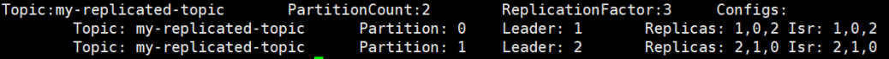

# 消息队列介绍

## 优点

1. 解耦

   （类似Spring的IOC）

   - 允许你独立的扩展或修改两边的处理过程，只要确保它们遵守同样的接口约束。

2. 可恢复性

   - 系统的一部分组件失效时，不会影响到整个系统。消息队列降低了进程间的耦合度，所以即使一个处理消息的进程挂掉，加入队列中的消息仍然可以在系统恢复后被处理。

3. 缓冲

   - 有助于控制和优化数据流经过系统的速度， 解决生产消息和消费消息的处理速度不一致的情况。

4. 灵活性 & 峰值处理能力

   （削峰）

   - 在访问量剧增的情况下，应用仍然需要继续发挥作用，但是这样的突发流量并不常见。如果为以能处理这类峰值访问为标准来投入资源随时待命无疑是巨大的浪费。使用消息队列能够使关键组件顶住突发的访问压力，而不会因为突发的超负荷的请求而完全崩溃。

5. 异步通信

   - 很多时候，用户不想也不需要立即处理消息。消息队列提供了异步处理机制，允许用户把一个消息放入队列，但并不立即处理它。想向队列中放入多少消息就放多少，然后在需要的时候再去处理它们。


## 消息队列的消费模式

### 点对点模式（queue模式）

**一对一，消费者主动拉取数据，消息收到后消息清除**

消息生产者生产消息发送到Queue中，然后消息消费者从Queue中取出并且消费消息。消息被消费以后， queue 中不再有存储，所以消息消费者不可能消费到已经被消费的消息。Queue 支持存在多个消费者，但是对一个消息而言，只会有一个消费者可以消费。

ActiveMq的队列就是使用的这种模式。


### 发布/订阅模式

**一对多，消费者消费数据之后不会清除消息**

消息生产者（发布）将消息发布到 topic 中，同时有多个消息消费者（订阅）消费该消息。和点对点方式不同，发布到 topic 的消息会被所有订阅者消费。

订阅发布模式又分为两种，一种是由客户端主动拉取数据，另一种是由服务端推送数据。

kafka采用的是客户端主动拉取数据的这种方式。


**服务端推送的缺点：**

推送速度由服务端决定，而下游会有多台客户端，且他们的处理速度不一致，如果服务端推送速度过快，而客户端的处理速度比较慢，那么就会导致客户端出现数据积压甚至崩溃；如果服务端推送速度过慢，而客户端的处理速度比较快，那么就会导致客户端的资源浪费。


**客户端主动拉取的缺点：**

客户端需要使用一个长轮询去询问服务端是否有新消息，有可能造成资源浪费，因为哪怕消息队列中没有新消息，客户端也会去询问。


# Kafka介绍

Kafka是最初由Linkedin公司开发，支持分区的（partition）、多副本的（replica），基于zookeeper协 调的分布式消息系统。它的最大的特性就是可以实时的处理大量数据以满足各种需求场景：比如基于hadoop的批处理系 统、低延迟的实时系统、Storm/Spark流式处理引擎，web/nginx日志、访问日志，消息服务等等，用scala语言编写， Linkedin于2010年贡献给了Apache基金会并成为顶级开源 项目。

Kafka采用**发布/订阅模式**的**消息队列**（Message Queue）。

Kafka借鉴了JMS规范的思想，但是确并没有完全遵循JMS规范。

# Kafka的使用场景

日志收集：一个公司可以用Kafka收集各种服务的log，通过kafka以统一接口服务的方式开放给各种 consumer，例如hadoop、Hbase、Solr等。

消息系统：解耦生产者和消费者、缓存消息等。

用户活动跟踪：Kafka经常被用来记录web用户或者app用户的各种活动，如浏览网页、搜索、点击等活动，这 些活动信息被各个服务器发布到kafka的topic中，然后订阅者通过订阅这些topic来做实时的监控分析，或者装载到 hadoop、数据仓库中做离线分析和挖掘。

运营指标：Kafka也经常用来记录运营监控数据。包括收集各种分布式应用的数据，生成各种操作的集中反馈，比如报警和报告。


# 术语解释

| 名称          | 解释                                                         |
| ------------- | ------------------------------------------------------------ |
| Broker        | 消息中间件处理节点（kafka进程），一个Kafka节点就是 一个broker，一个或者多个Broker可以组 成一个Kafka集群。一个 broker可以容纳多个 topic。 |
| Topic         | Kafka根据topic对消息进行归类，发布到 Kafka集群的每条消息都需要指定一个topic。对于每一个Topic，下面可以有多个分区(Partition)日志文件 |
| Producer      | 消息生产者，向Broker发送消息的客户端。                       |
| Consumer      | 消息消费者，从Broker读取消息的客户端。                       |
| ConsumerGroup | 每个Consumer属于一个特定的Consumer Group，消费者组内每个消费者负责消费不同分区的数据，一个分区只能由一个组内消费者消费；消费者组之间互不影响，消费者组是逻辑上的一个订阅者。即一条消息可以被多个不同的 Consumer Group消费，但是一个 Consumer Group中只能有一个Consumer 能够消费该消息。 |
| Partition     | 物理上的概念，为了实现扩展性，一个非常大的 topic 可以分布到多个 broker上，一个 topic 可以分为多个 partition，**每个 partition 是一个有序的队列**。这些队列中的message按顺序添加到一个叫做commit log的文件中。每个partition中的消息都有一个唯一的编号，称之为offset，用来唯一标识某个分区中的message，但是不同的 partition中的message的offset可能是相同的。 |
| Replica       | 副本（Replication），为保证集群中的某个节点发生故障时， 该节点上的 partition 数据不丢失，且 Kafka仍然能够继续工作， Kafka 提供了副本机制，一个 topic 的每个分区都有若干个副本，一个 leader 和若干个 follower。某个主题的副本数指的是某个broker中它的某个分区leader 加上其他broker中这个leader的follwer 的数量。**注意副本数不能超过实例数量。** |
| Leader        | 每个主题多个副本的“主”，生产者发送数据的对象，以及消费者消费数据的对象都是 leader。 |
| Follower      | 每个主题多个副本中的“从”，实时从 leader 中同步数据，保持和 leader 数据的同步。 leader 发生故障时，某个 Follower 会成为新的 leader。 |
| ISR           | 和 leader 保持同步的副本（含leader）集合。                   |
| Controller    | Kafka核心总控制器。在Kafka集群中会有一个或者多个broker，其中有一个broker会被选举为控制器（Kafka Controller），它负责管理整个 集群中所有分区和副本的状态。1、当某个分区的leader副本出现故障时，由控制器负责为该分区选举新的leader副本。2、当检测到某个分区的ISR集合发生变化时，由控制器负责通知所有broker更新其元数据信息。3、当使用kafka-topics.sh脚本为某个topic增加分区数量时，同样还是由控制器负责分区的重新分配。 |
| offset        | <br />一般情况下按照顺序逐条消费commit log中的消息，当然可以通过指定offset来重复消费某些消息， 或者跳过某些消息。<br /><br />consumer启动时会获取一次offset，而后在自己的内存中进行维护。<br /><br />Kafka 0.9 版本之前，consumer 默认将 offset 保存在 Zookeeper 中，从 0.9 版本开始， consumer 默认将 offset 保存在 Kafka 一个内置的 topic 中，该 topic 为__consumer_offsets。 |


# Kafka架构

## 服务端架构


## 客户端架构


# 工作流程

服务端(brokers)和客户端(producer、consumer)之间通信通过TCP协议来完成。


**消费者组的作用**

提高消费能力。例如：上图中第一个组里有A 和 B 两个消费者，A处理TopicA的Partition 0分区，而TopicA的 Partition1由B处理。如果只有消费者A，没有消费组，那么TopicA的 Partition0和Partition1都会由消费者A处理。

一般来说，消费者数和同一个主题的分区数相等时是最好的。


**zk**

存储kafka集群信息。只要多个kafka进程连的是同一个zk集群，那么他们就可以构建成一个集群。

0.9版本之前，zk中记录了每个消费者关闭时的消息偏移量（消费到了那条记录），这样消费者一旦重启就可以继续消费。

0.9版本之后（包括0.9），消费者关闭时的消息偏移量存储在了kafka中（kafka会创建Topic用来保存这些偏移量）。


kafka数据存储在磁盘中，默认保存7天。


# Kafka部署

Kafka官方下载地址：http://kafka.apache.org/downloads

包名说明：以 kafka_2.12-2.8.0.tgz 为例，2.12指的是Scala版本，2.8.0是kafka版本。

## 目录介绍

- bin

  kafka-topics.sh：操作主题

  kafka-consumer-perf-test.sh：消费者基准测试

  kafka-producer-perf-test：生产者基准测试

  kafka-console-producer.sh：kafka提供的用于测试的生产者

  kafka-console-consumer.sh：kafka提供的用于测试的消费者者

- config

  server.properties：kafka配置文件

  consumer.properties：kafka消费者的配置文件，用于kafka-consumer-perf-test.sh脚本执行的配置文件

  producer.properties：kafka生产者的配置文件，用于 kafka-console-producer.sh 脚本执行的配置文件

server.properties文件中的 log.dirs 指定了kafka数据的存储路径，主题数据就是存储在这个目录下。主题的存储格式是：主题名-分区号。（注意副本也是存储在这个目录下，且格式一致。）

日志文件目录（logs）中的 server.log 就是kafka的程序运行日志。

## 配置文件解析

https://kafka.apache.org/11/documentation.html#brokerconfigs

```properties
#broker 的全局唯一编号，不能重复
broker.id=0

# 这两个配置默认被注释。他们都可以用来配置kafka实例运行地址。默认端口是9092。区别是listeners只支持内网，advertised.listeners支持内外网区分。例如：1、在公司搭建的 kafka 集群，只有内网中的服务可以用，这种情况下，只需要用 listeners 就行。2、在 docker 中或者 在类似阿里云主机上部署 kafka 集群，这种情况下是 需要用到 advertised_listeners。
listeners=PLAINTEXT://192.168.136.151:9092
advertised.listeners=PLAINTEXT://192.168.136.151:9092

#删除 topic 功能使能
delete.topic.enable=true
#处理网络请求的线程数量
num.network.threads=3
#用来处理磁盘 IO 的现成数量
num.io.threads=8
#发送套接字的缓冲区大小
socket.send.buffer.bytes=102400
#接收套接字的缓冲区大小
socket.receive.buffer.bytes=102400
#请求套接字的缓冲区大小
socket.request.max.bytes=104857600
#kafka 数据存储路径。kafka程序的运行日志文件存储在logs目录下
log.dirs=/usr/local/kafka_2.12-2.8.0/kafka-logs
#topic 在当前 broker 上的分区个数
num.partitions=1
#用来恢复和清理 data 下数据的线程数量
num.recovery.threads.per.data.dir=1
#segment 文件保留的最长时间，超时将被删除
log.retention.hours=168
#配置连接 Zookeeper 集群地址，默认为localhost:2181
zookeeper.connect=hadoop102:2181,hadoop103:2181,hadoop104:2181
```


## 安装

注意要使用kafka需要先启动zk

Kafka部署以要部署三台机子为例，下面展示一台机子的部署过程，其他机子都是照抄：

1、上传并解压安装包

```sh
#上传压缩包到该目录 /usr/local
tar -zxvf kafka_2.12-2.8.0.tgz
```

2、修改配置文件 kafka_2.12-2.8.0/config/server.properties

```sh
vim kafka_2.12-2.8.0/config/server.properties

# 1、修改broker.id分别为0，1，2
# 2、修改log.dirs为/usr/local/kafka_2.12-2.8.0/kafka-logs，如果是单机伪集群的部署方式，那么可以指向各自的kafka家目录。
# 3、配置zookeeper.connect。
# 4、如果是单机伪集群的部署方式，那么需要配置 listeners 为PLAINTEXT://192.168.136.151:9092、PLAINTEXT://192.168.136.151:9093、=PLAINTEXT://192.168.136.151:9094
```


## 启动

1、启动zk。

2、启动kafka

```sh
# 方式一
kafka-server-start.sh [-daemon] server.properties

# 方式二
nohup kafka_2.12-2.8.0/bin/kafka-server-start.sh kafka_2.12-2.8.0/config/server.properties &
```

server.properties的配置路径是一个强制的参数，­daemon表示以后台进程运行。


## 停止

```sh
kafka_2.12-2.8.0/bin/kafka-server-stop.sh
```


# Kafka常用命令

以下所有的命令都有一些附加的选项；当我们不携带任何参数运行命令的时候，将会显示出这个命令的详细用法。

## C

**创建 topic**

```sh
kafka_2.12-2.8.0/bin/kafka-topics.sh --zookeeper localhost:2181 --create --replication-factor 2 -partitions 3 --topic first

# 或者
kafka_2.12-2.8.0/bin/kafka-topics.sh --bootstrap-server localhost:9092 --create --replication-factor 2 -partitions 3 --topic first
```


--zookeeper 指定zk地址

--topic 定义 topic 名

--replication-factor 定义副本数 

--partitions 定义分区数


除了通过手工的方式创建Topic，当producer发布一个消息到某个指定的Topic，这个Topic如果不存在，就会自动创建。


**发送消息**

```sh
kafka_2.12-2.8.0/bin/kafka-console-producer.sh --broker-list localhost:9092 --topic first
```

上面这条命令执行后会出现交互命令行，用来发送消息。

--broker-list： kafka broker列表


## R

**查看当前服务器中的所有 topic**

```sh
kafka_2.12-2.8.0/bin/kafka-topics.sh --bootstrap-server localhost:9092 --list

# 或者
kafka_2.12-2.8.0/bin/kafka-topics.sh --zookeeper localhost:2181 --list
```

--zookeeper 指定zk地址

--bootstrap-server 指定kafka服务端地址


**查看某个 Topic 的详情**

```sh
kafka_2.12-2.8.0/bin/kafka-topics.sh --zookeeper localhost:2181 --describe --topic first
```



- leader节点负责给定partition的所有读写请求。
- replicas 表示某个partition在哪几个broker上存在备份。不管这个几点是不是”leader“，甚至这个节点挂了，也会列出。 
- isr 是replicas的一个子集，它只列出当前还存活着的，并且已同步备份了对应分区的leader数据的节点。isr中含leader节点。


**消费消息**

```sh
# 该指令只适用于0.9之前的版本（不含0.9）
kafka_2.12-2.8.0/bin/kafka-console-consumer.sh --zookeeper localhost:2181 --topic first

# 或者
kafka_2.12-2.8.0/bin/kafka-console-consumer.sh --bootstrap-server localhost:9092 --topic first

# 获取某个主题下的所有消息(包括历史消息)。
kafka_2.12-2.8.0/bin/kafka-console-consumer.sh --bootstrap-server localhost:9092 --from-beginning --topic first
```

--from-beginning：会把主题中以往所有的数据都读取出来。


**查看组名**

```sh
bin/kafka‐consumer‐groups.sh ‐‐bootstrap‐server 192.168.0.60:9092 ‐‐list
```


**查看消费者的消费偏移量**

```sh
bin/kafka‐consumer‐groups.sh ‐‐bootstrap‐server 192.168.0.60:9092 ‐‐describe ‐‐group testGroup
```

通过这个可以查看消费者的消费偏移量。

current-offset、log-end-offset 和 lag ，分别表示当前消费偏移量，结束的偏移量(HW)，落后消费的消息数。


**消费多主题**

```sh
bin/kafka‐console‐consumer.sh ‐‐bootstrap‐server 192.168.0.60:9092 ‐‐whitelist "test|test‐2"
```


**单播消费**

一条消息只能被某一个消费者消费的模式，类似queue模式，只需让所有消费者在同一个消费组里即可 分别在两个客户端执行如下消费命令，然后往主题里发送消息，结果只有一个客户端能收到消息

```sh
bin/kafka‐console‐consumer.sh ‐‐bootstrap‐server 192.168.0.60:9092 ‐-consumer‐property group.id=testGroup ‐‐topic test
```

‐-consumer‐property group.id=testGroup 指定消费者组。


**多播消费**

一条消息能被多个消费者消费的模式，类似publish-subscribe模式费，针对Kafka同一条消息只能被同一个消费组下的某一个消 费者消费的特性，要实现多播只要保证这些消费者属于不同的消费组即可。我们再增加一个消费者，该消费者属于testGroup-2消费 组，结果两个客户端都能收到消息。

```sh
bin/kafka‐console‐consumer.sh ‐‐bootstrap‐server 192.168.0.60:9092 ‐-consumer‐property group.id=testGroup ‐‐topic test

bin/kafka‐console‐consumer.sh ‐‐bootstrap‐server 192.168.0.60:9092 ‐‐consumer‐property group.id=testGroup‐2 ‐‐topic test
```


## U

**添加分区(目前kafka不支持减少分区)**

```sh
kafka_2.12-2.8.0/bin/kafka-topics.sh --zookeeper
localhost:2181 --alter --topic first --partitions 6
```


## D

**删除 topic**

```sh
kafka_2.12-2.8.0/bin/kafka-topics.sh --zookeeper localhost:2181 --delete --topic first
```

需要 server.properties 中设置 delete.topic.enable=true 否则只是标记删除。


## maven坐标

```xml
<!--kafka客户端-->
<dependency>
    <groupId>org.apache.kafka</groupId>
    <artifactId>kafka-clients</artifactId>
    <version>2.8.0</version>
</dependency>

<!--对接log4j2日志框架-->
<dependency>
    <groupId>org.apache.logging.log4j</groupId>
    <artifactId>log4j-slf4j-impl</artifactId>
    <version>2.11.1</version>
</dependency>
```


# API 使用

## 生产者和消费者配置项

### 生产者配置

https://kafka.apache.org/11/documentation.html#producerconfigs

| 配置项                                       | 描述                                                         | 默认值                                    |
| -------------------------------------------- | ------------------------------------------------------------ | ----------------------------------------- |
| ProducerConfig.BOOTSTRAP_SERVERS_CONFIG      | 配置brocker地址，如果是集群最好配置多个机器的地址，因为如果只配置了一个broker而它又宕机了，那么就连无法连上kafka集群。多个broker地址以逗号分隔。 |                                           |
| ProducerConfig.ACKS_CONFIG                   | 配置生产者的应答机制。                                       | 1                                         |
| ProducerConfig.RETRIES_CONFIG                | 失败重试次数，重试能保证消息发送的可靠性，但是也可能造成消息重复发送，比如网络抖动，所以需要在接收者那 边做好消息接收的幂等性处理 | 0                                         |
| ProducerConfig.RETRY_BACKOFF_MS_CONFIG       | 失败重试间隔                                                 | 100ms                                     |
| ProducerConfig.BUFFER_MEMORY_CONFIG          | 设置本地缓冲区，如果设置了该缓冲区，消息会先发送到本地缓冲区，可以提高消息发送性能。 | 33554432byte，即32MB                      |
| ProducerConfig.BATCH_SIZE_CONFIG             | 设置批量发送消息的大小。kafka本地线程会从缓冲区取数据，批量发送到broker | 16384byte，即16kb                         |
| ProducerConfig.LINGER_MS_CONFIG              | 设置消息发送最大延迟。一般设置100毫秒左右。即如果100毫秒内，某个batch不满足设定的批量发送大小，那么这个batch也会被发送出去。 | 0，即消息必须立即被发送，但这样会影响性能 |
| ProducerConfig.VALUE_SERIALIZER_CLASS_CONFIG | 把发送的key从指定类型序列化为字节数组                        |                                           |
| ProducerConfig.VALUE_SERIALIZER_CLASS_CONFIG | 把发送消息value从指定类型序列化为字节数组                    |                                           |


### 消费者配置

https://kafka.apache.org/11/documentation.html#consumerconfigs

| 配置项                                         | 描述                                                         | 默认值       |
| ---------------------------------------------- | ------------------------------------------------------------ | ------------ |
| ConsumerConfig.BOOTSTRAP_SERVERS_CONFIG        | 配置brocker地址，如果是集群最好配置多个机器的地址，因为如果只配置了一个broker而它又宕机了，那么就连无法连上kafka集群。多个broker地址以逗号分隔。 |              |
| ConsumerConfig.GROUP_ID_CONFIG                 | 设置消费者组                                                 |              |
| ConsumerConfig.ENABLE_AUTO_COMMIT_CONFIG       | 设置是否自动提交offset                                       | true         |
| ConsumerConfig.AUTO_OFFSET_RESET_CONFIG        | 重置offset，可选值：[latest, earliest, none]                 | latest       |
| ConsumerConfig.AUTO_COMMIT_INTERVAL_MS_CONFIG  | 自动提交offset的间隔时间                                     | 60 * 1000 ms |
| ConsumerConfig.HEARTBEAT_INTERVAL_MS_CONFIG    | 心跳间隔时间，服务端broker通过心跳确认consumer是否故障，如果发现故障，就会通过心跳下发 **rebalance** 的指令给其他的consumer通知他们进行rebalance操作，这个时间可以稍微短一点。 | 3000ms       |
| ConsumerConfig.SESSION_TIMEOUT_MS_CONFIG       | 设置服务端broker多久感知不到一个consumer心跳就认为他故障了。 | 10s          |
| ConsumerConfig.MAX_POLL_INTERVAL_MS_CONFIG     | 如果两次poll操作间隔超过了这个时间，broker就会认为这个consumer处理能力太弱， 会将其踢出消费组，将分区分配给别的consumer消费。 | 300000ms     |
| ConsumerConfig.KEY_DESERIALIZER_CLASS_CONFIG   | 把发送的key从指定类型序列化为字节数组                        |              |
| ConsumerConfig.VALUE_DESERIALIZER_CLASS_CONFIG | 把发送消息value从指定类型序列化为字节数组                    |              |


## ProducerRecord

```java
// 指定发送分区
public ProducerRecord(String topic, Integer partition, K key, V value) {
    this(topic, partition, null, key, value, null);
}

// 未指定发送分区，具体发送的分区计算公式：hash(key)%partitionNum
public ProducerRecord(String topic, K key, V value) {
    this(topic, null, null, key, value, null);
}

// 未指定发送分区
public ProducerRecord(String topic, V value) {
    this(topic, null, null, null, value, null);
}
```


## Producer

```java
// 带回调的异步发送
public Future<RecordMetadata> send(ProducerRecord<K, V> record, Callback callback);

// 不带回调异步发送
public Future<RecordMetadata> send(ProducerRecord<K, V> record) {
    return send(record, null);
}

// 同步发送可以借助 Future.get() 实现，还可以使用 CountDownLatch 等方式来实现。
```


### 同步方式生产消息

同步发送的意思就是，一条消息发送之后，会阻塞当前线程，直至返回 ack。 由于 send 方法返回的是一个 Future 对象，根据 Futrue 对象的特点，我们也可以实现同 步发送的效果，只需在调用 Future 对象的 get 方发即可。

```java
import org.apache.kafka.clients.producer.KafkaProducer;
import org.apache.kafka.clients.producer.ProducerRecord;
import org.apache.kafka.clients.producer.RecordMetadata;
import org.slf4j.Logger;
import org.slf4j.LoggerFactory;

import java.util.Properties;
import java.util.concurrent.ExecutionException;
import java.util.concurrent.Future;

/**
 * 生产100个消息，消息内容为1-100（不含100）
 */
public class ProductDemo {

    private static final Logger logger = LoggerFactory.getLogger(ProductDemo.class);

    public static void main(String[] args) throws ExecutionException, InterruptedException {

        KafkaProducer<String, String> kafkaProducer = null;
        try {
            // 1、创建用于连接kafka的配置。
            Properties props = new Properties();
            // 指定kafka集群地址
            props.put("bootstrap.servers", "192.168.136.151:9092");
            // 指定acks模式，acks可取值1（默认值，消息写入leader后就返回应答，不等待副本同步。），0（不考虑任何的应答，即不考虑消息是否丢失），all（保证消息不丢失，其实就是当消息同步到主题分区的ISR副本中之后再返回值给生产者。）
            props.put("acks", "all");
            props.put("key.serializer", "org.apache.kafka.common.serialization.StringSerializer");
            props.put("value.serializer", "org.apache.kafka.common.serialization.StringSerializer");
             
            // 以下都有默认配置，可不配
            // 重试次数
             props.put("retries", 1);
             // 设置批次大小，单位：字节
             props.put("batch.size", 16384);
             // 等待时间
             props.put("linger.ms", 1);
             // 设置 RecordAccumulator 缓冲区大小，单位：字节
             props.put("buffer.memory", 33554432);

            // 2、创建生产者
            kafkaProducer = new KafkaProducer<String, String>(props);

            // 3、发送消息
            for (int i = 0; i < 100; i++) {
                // 构建消息，注意消息的泛型要和生产者定义的泛型一致。
                ProducerRecord<String, String> producerRecord = new ProducerRecord<String, String>("first", null, String.valueOf(i));
                Future<RecordMetadata> res = kafkaProducer.send(producerRecord);

                // 阻塞，等待服务端的返回消息, send使用独立的线程
                RecordMetadata recordMetadata = res.get();
                logger.info("{} 写入成功", i);
            }
        } finally {
            // 4、关闭生产者
            if (kafkaProducer != null)
                kafkaProducer.close();
        }
    }
}
```


### 异步带回调方式生产消息

回调函数会在 producer 收到 ack 时调用，为异步调用，该方法有两个参数，分别是 RecordMetadata 和 Exception，如果 Exception 为 null，说明消息发送成功，如果 Exception 不为 null，说明消息发送失败。

注意：消息发送失败会自动重试，不需要我们在回调函数中手动重试。

```java
package com.example.demo;

import org.apache.kafka.clients.producer.KafkaProducer;
import org.apache.kafka.clients.producer.ProducerRecord;
import org.apache.kafka.clients.producer.RecordMetadata;
import org.slf4j.Logger;
import org.slf4j.LoggerFactory;

import java.util.Properties;
import java.util.concurrent.ExecutionException;

public class ProductDemo2 {

    private static final Logger logger = LoggerFactory.getLogger(ProductDemo2.class);

    public static void main(String[] args) throws ExecutionException, InterruptedException {

        KafkaProducer<String, String> kafkaProducer = null;
        try {
            // 1、创建用于连接kafka的配置。
            Properties props = new Properties();
            // 指定kafka集群地址
            props.put(ProducerConfig.BOOTSTRAP_SERVERS_CONFIG, "192.168.136.151:9092");
            // 指定acks模式，acks可取值1（默认值），0（不考虑消息是否丢失），all（保证消息不丢失，其实就是当消息同步到主题分区的副本中之后再返回值给生产者。）
            props.put("acks", "all");
            props.put("key.serializer", "org.apache.kafka.common.serialization.StringSerializer");
            props.put("value.serializer", "org.apache.kafka.common.serialization.StringSerializer");

            // 2、创建生产者
            kafkaProducer = new KafkaProducer<String, String>(props);

            // 3、发送消息
            for (int i = 0; i < 100; i++) {
                // 构建消息，注意消息的泛型要和生产者定义的泛型一致。
                ProducerRecord<String, String> producerRecord = new ProducerRecord<String, String>("test", null, String.valueOf(i));
                kafkaProducer.send(producerRecord, (RecordMetadata metadata, Exception e)->{
                    // 回调函数，该方法会在 Producer 收到 ack 时调用，为异步调用
                    // 写入kafka成功返回的是RecordMetadata，写入kafka失败返回的是Exception
                    // 如果异常为null，则代表发送成功。
                    // 注意：消息发送失败会自动重试，不需要我们在回调函数中手动重试。
                    if (e == null) {
                        String topic = metadata.topic();
                        long offset = metadata.offset();
                        int partition = metadata.partition();
                        logger.info("topic: {}, offset: {}, partition: {}", topic, offset, partition);
                        return;
                    }
                    logger.error("生产消息失败，出现异常");
                });
            }
        } finally {
            // 4、关闭生产者
            if (kafkaProducer != null)
                kafkaProducer.close();
        }
    }
}
```


## Consumer

### 订阅主题

```java
// 指定主题
public void subscribe(Collection<String> topics);

// 指定主题并设置监听事件
public void subscribe(Collection<String> topics, ConsumerRebalanceListener listener);
```


### 设置offset

```java
//将指定分区partition的offset重置到offset
void seek(TopicPartition partition, long offset);

//将指定分区partition的offset重置到offset,并带有一些自定义的字符串元数据信息metadata
void seek(TopicPartition partition, OffsetAndMetadata offsetAndMetadata);

//将多个分区partitions的offset重置到分区开头
void seekToBeginning(Collection<TopicPartition> partitions);

//将多个分区partitions的offset重置到分区末尾
void seekToEnd(Collection<TopicPartition> partitions);
```


### 获取offset

```java
//获取多个分区的分区开始位移
Map<TopicPartition, Long> beginningOffsets(Collection<TopicPartition> partitions);

//在指定时间内获取多个分区的分区开始位移
Map<TopicPartition, Long> beginningOffsets(Collection<TopicPartition> partitions, Duration timeout);

//获取多个分区的分区末尾位移
Map<TopicPartition, Long> endOffsets(Collection<TopicPartition> partitions);

//在指定时间内获取多个分区的分区末尾位移
Map<TopicPartition, Long> endOffsets(Collection<TopicPartition> partitions, Duration timeout);

//根据时间戳获取指定时间戳之后的消息位移
Map<TopicPartition, OffsetAndTimestamp> offsetsForTimes(Map<TopicPartition, Long> timestampsToSearch);

//指定时间内根据时间戳获取指定时间戳之后的消息位移
Map<TopicPartition, OffsetAndTimestamp> offsetsForTimes(Map<TopicPartition, Long> timestampsToSearch, Duration timeout);
```


### 消费指定分区

```java
// 消费topicName的0分区
consumer.assign(Arrays.asList(new TopicPartition(topicName, 0)));
```


### 分区从头消费

从分区的offset为0处开始消费。（从头消费分区）

```java
// topicName的0分区从头消费
consumer.assign(Arrays.asList(new TopicPartition(topicName, 0)));
consumer.seekToBeginning(Arrays.asList(new TopicPartition(topicName, 0)));
```


### 指定offset消费

```java
// topicName的0分区从offset为10处开始消费。
consumer.seek(new TopicPartition(topicName, 0), 10);
```


### 从指定时间开始消费

```java
// 从半小时前开始消费
Map<TopicPartition, Long> map = new HashMap<>();
List<PartitionInfo> topicPartitions = kafkaConsumer.partitionsFor("first");
long time = new Date().getTime() - 1000 * 60 * 30;
topicPartitions.forEach(partitionInfo -> {
    map.put(new TopicPartition("first", partitionInfo.partition()), time);
});
Map<TopicPartition, OffsetAndTimestamp> parMap = kafkaConsumer.offsetsForTimes(map);
parMap.forEach((k, v)->{
    long offset = v.offset();
    System.out.println("partition: "+ k.partition() + ", offset: "+ offset);
    if (v != null) {
        //没有这行代码会导致下面的报错信息
        kafkaConsumer.assign(Arrays.asList(k));
        kafkaConsumer.seek(k, offset);
    }
});
```


### 例子

```java
//  1、创建用于连接kafka的配置。
Properties props = new Properties();
props.put("bootstrap.servers", "192.168.136.151:9092");
// 配置消费者组，将若干个消费者组织到一起，，共同消费kafka中的topic数据。
props.put("group.id", "test");
// 开启自动提交
props.put(ConsumerConfig.ENABLE_AUTO_COMMIT_CONFIG, "true");
// 配置自动提交的时间间隔
props.put("auto.commit.interval.ms", "1000");

props.put("key.deserializer", "org.apache.kafka.common.serialization.StringDeserializer");
props.put("value.deserializer", "org.apache.kafka.common.serialization.StringDeserializer");

// 2、创建Kafka消费者
KafkaConsumer<String, String> kafkaConsumer = new KafkaConsumer<String, String>(props);


// 3
String topicName = "first";

// 指定要消费的主题，分区自动分配。
//kafkaConsumer.subscribe(Arrays.asList("first"));

// 消费topicName的0分区
//consumer.assign(Arrays.asList(new TopicPartition(topicName, 0)));

// topicName的0分区从头消费
//consumer.assign(Arrays.asList(new TopicPartition(topicName, 0)));
//consumer.seekToBeginning(Arrays.asList(new TopicPartition(topicName, 0)));

// topicName的0分区从offset为10处开始消费。
consumer.seek(new TopicPartition(topicName, 0), 10);

// 从半小时前开始消费
//        Map<TopicPartition, Long> map = new HashMap<>();
//        List<PartitionInfo> topicPartitions = kafkaConsumer.partitionsFor("first");
//        long time = new Date().getTime() - 1000 * 60 * 30;
//        topicPartitions.forEach(partitionInfo -> {
//            map.put(new TopicPartition("first", partitionInfo.partition()), time);
//        });
//        Map<TopicPartition, OffsetAndTimestamp> parMap = kafkaConsumer.offsetsForTimes(map);
//        parMap.forEach((k, v)->{
//            long offset = v.offset();
//            System.out.println("partition: "+ k.partition() + ", offset: "+ offset);
//            if (v != null) {
//                //没有这行代码会导致下面的报错信息
//                kafkaConsumer.assign(Arrays.asList(k));
//                kafkaConsumer.seek(k, offset);
//            }
//        });

// 4、拉取数据
while(true) {
    ConsumerRecords<String, String> records = kafkaConsumer.poll(Duration.ofSeconds(5));

    records.forEach(record->{
        // 获取主题
        String topic = record.topic();

        // 获取offset, 这条消息处于kafka分区中的哪个位置
        long offset = record.offset();

        // 获取key 和 value
        String key = record.key();
        String value = record.value();

        logger.info("topic: {}, offset: {}, key: {}, value: {}", topic, offset, key, value);
    });
}
```


### 自动提交offset

Kafka 提供了自动提交 offset 的功能。

自动提交 offset 的相关参数：

- enable.auto.commit：是否开启自动提交 offset 功能。
- auto.commit.interval.ms：自动提交 offset 的时间间隔。

```java
import org.apache.kafka.clients.consumer.ConsumerRecords;
import org.apache.kafka.clients.consumer.KafkaConsumer;
import org.slf4j.Logger;
import org.slf4j.LoggerFactory;

import java.time.Duration;
import java.util.Arrays;
import java.util.Properties;

public class ConsumerDemo {

    private static final Logger logger = LoggerFactory.getLogger(ConsumerDemo.class);

    public static void main(String[] args) {
        //  1、创建用于连接kafka的配置。
        Properties props = new Properties();
        props.put("bootstrap.servers", "192.168.136.151:9092");
        // 配置消费者组，将若干个消费者组织到一起，，共同消费kafka中的topic数据。
        props.put("group.id", "test");
        // 开启自动提交
        props.put(ConsumerConfig.ENABLE_AUTO_COMMIT_CONFIG, "true");
        // 配置自动提交的时间间隔
        props.put("auto.commit.interval.ms", "1000");

        props.put("key.deserializer", "org.apache.kafka.common.serialization.StringDeserializer");
        props.put("value.deserializer", "org.apache.kafka.common.serialization.StringDeserializer");

        // 2、创建Kafka消费者
        KafkaConsumer<String, String> kafkaConsumer = new KafkaConsumer<String, String>(props);

        // 3、订阅要消费的主题
        kafkaConsumer.subscribe(Arrays.asList("first"));

        // 4、拉取数据
        while(true) {
            ConsumerRecords<String, String> records = kafkaConsumer.poll(Duration.ofSeconds(5));

            records.forEach(record->{
                // 获取主题
                String topic = record.topic();

                // 获取offset, 这条消息处于kafka分区中的哪个位置
                long offset = record.offset();

                // 获取key 和 value
                String key = record.key();
                String value = record.value();

                logger.info("topic: {}, offset: {}, key: {}, value: {}", topic, offset, key, value);
            });
        }
    }
}
```


### 手动提交

虽然自动提交 offset 十分简介便利，但由于其是基于时间提交的，开发人员难以把握 offset 提交的时机。因此 Kafka 还提供了手动提交 offset 的 API。

手动提交 offset 的方法有两种：分别是 commitSync（同步提交）和 commitAsync（异步 提交）。两者的相同点是，都会将本次 poll 的一批数据最高的偏移量提交；不同点是， commitSync 阻塞当前线程，一直到提交成功，并且会自动失败重试（由不可控因素导致， 也会出现提交失败）；而 commitAsync 则没有失败重试机制。


#### 同步提交 offset

关闭自动提交，使用 commitSync 方法提交offset。

```java
//  1、创建用于连接kafka的配置。
Properties props = new Properties();
props.put("bootstrap.servers", "192.168.136.151:9092");
// 配置消费者组，将若干个消费者组织到一起，，共同消费kafka中的topic数据。
props.put("group.id", "test");
// 关闭自动提交
props.put(ConsumerConfig.ENABLE_AUTO_COMMIT_CONFIG, "false");
props.put("key.deserializer", "org.apache.kafka.common.serialization.StringDeserializer");
props.put("value.deserializer", "org.apache.kafka.common.serialization.StringDeserializer");

// 2、创建Kafka消费者
KafkaConsumer<String, String> kafkaConsumer = new KafkaConsumer<>(props);

// 3、订阅要消费的主题
kafkaConsumer.subscribe(Arrays.asList("first"));

// 4、拉取数据
while(true) {
    ConsumerRecords<String, String> records = kafkaConsumer.poll(Duration.ofSeconds(5));

    records.forEach(record->{
        // 获取主题
        String topic = record.topic();

        // 获取offset, 这条消息处于kafka分区中的哪个位置
        long offset = record.offset();

        // 获取key 和 value
        String key = record.key();
        String value = record.value();

        logger.info("topic: {}, offset: {}, key: {}, value: {}", topic, offset, key, value);
    });

    // 同步提交，当前线程会被阻塞。
    kafkaConsumer.commitSync();
}
```


#### 异步提交 offset

关闭自动提交，使用 commitAsync 方法提交offset。

```java
//  1、创建用于连接kafka的配置。
Properties props = new Properties();
props.put("bootstrap.servers", "192.168.136.151:9092");
// 配置消费者组，将若干个消费者组织到一起，，共同消费kafka中的topic数据。
props.put("group.id", "test");
// 关闭自动提交
props.put(ConsumerConfig.ENABLE_AUTO_COMMIT_CONFIG, "false");
props.put("key.deserializer", "org.apache.kafka.common.serialization.StringDeserializer");
props.put("value.deserializer", "org.apache.kafka.common.serialization.StringDeserializer");

// 2、创建Kafka消费者
KafkaConsumer<String, String> kafkaConsumer = new KafkaConsumer<>(props);

// 3、订阅要消费的主题
kafkaConsumer.subscribe(Arrays.asList("first"));

// 4、拉取数据
while(true) {
    ConsumerRecords<String, String> records = kafkaConsumer.poll(Duration.ofSeconds(5));

    records.forEach(record->{
        // 获取主题
        String topic = record.topic();

        // 获取offset, 这条消息处于kafka分区中的哪个位置
        long offset = record.offset();

        // 获取key 和 value
        String key = record.key();
        String value = record.value();

        logger.info("topic: {}, offset: {}, key: {}, value: {}", topic, offset, key, value);
    });

    // 异步提交
    kafkaConsumer.commitAsync(new OffsetCommitCallback() {
        @Override
        public void onComplete(Map<TopicPartition,
                                OffsetAndMetadata> offsets, Exception exception) {
            if (exception != null) {
                System.err.println("Commit failed for" +
                        offsets);
            }
        }
    });
}
```


重新消费一个主题

消费者换组并配置ConsumerConfig.AUTO_OFFSET_RESET_CONFIG为earliest


offset保存与读取问题

consumer启动时会获取一次offset，而后在自己的内存中进行维护。


## 自定义 Interceptor

Producer 拦截器(interceptor)是在 Kafka 0.10 版本被引入的，主要用于实现 clients 端的定 制化控制逻辑。

对于 producer 而言，interceptor 使得用户在消息发送前以及 producer 回调逻辑前有机会 对消息做一些定制化需求，比如修改消息等。同时，producer 允许用户指定多个 interceptor 按序作用于同一条消息从而形成一个拦截链(interceptor chain)。Intercetpor 的实现接口是 org.apache.kafka.clients.producer.ProducerInterceptor，其定义的方法包括：

- configure(configs)：获取配置信息和初始化数据时调用。
- onSend(ProducerRecord)：该方法封装进 KafkaProducer.send 方法中，即它运行在用户主线程中。Producer 确保在消息被序列化以及计算分区前调用该方法。用户可以在该方法中对消息做任何操作，但最好保证不要修改消息所属的 topic 和分区，否则会影响目标分区的计算。
- onAcknowledgement(RecordMetadata, Exception)：该方法会在消息从 RecordAccumulator 成功发送到 Kafka Broker 之后，或者在发送过程中失败时调用。并且通常都是在 producer 回调逻辑触发之前。onAcknowledgement 运行在 producer 的 IO 线程中，因此不要在该方法中放入很重的逻辑，否则会拖慢 producer 的消息 发送效率。
- close：关闭 interceptor，主要用于执行一些资源清理工作。

interceptor 可能被运行在多个线程中，因此在具体实现时用户需要自行确保 线程安全。另外倘若指定了多个 interceptor，则 producer 将按照指定顺序调用它们，并且每个 interceptor 可能抛出的异常记录会捕获到错误日志中而非向上传递。这在使用过程中 要特别留意。


案例

实现一个简单的双 interceptor 组成的拦截链。第一个 interceptor 会在消息发送前将时间 戳信息加到消息 value 的最前部；第二个 interceptor 会在消息发送后更新成功发送消息数或 失败发送消息数。

```java
public class TimeInterceptor implements ProducerInterceptor<String, String> {


    @Override
    public ProducerRecord<String, String> onSend(ProducerRecord<String, String> record) {
        // 创建一个新的 record，把时间戳写入消息体的最前部
        return new ProducerRecord<>(record.topic(),
                record.partition(), record.timestamp(), record.key(),
                System.currentTimeMillis() + "," +
                        record.value());

    }

    @Override
    public void onAcknowledgement(RecordMetadata metadata, Exception exception) {

    }

    @Override
    public void close() {

    }

    @Override
    public void configure(Map<String, ?> configs) {

    }
}
```


```java
public class CounterInterceptor implements ProducerInterceptor<String, String> {

    private volatile AtomicInteger errorCounter = new AtomicInteger(0);
    private volatile AtomicInteger successCounter = new AtomicInteger(0);

    @Override
    public ProducerRecord<String, String> onSend(ProducerRecord<String, String> record) {
        return record;
    }

    @Override
    public void onAcknowledgement(RecordMetadata metadata, Exception exception) {
        // 统计成功和失败的次数
        if (exception == null) {
            successCounter.incrementAndGet();
        } else {
            errorCounter.incrementAndGet();
        }
    }

    @Override
    public void close() {
        // 保存结果
        System.out.println("Successful sent: " + successCounter.get());
        System.out.println("Failed sent: " + errorCounter.get());
    }

    @Override
    public void configure(Map<String, ?> configs) {

    }
}
```


```java
public class TestInterceptor {

    public static void main(String[] args) {
        // 1 设置配置信息
        Properties props = new Properties();
        props.put("bootstrap.servers", "192.168.136.151:9092");
        props.put("acks", "all");
        props.put("retries", 3);
        props.put("batch.size", 16384);
        props.put("linger.ms", 1);
        props.put("buffer.memory", 33554432);
        props.put("key.serializer",
                "org.apache.kafka.common.serialization.StringSerializer");
        props.put("value.serializer",
                "org.apache.kafka.common.serialization.StringSerializer");
        // 2 构建拦截链
        List<String> interceptors = new ArrayList<>();
        interceptors.add("com.example.demo.TimeInterceptor");
        interceptors.add("com.example.demo.CounterInterceptor");
        props.put(ProducerConfig.INTERCEPTOR_CLASSES_CONFIG, interceptors);
        String topic = "first";
        Producer<String, String> producer = new
                KafkaProducer<>(props);
        // 3 发送消息
        for (int i = 0; i < 10; i++) {
            ProducerRecord<String, String> record = new
                    ProducerRecord<>(topic, "message" + i);
            producer.send(record);
        }
        // 4 一定要关闭 producer，这样才会调用 interceptor 的 close 方法
        producer.close();
    }
}
```


# Kafka基准测试

基准测试是一种测量和评估软件性能指标的活动。

Kafka Producer基准测试工具kafka-producer-perf-test 参数介绍：

1. --topic 指定topic
2. --num-records	指定生产数据量（默认5000w）
3. --throughtput	指定吞吐量，用于限流（-1代表不指定）
4. --record-size   指定每条记录的大小（单位size）
5. --producer-props key=value 指定producer配置
6. ack  用于设置生产者生产数据到kafka中时，kafka会以什么样的方式返回，acks可取值1（默认值），0（不考虑消息是否丢失），all（保证消息不丢失，其实就是当消息同步到主题分区的副本中之后再返回值给生产者。）


Kafka Consumer 基准测试工具kafka-consumer-perf-test 参数介绍：

1. --topic 指定topic
2. --threads 指定线程数
3. --messages 指定总共要消费的数据条数
4. --broker-list kafka broker列表
5. --fetch-size 每次拉取的数据大小


## 基于1个分区1个副区的基准测试

测试步骤：

1. 启动kafka集群。
2. 创建具有1个分区1个副区的topic。
3. 同时运行生产者、消费者基准测试程序。

创建topic

```sh
kafka_2.12-2.8.0/bin/kafka-topics.sh --zookeeper localhost:2181 --create --replication-factor 1 -partitions 1 --topic benchmark
```


生产消息基准测试

```sh
kafka_2.12-2.8.0/bin/kafka-producer-perf-test.sh --topic benchmark --num-records 5000000 --throughput -1 --record-size 1000 --producer-props bootstrap.servers=localhost:9092,localhost:9093,localhost:9094 acks=1
```


消费者性能基准测试

```sh
kafka_2.12-2.8.0/bin/kafka-consumer-perf-test.sh --topic test --threads 1 --messages 5000000 --broker-list localhost:9092,localhost:9093,localhost:9094 --fetch-size 1048576
```


# Kafka监控

## Kafka Eagle

### 安装

Kafka Eagle 是通过 JMX 的方式拉取数据。

1、修改 kafka 启动命令

修改 kafka-server-start.sh 命令中

```sh
if [ "x$KAFKA_HEAP_OPTS" = "x" ]; then
 export KAFKA_HEAP_OPTS="-Xmx1G -Xms1G"
fi
```

为

```sh
if [ "x$KAFKA_HEAP_OPTS" = "x" ]; then
 export KAFKA_HEAP_OPTS="-server -Xms2G -Xmx2G -XX:PermSize=128m
-XX:+UseG1GC -XX:MaxGCPauseMillis=200 -XX:ParallelGCThreads=8 -XX:ConcGCThreads=5 -XX:InitiatingHeapOccupancyPercent=70"
 export JMX_PORT="9999"
 #export KAFKA_HEAP_OPTS="-Xmx1G -Xms1G"
fi
```

注意：修改之后在启动 Kafka 之前要分发给其他节点。


2、上传压缩包 kafka-eagle-bin-1.3.7.tar.gz 到集群/opt/software 目录。

3、解压到本地

```sh
tar -zxvf kafka-eagle-bin1.3.7.tar.gz
```


4、进入刚才解压的目录，并将 kafka-eagle-web-1.3.7-bin.tar.gz 解压至/opt/module

```sh
cd kafka-eagle-bin1.3.7
tar -zxvf kafka-eagle-web-1.3.7-bin.tar.gz -C /opt/module/
```


5、给启动文件执行权限

```sh
chmod 777 ke.sh
```


6、修改配置文件

```sh
######################################
# multi zookeeper&kafka cluster list
######################################
kafka.eagle.zk.cluster.alias=cluster1 # 这里支持多个kafka集群，以逗号分隔
cluster1.zk.list=hadoop102:2181,hadoop103:2181,hadoop104:2181
######################################
# kafka offset storage
######################################
cluster1.kafka.eagle.offset.storage=kafka
# cluster1.kafka.eagle.offset.storage=zookeeper # 低版本数据是存在zk里的，所以需要使用这个配置。
######################################
# enable kafka metrics
######################################
kafka.eagle.metrics.charts=true # 开启图表信息功能，否则监控页面上就看不到很多图表信息。
kafka.eagle.sql.fix.error=false
######################################
# kafka jdbc driver address
######################################
# eagle的数据存储在mysql中
kafka.eagle.driver=com.mysql.jdbc.Driver
kafka.eagle.url=jdbc:mysql://hadoop102:3306/ke?useUnicode=true&ch
aracterEncoding=UTF-8&zeroDateTimeBehavior=convertToNull # 如果数据库不存在他会自动创建。
kafka.eagle.username=root
kafka.eagle.password=000000
```


7、添加环境变量

```sh
export KE_HOME=/opt/module/eagle
export PATH=$PATH:$KE_HOME/bin

source /etc/profile
```


.8、启动

```sh
bin/ke.sh start
```


9、登录页面查看监控数据

`ip:8048/ke`

账户：admin

密码：123456


## Kafka-manager

安装及基本使用可参考：https://www.cnblogs.com/dadonggg/p/8205302.html


# Flume 对接 kafka

配置 flume(flume-kafka.conf)

```sh
# define
a1.sources = r1
a1.sinks = k1
a1.channels = c1
# source
a1.sources.r1.type = exec
a1.sources.r1.command = tail -F -c +0 /opt/module/data/flume.log
a1.sources.r1.shell = /bin/bash -c
# sink
a1.sinks.k1.type = org.apache.flume.sink.kafka.KafkaSink
a1.sinks.k1.kafka.bootstrap.servers =
hadoop102:9092,hadoop103:9092,hadoop104:9092
a1.sinks.k1.kafka.topic = first
a1.sinks.k1.kafka.flumeBatchSize = 20
a1.sinks.k1.kafka.producer.acks = 1
a1.sinks.k1.kafka.producer.linger.ms = 1
# channel
a1.channels.c1.type = memory
a1.channels.c1.capacity = 1000
a1.channels.c1.transactionCapacity = 100
# bind
a1.sources.r1.channels = c1
a1.sinks.k1.channel = c1
```


启动 kafka 消费者

 进入 flume 根目录下，启动 flume

```sh
 bin/flume-ng agent -c conf/ -n a1 -f jobs/flume-kafka.conf
```


 向 /opt/module/data/flume.log 里追加数据，查看 kafka 消费者消费情况

```sh
echo hello >> /opt/module/data/flume.log
```


# Spring Boot整合Kafka

引入spring boot kafka依赖

```xml
<dependency>
    <groupId>org.springframework.kafka</groupId>
    <artifactId>spring‐kafka</artifactId>
</dependency>
```


application.yml配置如下：

```yml
server:
  port: 8080

spring:
  kafka:
    bootstrap-servers: 192.168.0.60:9092,192.168.0.60:9093,192.168.0.60:9094
    producer: # 生产者
      retries: 3 # 设置大于0的值，则客户端会将发送失败的记录重新发送
      batch-size: 16384
      buffer-memory: 33554432
      # 指定消息key和消息体的编解码方式
      key-serializer: org.apache.kafka.common.serialization.StringSerializer
      value-serializer: org.apache.kafka.common.serialization.StringSerializer
    consumer:
      group-id: mygroup
      enable-auto-commit: true
```


生产者

```java
import org.springframework.beans.factory.annotation.Autowired;
import org.springframework.kafka.core.KafkaTemplate;
import org.springframework.web.bind.annotation.RequestMapping;
import org.springframework.web.bind.annotation.RestController;

@RestController
public class KafkaController {

    @Autowired
    private KafkaTemplate<String, String> kafkaTemplate;

    @RequestMapping("/send")
    public void send() {
        kafkaTemplate.send("mytopic", 0, "key", "this is a msg");
    }

}
```


消费者

```java
import org.apache.kafka.clients.consumer.ConsumerRecord;
import org.springframework.kafka.annotation.KafkaListener;
import org.springframework.stereotype.Component;

@Component
public class MyConsumer {

    /**
     * @KafkaListener(groupId = "testGroup", topicPartitions = {
     *             @TopicPartition(topic = "topic1", partitions = {"0", "1"}),
     *             @TopicPartition(topic = "topic2", partitions = "0",
     *                     partitionOffsets = @PartitionOffset(partition = "1", initialOffset = "100"))
     *     },concurrency = "6")
     *
     *  concurrency：指定同组下的启动的消费者个数，也就是并发消费数，但是注意必须小于等于分区总数。
     */
    @KafkaListener(topics = "mytopic",groupId = "zhugeGroup")
    public void listen(ConsumerRecord<String, String> record) {
        String value = record.value();
        System.out.println(value);
        System.out.println(record);
    }
}

```


