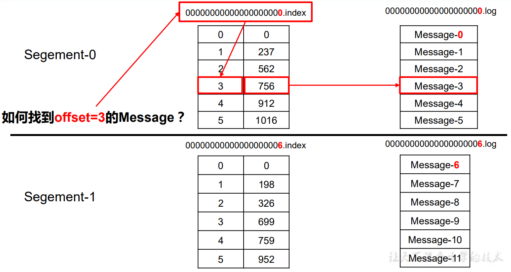

# 日志分段存储

Kafka 一个分区的消息数据对应存储在一个文件夹下，以topic名称+分区号命名，kafka规定了一个分区内的 .log 文件 最大为 1G，做这个限制目的是为了方便把 .log 加载到内存去操作。


segment：消息分段，由.index、.log 和 .timeindex组成，而他们的**文件名代表了当前文件的起始offset**。根据service.properties文件中的 log.segment.bytes （该选项指定了日志文件的大小，默认是1G）配置的值进行分段，即当前分段的.log文件大小达到了log.segment.bytes设定的值，那么就会创建新的分段，也就是新的.index、.log 和 .timeindex 文件。

由于生产者生产的消息会不断追加到 log 文件末尾，为防止 log 文件过大导致数据定位效率低下，Kafka 采取了分片和索引机制，将每个 partition 分为多个 segment。同一分区的所有分段文件都位于同一个文件夹下（即 **topic名称+分区号** 目录下）。例如，first 这个 topic 有三个分区，则其对应的文件夹为 first-0,first-1,first-2。

一个日志段文件满了，就自动开一个新的日志段文件来写入，避免单个文件过大，影响文件的读写性能，这个过程叫做 log rolling，正在被写入的那个日志段文件，叫做 active log segment。

index文件里每条记录的大小是固定的，便于查询，只需把大小和偏移量相乘便知道了当前偏移量所对应的记录，下图为 index 文件和 log 文件的结构示意图。

注意：早期的kafka没有.timeindex文件，只有 .index 和 .log 。

```
# .index是当前分段（以这个例子来说就是 [0, 5367851) 分段）的offset索引文件，kafka生产者客户端往分区发送的消息达到4K(可配置)，kafka就会记录一条当前消息的offset到index文件，即当前文件不会每条消息offset都记录，它只会记录一个批次中的最后一条消息的offset值+1和它对应log文件中的物理偏移地址，也就是说记录的是offset段。
# 如果要定位消息的offset会先在这个文件里快速定位到对应offset区间的起始值，再去log文件里找具体消息
00000000000000000000.index
# 消息存储文件，主要存offset和消息体
00000000000000000000.log
# .timeindex是当前分段的消息发送时间索引文件，kafka生产者客户端往分区发送的消息达到4K(可配置), kafka就会记录一条当前消息的发送时间戳与对应的offset到timeindex文件，记录方式与.index一样，记录一个批次中的最后一条消息的offset值与时间戳，即记录分段时间与offset。
# 如果需要按照时间来定位消息的offset，会先在这个文件里查找
00000000000000000000.timeindex

00000000000005367851.index
00000000000005367851.log
00000000000005367851.timeindex

00000000000009936472.index
00000000000009936472.log
00000000000009936472.timeindex
```

通过二分查找法查找index文件中的内容。

先通过offset确定消息处在分区的哪个分段里，再通过index文件定位到offset段，获取该offset段的的起始offset对应的log文件的物理偏移地址，最后根据这个物理偏移地址到当前分段的 log 文件中查找消息。



“.index”文件存储大量的索引信息，“.log”文件存储大量的数据，索引文件中的元 数据指向对应数据文件中 message 的物理偏移地址。


# Controller 

## 选举机制

在kafka集群启动的时候，会自动选举一台broker作为controller来管理整个集群，选举的过程是集群中每个broker都会 尝试在zookeeper上创建一个 /controller 临时节点，zookeeper会保证有且仅有一个broker能创建成功，这个broker 就会成为集群的总控器controller。当这个controller角色的broker宕机了，此时zookeeper临时节点会消失，集群里其他broker会一直监听这个临时节 点，发现临时节点消失了，就会再次尝试竞争创建临时节点。


## 职责

具备控制器身份的broker需要比其他普通的broker多一份职责，具体细节如下：

- 监听broker相关的变化。为Zookeeper中的/brokers/ids/节点添加BrokerChangeListener，用来处理 broker 增减的变化。
- 监听topic相关的变化。为Zookeeper中的/brokers/topics节点添加TopicChangeListener，用来处理topic增减的变化；为Zookeeper中的/admin/delete_topics节点添加TopicDeletionListener，用来处理删除topic的动作。
- 从Zookeeper中读取获取当前所有与topic、partition以及broker有关的信息并进行相应的管理。对于所有 topic 所对应的Zookeeper中的/brokers/topics/[topic]节点添加PartitionModificationsListener，用来监听topic中的分区分配变化。
- 更新集群的元数据信息，同步到其他普通的broker节点中。


# Partition的副本Leader选举机制

例如：某个分区leader所在的broker挂了，由于controller注册了监听broker节点的事件，所以会感知到有broker挂了，而后controller会从它自身存储的 parititon 的 replicas 列表中取出第一个broker作为leader，当然这个broker需要也同时存在于ISR列表里。


# 消费者Rebalance机制

## 介绍

消费者rebalance就是说如果consumer group中某个消费者挂了，此时会自动把分配给他的分区交给其他的消费者，如 果他又重启了，那么又会把一些分区重新交还给他，如下情况可能会触发消费者rebalance

- consumer所在服务重启或宕机了
- 动态给topic增加了分区
- 消费组订阅了更多的topic


## Rebalance过程

当有消费者加入消费组时，消费者、消费组及组协调器之间会经历以下几个阶段。

> 组协调器GroupCoordinator：每个consumer group都会选择一个broker作为自己的组协调器coordinator，负责监控这个消费组里的所有消费者的心跳，以及判断是否宕机，然后开启消费者rebalance。
>
> 组协调器选择方式：
>
> 通过如下公式可以选出consumer消费的offset要提交到__consumer_offsets的哪个分区，这个分区leader对应的broker 就是这个consumer group的coordinator。
>
> 公式：hash(consumer group id) % __consumer_offsets主题的分区数

**第一阶段：选择组协调器**

consumer group 中的每个consumer启动时会向kafka集群中的某个节点发送 FindCoordinatorRequest 请求来查找对应的组协调器GroupCoordinator，并跟其建立网络连接。

