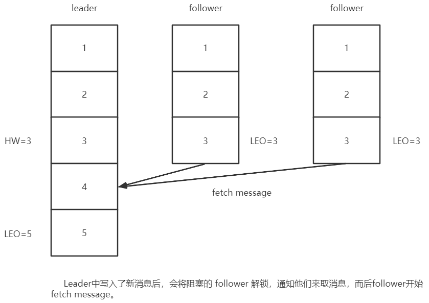

# 生产者ACK应答机制

对于某些不太重要的数据，对数据的可靠性要求不是很高，能够容忍数据的少量丢失，所以没必要等 ISR 中的 follower 全部接收成功。

所以 Kafka 为用户提供了三种可靠性级别，用户根据对可靠性和延迟的要求进行权衡， 选择以下的配置。

acks 参数配置：

- 0：producer 不等待 broker 的 ack，这一操作提供了一个最低的延迟，broker 一接收到还没有写入磁盘就已经返回，当 broker 故障时有可能丢失数据；

  一般在大数据的场景使用，例如：用户行为日志的统计。

- 1：producer 等待 broker 的 ack，partition 的 leader 成功将数据写入本地后返回 ack，如果在 follower 同步成功之前 leader 故障，那么将会丢失数据；

- -1（all）：producer 等待 broker 的 ack，分区的**min.insync.replicas**个副本全部落盘成功后才返回 ack。但是如果在 follower 同步完成后，broker 发送 ack 之前，leader 发生故障，那么会造成数据重复（因为leader在broker发送ack之前挂掉后，producer就不会接收到ack，那么producer就会重新发送数据，而此时新选举出来的leader中已经存储了该数据，所以就造成了数据的重复）。但是在极限情况下，这种模式还是会造成数据的丢失。例如：当zk中的ISR队列里只剩当前leader，一旦这个leader挂了，那么数据也就丢失了。
  **一般是金融级别，或跟钱打交道的场景才会使用这种配置。**

  **min.insync.replicas**代表最小要同步的副本数，默认为1，应该要配置1以上，因为如果为1的话其实就与ack设置为1的时候一样了。如果不能满足这个最小值，那么生产者将引发一个异常(NotEnoughReplicas或NotEnoughReplicasAfterAppend)。

# 日志分段存储

kafka数据存储在磁盘中，默认保存7天。

Kafka 一个分区的消息数据对应存储在一个文件夹下，以topic名称+分区号命名，kafka规定了一个分区内的 .log 文件 最大为 1G，做这个限制目的是为了方便把 .log 加载到内存去操作。


segment：消息分段，由.index、.log 和 .timeindex组成，而他们的**文件名代表了当前文件的起始offset**。根据service.properties文件中的 log.segment.bytes （该选项指定了日志文件的大小，默认是1G）配置的值进行分段，即当前分段的.log文件大小达到了log.segment.bytes设定的值，那么就会创建新的分段，也就是新的.index、.log 和 .timeindex 文件。

由于生产者生产的消息会不断追加到 log 文件末尾，为防止 log 文件过大导致数据定位效率低下，Kafka 采取了分片和索引机制，将每个 partition 分为多个 segment。同一分区的所有分段文件都位于同一个文件夹下（即 **topic名称+分区号** 目录下）。例如，first 这个 topic 有三个分区，则其对应的文件夹为 first-0,first-1,first-2。

一个日志段文件满了，就自动开一个新的日志段文件来写入，避免单个文件过大，影响文件的读写性能，这个过程叫做 log rolling，正在被写入的那个日志段文件，叫做 active log segment。

index文件里每条记录的大小是固定的，便于查询，只需把大小和偏移量相乘便知道了当前偏移量所对应的记录，下图为 index 文件和 log 文件的结构示意图。

注意：早期的kafka没有.timeindex文件，只有 .index 和 .log 。

```
# .index是当前分段（以这个例子来说就是 [0, 5367851) 分段）的offset索引文件，kafka生产者客户端往分区发送的消息达到4K(可配置)，kafka就会记录一条当前消息的offset到index文件，即当前文件不会每条消息offset都记录，它只会记录一个批次中的最后一条消息的offset值+1和它对应log文件中的物理偏移地址，也就是说记录的是offset段。
# 如果要定位消息的offset会先在这个文件里快速定位到对应offset区间的起始值，再去log文件里找具体消息
00000000000000000000.index
# 消息存储文件，主要存offset和消息体
00000000000000000000.log
# .timeindex是当前分段的消息发送时间索引文件，kafka生产者客户端往分区发送的消息达到4K(可配置), kafka就会记录一条当前消息的发送时间戳与对应的offset到timeindex文件，记录方式与.index一样，记录一个批次中的最后一条消息的offset值与时间戳，即记录分段时间与offset。
# 如果需要按照时间来定位消息的offset，会先在这个文件里查找
00000000000000000000.timeindex

00000000000005367851.index
00000000000005367851.log
00000000000005367851.timeindex

00000000000009936472.index
00000000000009936472.log
00000000000009936472.timeindex
```

通过二分查找法查找index文件中的内容。

先通过offset确定消息处在分区的哪个分段里，再通过index文件定位到offset段，获取该offset段的的起始offset对应的log文件的物理偏移地址，最后根据这个物理偏移地址到当前分段的 log 文件中查找消息。


“.index”文件存储大量的索引信息，“.log”文件存储大量的数据，索引文件中的元 数据指向对应数据文件中 message 的物理偏移地址。

# Controller 

## 选举机制

在kafka集群启动的时候，会自动选举一台broker作为controller来管理整个集群，选举的过程是集群中每个broker都会尝试在zookeeper上创建一个 /controller 临时节点，zookeeper会保证有且仅有一个broker能创建成功，这个broker 就会成为集群的总控器controller。当这个controller角色的broker宕机了，此时zookeeper临时节点会消失，集群里其他broker会一直监听这个临时节点，发现临时节点消失了，就会再次尝试竞争创建临时节点。


## 职责

具备控制器身份的broker需要比其他普通的broker具备的作用如下：

1、当某个分区的leader副本出现故障时，由控制器负责为该分区选举新的leader副本。

2、当检测到某个分区的ISR集合发生变化时，由控制器负责通知所有broker更新其元数据信息。

3、当某个topic增加分区数量时，由控制器负责分区的重新分配。

具体细节如下：

- 监听broker相关的变化。为Zookeeper中的/brokers/ids/节点添加BrokerChangeListener，用来处理 broker 增减的变化。
- 监听topic相关的变化。为Zookeeper中的/brokers/topics节点添加TopicChangeListener，用来处理topic增减的变化；为Zookeeper中的/admin/delete_topics节点添加TopicDeletionListener，用来处理删除topic的动作。
- 从Zookeeper中读取获取当前所有与topic、partition以及broker有关的信息并进行相应的管理。对于所有 topic 所对应的Zookeeper中的/brokers/topics/[topic]节点添加PartitionModificationsListener，用来监听topic中的分区分配变化。
- 更新集群的元数据信息，同步到其他普通的broker节点中。


# Partition的副本Leader选举机制

例如：某个分区leader所在的broker挂了，由于controller注册了监听broker节点的事件，所以会感知到有broker挂了，而后controller会从 parititon 的 replicas 列表中取出第一个broker作为leader，当然这个broker需要也同时存在于ISR列表里。


# 消费者自动分区公式

hash(key)%partitionNum

key是consumer发送消息时的key

# 消费者的offset

## 介绍

consumerGroupId+topic+分区号确定了唯一的offset，它表示当前消费者消费到了某个主题分区的某条消息。每个consumer是基于自己在commit log中的消费进度(offset)来进行工作的。在kafka中，offset 由 consumer 自己来维护。而这意味kafka中的consumer对集群的影响是非常小的，添加一个或者减少一个consumer，对于集群或者其他consumer 来说，都是没有影响的，因为每个consumer维护各自的offset且一个消费者组中只能有一个消费者消费同一个分区。**所以说kafka集群是无状态的，性能不会因为 consumer数量受太多影响。kafka还将很多关键信息记录在zookeeper里，保证自己的无状态，从而在水平扩容时非常方便。**

一般情况下按照顺序逐条消费commit log中的消息，当然可以通过指定offset来重复消费某些消息， 或者跳过某些消息。

consumer启动时会获取一次offset，而后在自己的内存中进行维护。


## 提交的offset值

消费者提交消费位移时提交的是当前消费到的最新消息的 offset+1。


## 获取 __consumer_offsets 队列

Kafka 0.9 版本之前，consumer 默认将 offset 保存在 Zookeeper 中，从 0.9 版本开始， consumer 默认将 offset 保存在 Kafka 一个内置的 topic 中，该 topic 为__consumer_offsets。

1）修改配置文件

consumer.properties exclude.internal.topics=false

2）读取 offset

0.11.0.0 之前版本:

```sh
bin/kafka-console-consumer.sh --topic __consumer_offsets --zookeeper hadoop102:2181 --formatter "kafka.coordinator.GroupMetadataManager\$OffsetsMessageFormatter" --consumer.config config/consumer.properties --from-beginning
```

0.11.0.0 之后版本(含):

```sh
bin/kafka-console-consumer.sh --topic __consumer_offsets --zookeeper hadoop102:2181 --formatter "kafka.coordinator.group.GroupMetadataManager\$OffsetsMessageFormatter" --consumer.config config/consumer.properties --frombeginning
```


## offset记录机制

由于 consumer 在消费过程中可能会出现断电宕机等故障，consumer 恢复后，需要从故障前的位置的继续消费，所以 consumer 需要记录自己消费到了哪个 offset，以便故障恢复后继续消费。

每个consumer会定期将自己消费分区的offset提交给kafka内部topic（__consumer_offsets），提交过去的时候，key是 consumerGroupId+topic+分区号，value就是当前offset的值，kafka会定期清理topic里的消息，最后就保留最新的那条数据。

因为__consumer_offsets可能会接收到高并发的请求，kafka默认给其分配50个分区(可以通过 offsets.topic.num.partitions设置)，这样可以通过加机器的方式提高并发性能。


## offset分区选择公式

hash(consumer group id) % __consumer_offsets主题的分区数

# 消费者Rebalance机制

## 介绍

消费者rebalance就是说如果consumer group中某个消费者挂了，此时会自动把分配给他的分区交给其他的消费者，如果他又重启了，那么又会把一些分区分配给他。


## 触发rebalance情况

- consumer所在服务重启或宕机了
- 动态给topic增加了分区
- 消费组订阅了更多的topic


## Rebalance过程

当有消费者加入消费组时，消费者、消费组及组协调器之间会经历以下几个阶段。

> 组协调器GroupCoordinator：每个consumer group都会选择一个**broker**作为自己的组协调器coordinator，负责监控这个消费组里的所有消费者的心跳，以及判断是否宕机，然后开启消费者rebalance（含选举consumer LeaderCoordinator）。
>
> 


**第一阶段：选择组协调器**

consumer group 中的每个consumer启动时会向kafka集群中的某个节点发送 FindCoordinatorRequest 请求来查找对应的组协调器GroupCoordinator，并跟其建立网络连接。

**组协调器选举方式**：

通过如下公式可以选出consumer消费的offset要提交到__consumer_offsets的哪个分区，这个分区leader对应的broker 就是这个consumer group的coordinator。

公式：hash(consumer group id) % __consumer_offsets主题的分区数


**第二阶段：加入消费者组（JOIN GROUP）**

在成功找到消费组所对应的 GroupCoordinator 之后就进入 加入消费组 的阶段，在此阶段的消费者会向 GroupCoordinator 发送 **JoinGroupRequest** 请求，并处理响应。然后 GroupCoordinator 从 consumer group 中选择第一个加入 group 的 consumer 作为 LeaderCoordinator (**消费组协调器**)，把consumer group情况发送给这个LeaderCoordinator，接着这个 leader会负责制定分区方案。


**第三阶段（ SYNC GROUP)**

consumer LeaderCoordinator 通过给GroupCoordinator发送 **SyncGroupRequest**，接着GroupCoordinator就把分区方案下发给各个consumer，他们会根据指定分区的leader broker进行网络连接以及消息消费。


## 分区分配策略

### 介绍

一个 consumer group 中有多个 consumer，一个 topic 有多个 partition，所以必然会涉及到 partition 的分配问题，即确定哪个 partition 由哪个 consumer 来消费。

Kafka 有三种分配策略：RoundRobin、Range 和 sticky。


### Range

默认分配策略

以主题为单位进行划分，订阅的每个主题都会执行如下的分配规则：

- 首先，将分区按分区序号排行序，消费者按名称的字典序排序。

- 然后，用分区总数除以消费者总数。如果能够除尽，则平均分配；若除不尽，则位于排序前面的消费者将多负责一个分区。即假设 n＝分区数／消费者数量 = 3， m＝分区数%消费者数量 = 1，那么前 m 个（含m）消费者每个分配 n+1 个分区，后面的（消费者数量－m ）个消费者每个分配 n 个分区。

  公式：
  n = 单个主题分区数 / 消费者数
  m = 单个主题分区数 % 消费者数

  前m个（包括m）消费者消费n+1个分区，剩余消费者消费n个分区。


分区分配的算法如下：

```java
@Override
public  Map<String, List<TopicPartition>> assign(Map<String, Integer> partitionsPerTopic,
                                                 Map<String, Subscription> subscriptions) {
    Map<String, List<String>> consumersPerTopic = consumersPerTopic(subscriptions);
    Map<String, List<TopicPartition>> assignment =  new  HashMap<>();
    for  (String memberId : subscriptions.keySet())
        assignment.put(memberId,  new  ArrayList<TopicPartition>());
    //for循环对订阅的多个topic分别进行处理
    for  (Map.Entry<String, List<String>> topicEntry : consumersPerTopic.entrySet()) {
        String topic = topicEntry.getKey();
        List<String> consumersForTopic = topicEntry.getValue();

        Integer numPartitionsForTopic = partitionsPerTopic.get(topic);
        if  (numPartitionsForTopic ==  null )
            continue ;
        //对消费者进行排序
        Collections.sort(consumersForTopic);
        //计算平均每个消费者分配的分区数
        int  numPartitionsPerConsumer = numPartitionsForTopic / consumersForTopic.size();
        //计算平均分配后多出的分区数
        int  consumersWithExtraPartition = numPartitionsForTopic % consumersForTopic.size();

        List<TopicPartition> partitions = AbstractPartitionAssignor.partitions(topic, numPartitionsForTopic);
        for  ( int  i =  0 , n = consumersForTopic.size(); i < n; i++) {
            //计算第i个消费者，分配分区的起始位置
            int  start = numPartitionsPerConsumer * i + Math.min(i, consumersWithExtraPartition);
            //计算第i个消费者，分配到的分区数量
            int  length = numPartitionsPerConsumer + (i +  1  > consumersWithExtraPartition ?  0  :  1 );
            assignment.get(consumersForTopic.get(i)).addAll(partitions.subList(start, start + length));
        }
    }
    return  assignment;
}
```


假设，有1个主题、10个分区、3个消费者线程， 10 / 3 = 3，而且除不尽，那么消费者C1将会多消费一个分区，分配结果是：

- C1将消费T1主题的0、1、2、3分区。
- C2将消费T1主题的4、5、6分区。
- C3将消费T1主题的7、8、9分区


假如，同一消费者组里的消费者C1和C2，订阅了2个主题（T0和T1），它们都有3个分区。

分配过程：

T0的分区数 / 消费者总数 = 3 / 2 = 1，除不尽余1，那么消费者C1将会多消费一个分区；

T1的分区数 / 消费者总数 = 3 / 2 = 1，除不尽余1，那么消费者C1将会多消费一个分区；

所以分配结果是：

- C1将消费T0主题的 0、1 号分区，以及T1主题的 0、1 号分区。（T0-0，T0-1，T1-0，T1-1）
- C2将消费T0主题的 2 号分区，以及T1主题的 2 号分区。（T0-2，T1-2）


假设，同一消费者组里的消费者C1和C2，分别订阅了2个主题，C1订阅了T0，C2订阅了T1。

分配结果：

C1将消费T0的所有分区，C2将消费T1的所有分区。


> 这种分配方式存在着明显的一个问题，随着消费者订阅的Topic的数量的增加，不均衡的问题会越来越严重。


### RoundRobin

轮询分配分区策略。

以消费者组为单位进行划分

把消费者组订阅的所有partition根据hash运算结果排序，然后轮询 consumer 为它们分配partition，尽可能的把partition均匀的分配给consumer。

**1、如果同一个消费组内所有的消费者的订阅信息都是相同的，那么RoundRobinAssignor策略的分区分配会是均匀的。**

假设消费组中有2个消费者C0和C1，都订阅了主题t0和t1，并且每个主题都有3个分区，那么所订阅的所有分区可以标识为：t0p0、t0p1、t0p2，t1p0、t1p1、t1p2。

假设分区排序结果为：t0p0、t0p1、t0p2，t1p0、t1p1、t1p2。

最终的分配结果为：

消费者C0：t0p0、t0p2、t1p1

消费者C1：t0p1、t1p0、t1p2

**2、如果同一个消费组内的消费者所订阅的信息是不相同的，那么在执行分区分配的时候就不是完全的轮询分配，有可能会导致分区分配的不均匀。如果某个消费者没有订阅消费组内的某个topic，那么在分配分区的时候此消费者将分配不到这个topic的任何分区。**

假如有3个Topic，T0（三个分区P0-0，P0-1，P0-2），T1(三个分区P1-0，P1-1，P1-2)，T2(三个分区P2-0，P2-1，P2-2)。

有三个消费者：C0(订阅了T0),   C1（订阅了T0，T1），C2(订阅了T0，T1，T2)。

那么分区过程如下：

1）、通过哈希运算对消费者组的所有主题分区进行排序。假设排序后情况：P0-0，P0-1，P0-2，P1-0，P1-1，P1-2，P2-0，P2-1，P2-2。

2）、轮询消费者，分配分区。分配过程如下：

- P0-0分配给C0
- P0-1分配给C1
- P0-2分配给C2
- P1-0分配给C0但是C0并没订阅T1，于是跳过C0把P1-0分配给C1，
- P1-1分配给C2，
- P1-2分配给C0但是C0并没订阅T1，于是跳过C0把P1-2分配给C1，
- 依照如上步骤，T2的分区都会分配给C2。

C0：P0-0
C1：P1-0，P1-2
C2：P1-1，P2-0，P2-1，P2-2

可以发现C2承担了4个分区的消费还不够均衡，而C1订阅了T1，如果把 P1-1 交给C1消费能更加的均衡。

> RoundRobin方式适用于消费者组里的消费者订阅的主题一致。


### Sticky

Kafka从0.11.x版本开始引入这种分配策略。

它的目的是在执行一次新的分配时，能在上一次分配的结果的基础上，尽量少的调整分区分配的变动，节省因分区分配变化带来的开销。

没有发生rebalance时，Sticky分配策略和RoundRobin分配策略类似。

Sticky是“粘性的”，可以理解为分配结果是带“粘性的”——每一次分配变更相对上一次分配做最少的变动。其目标有两点：

- 分区的分配要尽可能的均匀；
- 在发生rebalance（重新分配分区）时，分区的分配尽可能的与上次分配的保持相同。

当这两个目标发生冲突时，优先保证第一个目标。第一个目标是每个分配算法都尽量尝试去完成的，而第二个目标才真正体现出StickyAssignor特性的。

举例：

**消费者订阅相同 Topic**

假设消费组内有3个消费者：C0、C1和C2，它们都订阅了4个主题：t0、t1、t2、t3，并且每个主题有2个分区，也就是说整个消费组订阅了t0p0、t0p1、t1p0、t1p1、t2p0、t2p1、t3p0、t3p1这8个分区。最终的分配结果如下：


消费者C0：t0p0、t1p1、t3p0
消费者C1：t0p1、t2p0、t3p1
消费者C2：t1p0、t2p1

假设此时消费者C1脱离了消费组，那么消费组就会执行再平衡操作，进而消费分区会重新分配。如果采用RoundRobinAssignor策略，那么此时的分配结果如下：


消费者C0：t0p0、t1p0、t2p0、t3p0
消费者C2：t0p1、t1p1、t2p1、t3p1


如分配结果所示，RoundRobinAssignor策略会按照消费者C0和C2进行重新轮询分配。而如果此时使用的是StickyAssignor策略，那么分配结果为：


消费者C0：t0p0、t1p1、t3p0、t2p0
消费者C2：t1p0、t2p1、t0p1、t3p1

可以看到分配结果中保留了上一次分配中对于消费者C0和C2的所有分配结果，并将原来消费者C1的“负担”分配给了剩余的两个消费者C0和C2，最终C0和C2的分配还保持了均衡。

如果发生分区重分配，那么对于同一个分区而言有可能之前的消费者和新指派的消费者不是同一个，对于之前消费者进行到一半的处理还要在新指派的消费者中再次复现一遍，这显然很浪费系统资源。StickyAssignor策略如同其名称中的“sticky”一样，让分配策略具备一定的“粘性”，尽可能地让前后两次分配相同，进而减少系统资源的损耗以及其它异常情况的发生。


**消费者订阅不同 Topic**

同样消费组内有3个消费者：C0、C1和C2，集群中有3个主题：t0、t1和t2，这3个主题分别有1、2、3个分区，也就是说集群中有t0p0、t1p0、t1p1、t2p0、t2p1、t2p2这6个分区。消费者C0订阅了主题t0，消费者C1订阅了主题t0和t1，消费者C2订阅了主题t0、t1和t2。

如果此时采用RoundRobinAssignor策略，那么最终的分配结果如下所示：

( 红线是订阅，其他颜色的线是分配分区 )


消费者C0：t0p0
消费者C1：t1p0
消费者C2：t1p1、t2p0、t2p1、t2p2

如果此时采用的是StickyAssignor策略，那么最终的分配结果为：
( 红线是订阅，其他颜色的线是分配分区 )


消费者C0：t0p0
消费者C1：t1p0、t1p1
消费者C2：t2p0、t2p1、t2p2

可以看到这是一个最优解。


假如此时消费者C0脱离了消费组，那么RoundRobin策略的分配结果为：
( 红线是订阅，其他颜色的线是分配分区 )


消费者C1：t0p0、t1p1
消费者C2：t1p0、t2p0、t2p1、t2p2

可以看到RoundRobinAssignor策略保留了消费者C1和C2中原有的3个分区的分配：t2p0、t2p1和t2p2

而如果采用的是StickyAssignor策略，那么分配结果为：
( 红线是订阅，其他颜色的线是分配分区 )


消费者C1：t1p0、t1p1、t0p0
消费者C2：t2p0、t2p1、t2p2

可以看到StickyAssignor策略保留了消费者C1和C2中原有的5个分区的分配：t1p0、t1p1、t2p0、t2p1、t2p2。


从结果上看StickyAssignor策略比另外两者分配策略而言显得更加的优异，这个策略的代码实现也是异常复杂，如果一个 group 里面，不同的 Consumer 订阅不同的 topic, 那么设置Sticky 分配策略还是很有必要的。


# HW 和 LEO

## 介绍

HW（High Watermark，高水位）：取一个partition对应的ISR中最小的LEO(log-end-offset)作为HW。consumer最多只能消费到HW所在的位置。另外每个replica都有HW,leader和follower各自负责更新自己的HW的状态。对于leader新写入的消息，consumer不能立刻消费，**leader会等待该消息被所有ISR中的replicas同步后再更新HW**，此时消息才能被consumer消费。这样就保证了如果leader所在的broker失效，该消息仍然可以从新选举的leader中获取。对于来自内部broker的读取请求，没有HW的限制。

LEO：指的是每个副本最大的 offset；


## follower 更新 HW 时机

follower更新HW发生在其更新LEO之后，一旦follower向log写完数据，它会尝试更新它自己的HW值。具体算法就是比较当前 LEO 值与FETCH响应中 leader 的 HW 值，取两者中的小者作为新的 HW 值。这告诉我们一个事实：即使 follower 的LEO 值超过了 leader 的HW值，follower 的 HW 值也不会越过 leader 的 HW 值。


## leader 更新 HW 时机

leader的HW值就是分区HW值，因此何时更新这个值是我们最关心的，因为它直接影响了分区数据对于consumer的可见性 。以下4种情况下leader会尝试去更新分区HW——切记是尝试，有可能因为不满足条件而不做任何更新：

- 副本成为leader副本时：当某个副本成为了分区的leader副本，Kafka会尝试去更新分区HW。这是显而易见的道理，毕竟分区leader发生了变更，这个副本的状态是一定要检查的！
- broker出现崩溃导致副本被踢出ISR时：若有broker崩溃则必须查看下是否会波及此分区，因此检查下分区HW值是否需要更新是有必要的。
- producer向leader副本写入消息时：因为写入消息会更新leader的LEO，故有必要再查看下HW值是否也需要修改
- leader处理follower FETCH请求时：当leader处理follower的FETCH请求时首先会从底层的log读取数据，之后会尝试更新分区HW值

 特别注意上面4个条件中的最后两个。它揭示了一个事实——当Kafka broker都正常工作时，分区HW值的更新时机有两个：leader处理PRODUCE请求时和leader处理FETCH请求时。

具体：https://www.cnblogs.com/huxi2b/p/7453543.html


## 正常情况下的HW更新过程

当producer生产消息至broker后，ISR以及HW和LEO的流转过程：





## 注意

**HW只能保证副本之间的数据一致性，并不能保证数据不丢失或者不重复。**

# broker故障情况分析

## follower 故障

某个 follower 发生故障后会被临时踢出 ISR，待该 follower 恢复后，该 follower 会读取当前自身的 HW，并将 log 文件高于这个 HW 的部分截取掉，从 HW 开始向 leader 进行同步。等该 follower 的 LEO 大于等于该 leader 的  HW 时重新加入 ISR 。


## leader 故障

leader 发生故障之后，会从 ISR 中选出一个新的 leader，之后为保证多个副本之间的数据一致性，其余的 follower 会先将各自的 log 文件中高于自身 HW 的部分截掉，然后从新的 leader 同步数据。当原本的leader副本恢复后，它会先将log 文件中高于自身 HW 的部分截取掉，从自身的 HW 开始向新 leader 进行同步。等该 follower 的 LEO 大于等于该 leader 的  HW 时重新加入 ISR 。


# 数据丢失情况分析

## ACK=1


# 生产者发布消息机制

## 写入方式

producer 采用 push 模式将消息发布到 broker，每条消息都被 append 到 patition 的分段log文件中，顺序写磁盘（顺序写磁盘 效率比随机写内存要高，保障 kafka 吞吐率）。


## 消息路由机制（分区分配）

producer 发送消息到 broker 时，会根据分区算法选择将其存储到哪一个 partition。其路由机制为：

- 指定了 patition，则直接使用；
- 未指定 patition 但指定 key，通过将 key 的 hash 值与 topic 的 partition 数进行取余得到 partition 值。
- patition 和 key 都未指定，第一次调用时随机生成一个整数（后面每次调用在这个整数上自增），将这个值与 topic 可用的 partition 总数取余得到 partition 值，也就是常说的 round-robin 算法。（其实就是使用轮询算法选出一个 patition。）


## 写入流程

以ACK=-1，min.insync.replicas=2的情况为例。


1. producer发送消息时消息会先发送到本地缓冲区，而批量发送线程会从这个缓冲区里获取消息，当满足两个条件（1、多条消息容量达到ProducerConfig.BATCH_SIZE_CONFIG设置的大小，2、距离上一次发送的延迟时间达到ProducerConfig.LINGER_MS_CONFIG设置的值）中的任意一个时，就会触发真正的发送。
2. producer 先从 zookeeper 的 "/brokers/topics/某主题/partitions/某分区/state" 节点找到该 partition 的 leader。
3. producer 将消息发送给该 leader。
4. leader 将消息写入本地 log。
5. followers 从 leader pull 消息，写入本地 log 后 向leader 发送 ACK。
6. leader 收到所有 ISR 中的 replica 的 ACK 后，增加 HW（high watermark，最后 commit 的 offset） 并向 producer 发送 ACK。


# 创建主题流程

1）会在 zookeeper 中的/brokers/topics 节点下创建一个新的 topic 节点，如： /brokers/topics/first。

2）触发 Controller 的监听程序。

3）kafka Controller 负责 topic 的创建工作，并更新 metadata cache。


# 事务

Kafka 从 0.11 版本开始引入了事务支持。事务可以保证 Kafka 在 Exactly Once 语义的基 础上，生产和消费可以跨分区和会话，要么全部成功，要么全部失败。


## Producer 事务

为了实现跨分区跨会话的事务，需要引入一个全局唯一的 Transaction ID，并将 Producer 获得的PID 和Transaction ID 绑定。这样当Producer 重启后就可以通过正在进行的 Transaction ID 获得原来的 PID。

为了管理 Transaction，Kafka 引入了一个新的组件 Transaction Coordinator。Producer 就 是通过和 Transaction Coordinator 交互获得 Transaction ID 对应的任务状态。Transaction Coordinator 还负责将事务所有写入 Kafka 的一个内部 Topic，这样即使整个服务重启，由于 事务状态得到保存，进行中的事务状态可以得到恢复，从而继续进行。


## Consumer 事务

上述事务机制主要是从 Producer 方面考虑，对于 Consumer 而言，事务的保证就会相对较弱，尤其时无法保证 Commit 的信息被精确消费。这是由于 Consumer 可以通过 offset 访 问任意信息，而且不同的 Segment File 生命周期不同，同一事务的消息可能会出现重启后被 删除的情况。


