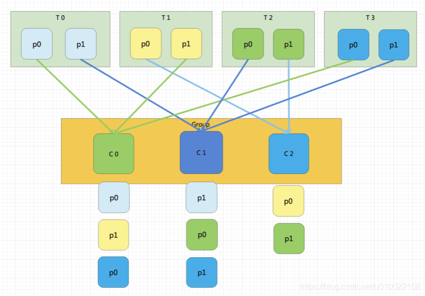
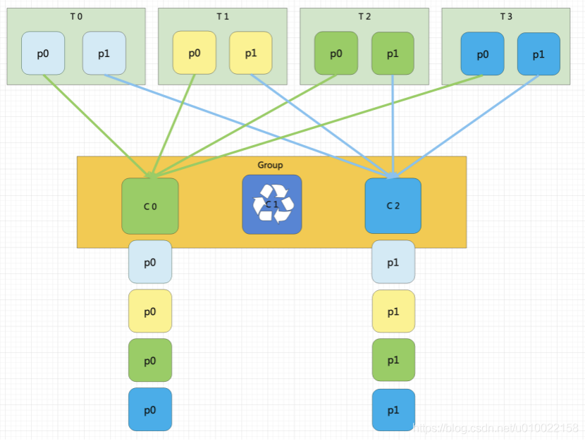
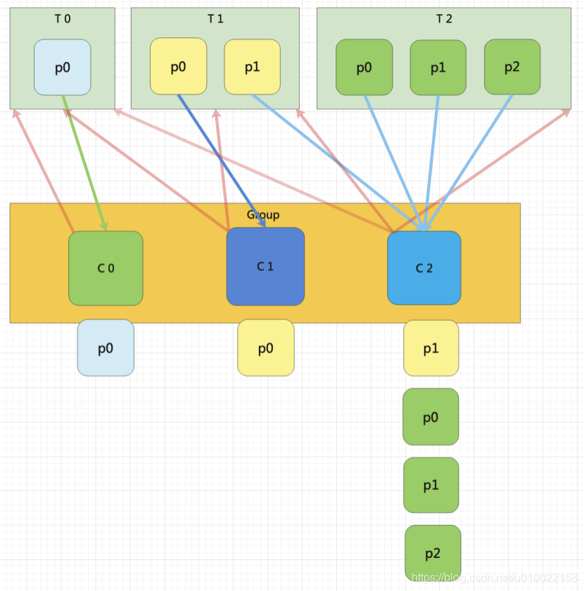
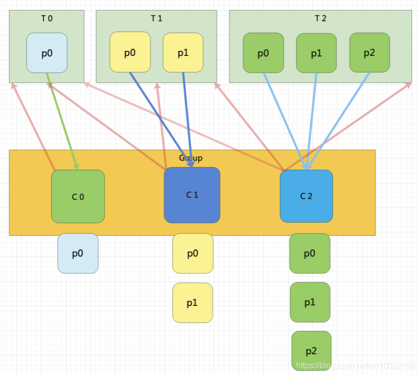
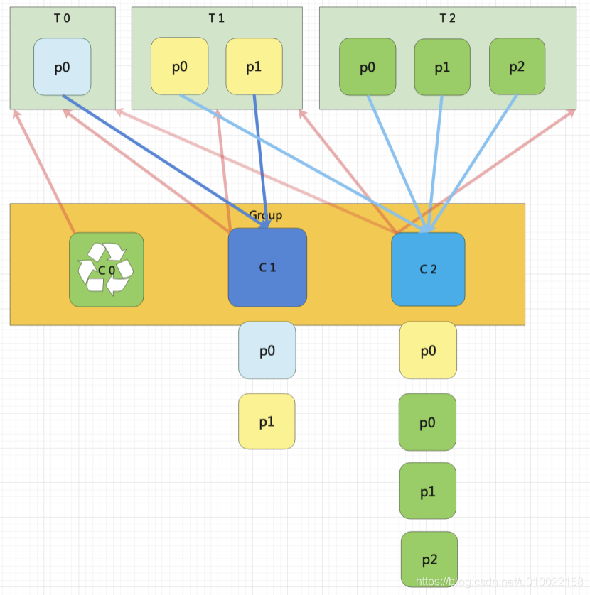
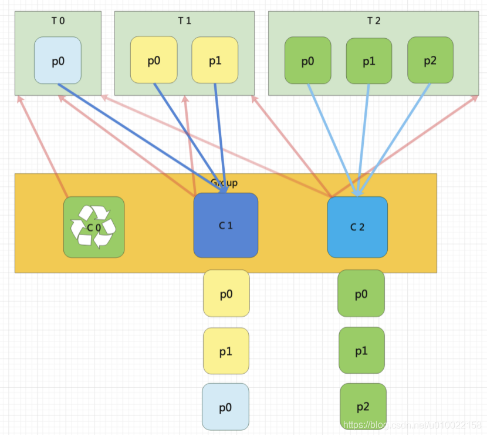

# Kafka工作流程及存储机制

## 工作流程


Kafka 中消息是以 topic 进行分类的，生产者生产消息，消费者消费消息，都是面向 topic 的。

topic 是逻辑上的概念，而 partition 是物理上的概念，每个 partition 对应数个分区存储目录，分区目录中存在者log文件，该 log 文件中存储的就是 producer 生产的数据。Producer 生产的数据会被不断追加到该 log 文件末端，且每条数据都有自己的 offset。消费者组中的每个消费者，都会实时记录自己 消费到了哪个 offset，以便出错恢复时，从上次的位置继续消费。


# 生产者

## 分区分配策略

### 分区的原因

（1）方便在集群中扩展，每个 Partition 可以通过调整以适应它所在的机器，而一个 topic 又可以有多个 Partition 组成，因此整个集群就可以适应任意大小的数据了； 

（2）可以提高并发，因为可以以 Partition 为单位读写了。


### 分区分配的原则

生成者发送消息时，需要将要发送的数据封装成一个 ProducerRecord 对象。下面借助这个对象来分析分区原则。

```java
public ProducerRecord(String topic, Integer partition, Long timestamp, K key, V value, Iterable<Header> headers);
public ProducerRecord(String topic, Integer partition, Long timestamp, K key, V value);
public ProducerRecord(String topic, Integer partition, K key, V value, Iterable<Header> headers);
public ProducerRecord(String topic, Integer partition, K key, V value);
public ProducerRecord(String topic, K key, V value);
public ProducerRecord(String topic, V value);
```


- 指明 partition 的情况下，直接将指明的值直接作为 partiton 值；
- 没有指明 partition 值但有 key 的情况下，将 key 的 hash 值与 topic 的 partition 数进行取余得到 partition 值；
- 既没有 partition 值又没有 key 值的情况下，第一次调用时随机生成一个整数（后面每次调用在这个整数上自增），将这个值与 topic 可用的 partition 总数取余得到 partition 值，也就是常说的 round-robin 算法。


## 数据可靠性保证

### 副本数据同步策略

为保证 producer 发送的数据，能可靠的发送到指定的 topic，topic 的每个 partition 收到 producer 发送的数据后，都需要向 producer 发送 ack（acknowledgement 确认收到），如果 producer 收到 ack，就会进行下一轮的发送，**否则重新发送数据**。

由此引出了以下两个问题：

- 何时发送ack？

    确保有follower与leader同步完成， leader再发送ack，这样才能保证leader 挂掉之后，能在follower中选举出新的 leader。

- 多少个follower同步完成之后发送ack？（副本同步策略）

    1、半数以上的follower同步完成，即可发送ack。

    2、全部的follower同步完成，才可以发 送ack。


副本数据同步策略对比：

| 方案                         | 优点                                                       | 缺点                                                        |
| ---------------------------- | ---------------------------------------------------------- | ----------------------------------------------------------- |
| 半数以上完成同步，就发送 ack | 延迟低                                                     | 选举新的 leader 时，容忍 n 台节点的故障，需要 2n+1 个副本。 |
| 全部完成同步，才发送 ack     | 选举新的 leader 时，容忍 n 台节点的故障，需要 n+1 个副本。 | 延迟高                                                      |


Kafka 选择了第二种方案，原因如下：

1. 同样为了容忍 n 台节点的故障，第一种方案需要 2n+1 个副本，而第二种方案只需要 n+1 个副本，而 Kafka 的每个分区都有大量的数据，第一种方案会造成大量数据的冗余。
2. 虽然第二种方案的网络延迟会比较高，但网络延迟对 Kafka 的影响较小。


### ISR

采用第二种方案之后，设想以下情景：leader 收到数据，所有 follower 都开始同步数据， 但有一个 follower，因为某种故障，迟迟不能与 leader 进行同步，那 leader 就要一直等下去， 直到它完成同步，才能发送 ack。这个问题怎么解决呢？

解决方案：

Leader 维护了一个动态的 in-sync replica set (ISR)，意为和 leader 保持同步的副本（含leader）集合。当 ISR 中的 follower 完成数据的同步之后，leader 就会给 follower 发送 ack。如果 follower 长时间未向 leader 同步数据 ， 则该 follower 将被踢出 ISR ， 该时间阈值由 replica.lag.time.max.ms 参数设定。**Leader 发生故障之后，就会从 ISR 中选举新的 leader。**

**那么问题来了，这个ISR是由leader维护，leader挂了ISR怎么办呢？所以Kafka会在ZK中存储这个ISR！**

Kafka集群的一些重要信息都记录在ZK中，比如集群的所有代理节点、主题的所有分区、分区的副本信息(副本集(AR)、主副本(leader)、同步的副本集(ISR))。外部事件会更新ZK的数据，ZK中的数据一旦发生变化，控制器都要做出不同的相应处理。


### ack 应答机制

对于某些不太重要的数据，对数据的可靠性要求不是很高，能够容忍数据的少量丢失，所以没必要等 ISR 中的 follower 全部接收成功。

所以 Kafka 为用户提供了三种可靠性级别，用户根据对可靠性和延迟的要求进行权衡， 选择以下的配置。

acks 参数配置：

- 0：producer 不等待 broker 的 ack，这一操作提供了一个最低的延迟，broker 一接收到还没有写入磁盘就已经返回，当 broker 故障时有可能丢失数据；

  一般在大数据的场景使用，例如：用户行为日志的统计。

- 1：producer 等待 broker 的 ack，partition 的 leader 成功将数据写入本地后返回 ack，如果在 follower 同步成功之前 leader 故障，那么将会丢失数据；

- -1（all）：producer 等待 broker 的 ack，分区的**min.insync.replicas**个副本全部落盘成功后才返回 ack。但是如果在 follower 同步完成后，broker 发送 ack 之前，leader 发生故障，那么会造成数据重复（因为leader在broker发送ack之前挂掉后，producer就不会接收到ack，那么producer就会重新发送数据，而此时新选举出来的leader中已经存储了该数据，所以就造成了数据的重复）。但是在极限情况下，这种模式还是会造成数据的丢失。例如：当zk中的ISR队列里只剩当前leader，一旦这个leader挂了，那么数据也就丢失了。
  **一般是金融级别，或跟钱打交道的场景才会使用这种配置。**

  **min.insync.replicas**代表最小要同步的副本数，默认为1，应该要配置1以上，因为如果为1的话其实就与ack设置为1的时候一样了。如果不能满足这个最小值，那么生产者将引发一个异常(NotEnoughReplicas或NotEnoughReplicasAfterAppend)。


### kafka对故障的处理（数据一致性处理）

> Log文件中的 HW 和 LEO。
>
> LEO：指的是每个副本最大的 offset；
>
> HW（High Watermark，高损备）：指的是消费者能见到的最大的 offset，ISR 队列中最小的 LEO。
>
> HW之前的数据才对Consumer可见


故障情况分析：

- follower 故障

    某个 follower 发生故障后会被临时踢出 ISR，待该 follower 恢复后，该 follower 会读取本地磁盘记录的**上次（挂掉时）**的 HW，并将 log 文件高于 HW 的部分截取掉，从 HW 开始向 leader 进行同步。等该 follower 的 LEO 大于等于该 Partition 的  HW，就可以重新加入 ISR 了。

- leader 故障

    leader 发生故障之后，会从 ISR 中选出一个新的 leader，之后为保证多个副本之间的数据一致性，其余的 follower 会先将各自的 log 文件高于 HW 的部分截掉，然后从新的 leader 同步数据。

**注意：HW只能保证副本之间的数据一致性，并不能保证数据不丢失或者不重复。**


**follower副本何时更新HW？**

follower更新HW发生在其更新LEO之后，一旦follower向log写完数据，它会尝试更新它自己的HW值。具体算法就是比较当前LEO值与FETCH响应中leader的HW值，取两者的小者作为新的HW值。这告诉我们一个事实：如果follower的LEO值超过了leader的HW值，那么follower HW值是不会越过leader HW值的。


**leader副本何时更新HW值？**

leader的HW值就是分区HW值，因此何时更新这个值是我们最关心的，因为它直接影响了分区数据对于consumer的可见性 。以下4种情况下leader会尝试去更新分区HW——切记是尝试，有可能因为不满足条件而不做任何更新：

- 副本成为leader副本时：当某个副本成为了分区的leader副本，Kafka会尝试去更新分区HW。这是显而易见的道理，毕竟分区leader发生了变更，这个副本的状态是一定要检查的！
- broker出现崩溃导致副本被踢出ISR时：若有broker崩溃则必须查看下是否会波及此分区，因此检查下分区HW值是否需要更新是有必要的。
- producer向leader副本写入消息时：因为写入消息会更新leader的LEO，故有必要再查看下HW值是否也需要修改
- leader处理follower FETCH请求时：当leader处理follower的FETCH请求时首先会从底层的log读取数据，之后会尝试更新分区HW值

 特别注意上面4个条件中的最后两个。它揭示了一个事实——当Kafka broker都正常工作时，分区HW值的更新时机有两个：leader处理PRODUCE请求时和leader处理FETCH请求时。

具体：https://www.cnblogs.com/huxi2b/p/7453543.html


## Exactly Once

将服务器的 ACK 级别设置为-1，可以保证 Producer 到 Server 之间不会丢失数据，即 At Least Once 语义。相对的，将服务器 ACK 级别设置为 0，可以保证生产者每条消息只会被发送一次，即 At Most Once 语义。

At Least Once 可以保证数据不丢失，但是不能保证数据不重复；相对的，At Least Once 可以保证数据不重复，但是不能保证数据不丢失。但是，对于一些非常重要的信息，比如说 交易数据，下游数据消费者要求**数据既不重复也不丢失**，即 Exactly Once 语义。在 0.11 版本以前的 Kafka，对此是无能为力的，只能保证数据不丢失，再在下游消费者对数据做全局去重。对于多个下游应用的情况，每个都需要单独做全局去重，这就对性能造成了很大影响。

0.11 版本的 Kafka，引入了一项重大特性：幂等性。所谓的幂等性就是指 Producer 不论向 Server 发送多少次重复数据，Server 端都只会持久化一条。幂等性结合 At Least Once 语 义，就构成了 Kafka 的 Exactly Once 语义。即：
At Least Once + 幂等性 = Exactly Once

要启用幂等性，只需要将 Producer 的参数中 enable.idompotence 设置为 true 即可（开启幂等性后ack默认置为-1）。

Kafka 的幂等性实现其实就是将原来下游需要做的去重放在了数据上游。开启幂等性的 Producer 在 初始化的时候会被分配一个 PID，发往同一 Partition 的消息会附带 Sequence Number。而 Broker 端会对 <PID, Partition, SeqNumber> （这个其实就是主键）做缓存，当具有相同主键的消息提交时，Broker 只会持久化一条。

但是生产者重启它的 PID 就会变化，所以幂等性只能解决单次会话单个分区里的数据重复问题，即幂等性无法保证跨 分区跨会话的 Exactly Once。


# 消费者

## 消费方式

consumer 采用 pull（拉）模式从 broker 中读取数据。

push（推）模式很难适应消费速率不同的消费者，因为消息发送速率是由 broker 决定的。它的目标是尽可能以最快速度传递消息，但是这样很容易造成 consumer 来不及处理消息，典型的表现就是拒绝服务以及网络拥塞。而 pull 模式则可以根据 consumer 的消费能力以适当的速率消费消息。

pull 模式不足之处是，如果 kafka 没有数据，消费者可能会陷入循环中，一直返回空数据。针对这一点，Kafka 的消费者在消费数据时会传入一个时长参数 timeout，如果当前没有数据可供消费，consumer 会等待一段时间之后再返回，这段时长即为 timeout。


## 顺序消费

一个partition同一个时刻在一个consumer group中只有一个consumer instance在消费，从而保证顺序。

Kafka只在partition的范围内保证消息消费的局部顺序性，不能在同一个topic中的多个partition中保证总的消费顺序 性。

**如果有在总体上保证消费顺序的需求，那么可以通过将topic的partition数量设置为1，将consumer group中的 consumer instance数量也设置为1。**


## 分区分配策略

### 介绍

一个 consumer group 中有多个 consumer，一个 topic 有多个 partition，所以必然会涉及到 partition 的分配问题，即确定哪个 partition 由哪个 consumer 来消费。

Kafka 有三种分配策略：

RoundRobin、Range 和 。


### 分配触发时机

- 同一个Consumer Group内新增或减少Consumer
- Topic分区发生变化


### Range

默认分配策略

以主题为单位进行划分，即订阅的每个主题都会执行如下的分配规则：

- 首先，将分区按数字顺序排行序，消费者按名称的字典序排序。

- 然后，用分区总数除以消费者总数。如果能够除尽，则平均分配；若除不尽，则位于排序前面的消费者将多负责一个分区。

  公式：
  n = 单个主题分区数 / 消费者数
  m = 单个主题分区数 % 消费者数

  前m个（包括m）消费者消费n+1个分区，剩余消费者消费n个分区。


分区分配的算法如下：

```java
@Override
public  Map<String, List<TopicPartition>> assign(Map<String, Integer> partitionsPerTopic,
                                                 Map<String, Subscription> subscriptions) {
    Map<String, List<String>> consumersPerTopic = consumersPerTopic(subscriptions);
    Map<String, List<TopicPartition>> assignment =  new  HashMap<>();
    for  (String memberId : subscriptions.keySet())
        assignment.put(memberId,  new  ArrayList<TopicPartition>());
    //for循环对订阅的多个topic分别进行处理
    for  (Map.Entry<String, List<String>> topicEntry : consumersPerTopic.entrySet()) {
        String topic = topicEntry.getKey();
        List<String> consumersForTopic = topicEntry.getValue();

        Integer numPartitionsForTopic = partitionsPerTopic.get(topic);
        if  (numPartitionsForTopic ==  null )
            continue ;
        //对消费者进行排序
        Collections.sort(consumersForTopic);
        //计算平均每个消费者分配的分区数
        int  numPartitionsPerConsumer = numPartitionsForTopic / consumersForTopic.size();
        //计算平均分配后多出的分区数
        int  consumersWithExtraPartition = numPartitionsForTopic % consumersForTopic.size();

        List<TopicPartition> partitions = AbstractPartitionAssignor.partitions(topic, numPartitionsForTopic);
        for  ( int  i =  0 , n = consumersForTopic.size(); i < n; i++) {
            //计算第i个消费者，分配分区的起始位置
            int  start = numPartitionsPerConsumer * i + Math.min(i, consumersWithExtraPartition);
            //计算第i个消费者，分配到的分区数量
            int  length = numPartitionsPerConsumer + (i +  1  > consumersWithExtraPartition ?  0  :  1 );
            assignment.get(consumersForTopic.get(i)).addAll(partitions.subList(start, start + length));
        }
    }
    return  assignment;
}
```


假设，有1个主题、10个分区、3个消费者线程， 10 / 3 = 3，而且除不尽，那么消费者C1将会多消费一个分区，分配结果是：

- C1将消费T1主题的0、1、2、3分区。
- C2将消费T1主题的4、5、6分区。
- C3将消费T1主题的7、8、9分区


假如，同一消费者组里的消费者C1和C2，订阅了2个主题（T0和T1），它们都有3个分区。

分配过程：

T0的分区数 / 消费者总数 = 3 / 2 = 1，除不尽余1，那么消费者C1将会多消费一个分区；

T1的分区数 / 消费者总数 = 3 / 2 = 1，除不尽余1，那么消费者C1将会多消费一个分区；

所以分配结果是：

- C1将消费T0主题的 0、1 号分区，以及T1主题的 0、1 号分区。（T0-0，T0-1，T1-0，T1-1）
- C2将消费T0主题的 2 号分区，以及T1主题的 2 号分区。（T0-2，T1-2）


假设，同一消费者组里的消费者C1和C2，分别订阅了2个主题，C1订阅了T0，C2订阅了T1。

分配结果：

C1将消费T0的所有分区，C2将消费T1的所有分区。


> 这种分配方式存在着明显的一个问题，随着消费者订阅的Topic的数量的增加，不均衡的问题会越来越严重。


### RoundRobin

轮询分配分区策略。

以消费者组为单位进行划分

把消费者组订阅的所有partition根据hash运算结果排序，然后轮询 consumer 为它们分配partition，尽可能的让把partition均匀的分配给consumer。

**1、如果同一个消费组内所有的消费者的订阅信息都是相同的，那么RoundRobinAssignor策略的分区分配会是均匀的。**

假设消费组中有2个消费者C0和C1，都订阅了主题t0和t1，并且每个主题都有3个分区，那么所订阅的所有分区可以标识为：t0p0、t0p1、t0p2，t1p0、t1p1、t1p2。

假设分区排序结果为：t0p0、t0p1、t0p2，t1p0、t1p1、t1p2。

最终的分配结果为：

消费者C0：t0p0、t0p2、t1p1

消费者C1：t0p1、t1p0、t1p2

**2、如果同一个消费组内的消费者所订阅的信息是不相同的，那么在执行分区分配的时候就不是完全的轮询分配，有可能会导致分区分配的不均匀。如果某个消费者没有订阅消费组内的某个topic，那么在分配分区的时候此消费者将分配不到这个topic的任何分区。**

假如有3个Topic，T0（三个分区P0-0，P0-1，P0-2），T1(三个分区P1-0，P1-1，P1-2)，T2(三个分区P2-0，P2-1，P2-2)。

有三个消费者：C0(订阅了T0),   C1（订阅了T0，T1），C2(订阅了T0，T1，T2)。

那么分区过程如下：

1）、通过哈希运算对消费者组的所有主题分区进行排序。假设排序后情况：P0-0，P0-1，P0-2，P1-0，P1-1，P1-2，P2-0，P2-1，P2-2。

2）、轮询消费者，分配分区。分配过程如下：

- P0-0分配给C0
- P0-1分配给C1
- P0-2分配给C2
- P1-0分配给C0但是C0并没订阅T1，于是跳过C0把P1-0分配给C1，
- P1-1分配给C2，
- P1-2分配给C0但是C0并没订阅T1，于是跳过C0把P1-2分配给C1，
- 依照如上步骤，T2的分区都会分配给C2。

C0：P0-0
C1：P1-0，P1-2
C2：P1-1，P2-0，P2-1，P2-2

可以发现C2承担了4个分区的消费还不够均衡，而C1订阅了T1，如果把 P1-1 交给C1消费能更加的均衡。


> RoundRobin方式适用于消费者组里的消费者订阅的主题一致。


### Sticky

Kafka从0.11.x版本开始引入这种分配策略。

它的目的是在执行一次新的分配时，能在上一次分配的结果的基础上，尽量少的调整分区分配的变动，节省因分区分配变化带来的开销。

没有发生rebalance时，Sticky分配策略和RoundRobin分配策略类似。

Sticky是“粘性的”，可以理解为分配结果是带“粘性的”——每一次分配变更相对上一次分配做最少的变动。其目标有两点：

- 分区的分配要尽可能的均匀；
- 在发生rebalance（重新分配分区）时，分区的分配尽可能的与上次分配的保持相同。

当这两个目标发生冲突时，优先保证第一个目标。第一个目标是每个分配算法都尽量尝试去完成的，而第二个目标才真正体现出StickyAssignor特性的。

举例：

**消费者订阅相同 Topic**

假设消费组内有3个消费者：C0、C1和C2，它们都订阅了4个主题：t0、t1、t2、t3，并且每个主题有2个分区，也就是说整个消费组订阅了t0p0、t0p1、t1p0、t1p1、t2p0、t2p1、t3p0、t3p1这8个分区。最终的分配结果如下：



消费者C0：t0p0、t1p1、t3p0
消费者C1：t0p1、t2p0、t3p1
消费者C2：t1p0、t2p1

假设此时消费者C1脱离了消费组，那么消费组就会执行再平衡操作，进而消费分区会重新分配。如果采用RoundRobinAssignor策略，那么此时的分配结果如下：



消费者C0：t0p0、t1p0、t2p0、t3p0
消费者C2：t0p1、t1p1、t2p1、t3p1


如分配结果所示，RoundRobinAssignor策略会按照消费者C0和C2进行重新轮询分配。而如果此时使用的是StickyAssignor策略，那么分配结果为：


消费者C0：t0p0、t1p1、t3p0、t2p0
消费者C2：t1p0、t2p1、t0p1、t3p1

可以看到分配结果中保留了上一次分配中对于消费者C0和C2的所有分配结果，并将原来消费者C1的“负担”分配给了剩余的两个消费者C0和C2，最终C0和C2的分配还保持了均衡。

如果发生分区重分配，那么对于同一个分区而言有可能之前的消费者和新指派的消费者不是同一个，对于之前消费者进行到一半的处理还要在新指派的消费者中再次复现一遍，这显然很浪费系统资源。StickyAssignor策略如同其名称中的“sticky”一样，让分配策略具备一定的“粘性”，尽可能地让前后两次分配相同，进而减少系统资源的损耗以及其它异常情况的发生。


**消费者订阅不同 Topic**

同样消费组内有3个消费者：C0、C1和C2，集群中有3个主题：t0、t1和t2，这3个主题分别有1、2、3个分区，也就是说集群中有t0p0、t1p0、t1p1、t2p0、t2p1、t2p2这6个分区。消费者C0订阅了主题t0，消费者C1订阅了主题t0和t1，消费者C2订阅了主题t0、t1和t2。

如果此时采用RoundRobinAssignor策略，那么最终的分配结果如下所示：

( 红线是订阅，其他颜色的线是分配分区 )



消费者C0：t0p0
消费者C1：t1p0
消费者C2：t1p1、t2p0、t2p1、t2p2

如果此时采用的是StickyAssignor策略，那么最终的分配结果为：
( 红线是订阅，其他颜色的线是分配分区 )



消费者C0：t0p0
消费者C1：t1p0、t1p1
消费者C2：t2p0、t2p1、t2p2

可以看到这是一个最优解。


假如此时消费者C0脱离了消费组，那么RoundRobin策略的分配结果为：
( 红线是订阅，其他颜色的线是分配分区 )



消费者C1：t0p0、t1p1
消费者C2：t1p0、t2p0、t2p1、t2p2

可以看到RoundRobinAssignor策略保留了消费者C1和C2中原有的3个分区的分配：t2p0、t2p1和t2p2

而如果采用的是StickyAssignor策略，那么分配结果为：
( 红线是订阅，其他颜色的线是分配分区 )



消费者C1：t1p0、t1p1、t0p0
消费者C2：t2p0、t2p1、t2p2

可以看到StickyAssignor策略保留了消费者C1和C2中原有的5个分区的分配：t1p0、t1p1、t2p0、t2p1、t2p2。


从结果上看StickyAssignor策略比另外两者分配策略而言显得更加的优异，这个策略的代码实现也是异常复杂，如果一个 group 里面，不同的 Consumer 订阅不同的 topic, 那么设置Sticky 分配策略还是很有必要的。


# zk中的节点说明

- /brocker/ids

  记录了所有的kafka实例信息。

- /consumers

  该路径下存储了消费者组列表，节点名为消费者组名，如果一个消费者在启动时没有指定消费者，那么kafka会为它创建一个消费者组，例如：console-consumer-70850。

- /consumers/消费者组名

  offsets就保存在这个路径下。
  
- /consumers/消费者组名/offsets

    该路径下存储了消费者提交了哪些topic的offset。

- /consumers/消费者组名/offsets/topic

    该路径下存储了消费者提交了某个topic的某些的分区的offset

- /consumers/消费者组名/offsets/topic/分区

    存储该消费者组在该分区下的offset值。


# 高效读写数据

## 顺序写磁盘

Kafka 的 producer 生产数据，要写入到 log 文件中，写的过程是一直追加到文件末端， 为顺序写。官网有数据表明，同样的磁盘，顺序写能到 600M/s，而随机写只有 100K/s。这 与磁盘的机械机构有关，顺序写之所以快，是因为其省去了大量磁头寻址的时间。


## 零拷贝


# 事务

Kafka 从 0.11 版本开始引入了事务支持。事务可以保证 Kafka 在 Exactly Once 语义的基 础上，生产和消费可以跨分区和会话，要么全部成功，要么全部失败。

## Producer 事务

在跨分区跨会话的场景下，保证生产的消息精准一次性写入kafka


## Consumer 事务

保证消费的消息只消费一次。


# 消息发送流程


# 重点

某个主题的副本数指的是某个实例中它的某个分区leader 加上 其他实例中对应那个实例的主题分区的follwer 的数量。（以上图为例：topicA的副本数=broker1的topicA的分区1的Leader+broker2中的topicA的分区1的follower=2）

副本数不能超过实例数量。

kafka以日志形式存储消息。

0.9版本之后，消息偏移量存储在了kafka的消费者偏移主题中（主题名：__consumer_offsets），即存储在了日志目录中。

消息偏移量主题，具有50个分区，分布在不同的实例上，没有副本，文件名格式为 __consumer_offsets-分区。即如果有3个实例那么kafka会尽量均匀（分区数量）且有序（轮询，例如：broker1存储分区1，broker2存储分区2......）的在每个实例上存储分区。

生产者可以往一个不存在的主题发送消息，kafka会自动创建这个主题，分区数和副本数默认都是1，可以在service.properties中配置。

partition  的 segment 的 index 和 log 文件以当前 segment 的第一条消息的 offset 命名。

index文件里每条记录的大小是固定的，便于查询，只需把大小和偏移量相乘便可得到当前偏移量所对应的索引记录。（即定长索引来定位不定长数据）

通过二分查找法查找index文件中的内容。

为保证 producer 发送的数据，能可靠的发送到指定的 topic，topic 的每个 partition 收到 producer 发送的数据后，都需要向 producer 发送 ack（acknowledgement 确认收到），如果 producer 收到 ack，就会进行下一轮的发送，**否则重新发送数据**。

ISR队列由leader维护，同时kafka在zk中存储了ISR，保证了leader挂了之后也能正常运行。ISR在zk中的主要存储路径/brokers/topics。

Leader 发生故障之后，就会从 ISR 中选举新的 leader。

HW之前的数据才对Consumer可见。

log的partitions分布在kafka集群中不同的broker上，每个broker可以请求备份其他broker上partition上的数据。kafka 集群支持配置一个partition备份的数量。

针对每个partition，都有一个broker起到“leader”的作用，0个或多个其他的broker作为“follwers”的作用。

leader处理所有的针对这个partition的读写请求，而followers被动复制leader的结果。如果这个leader失效了，其中 的一个follower将会自动的变成新的leader。

生产者将消息发送到topic中去，同时负责选择将message发送到topic的哪一个partition中。通过round­robin做简单的 负载均衡。也可以根据消息中的某一个关键字来进行区分。通常第二种方式使用的更多。


# 总结

Kafka 中的 ISR(InSyncRepli)、OSR(OutSyncRepli)、AR(AllRepli)代表什么？

ISR 指的是和 leader 保持同步的 follower 集合。

OSR 指的是不和 leader 保持同步的 follower 集合。

AR 指的是所有的副本集合。

ISR + OSR = AR


Kafka 中的 HW、LEO 等分别代表什么？

HW（High Watermark，高损备）：指的是消费者能见到的最大的 offset，ISR 队列中最小的 LEO。

LEO：指的是每个副本最大的 offset；


Kafka 中是怎么体现消息顺序性的？

分区内有序。


Kafka 中的分区器、序列化器、拦截器的作用？它们之间的处理顺序是什么？

执行顺序：拦截器、序列化器、分区器


Kafka 生产者客户端的整体结构是什么样子的？使用了几个线程来处理？分别是什么？

使用2个线程来处理，分别是main线程和send线程


消费者提交消费位移时提交的是当前消费到的最新消息的 offset 还是 offset+1？

offset+1


有哪些情形会造成重复消费？

先处理数据再提交offset


那些情景会造成消息漏消费？

先提交offset后处理数据


当使用 kafka-topics.sh 创建（删除）了一个 topic 之后，Kafka 背后会执行什么逻辑？

1）会在 zookeeper 中的/brokers/topics 节点下创建一个新的 topic 节点，如： /brokers/topics/first。

2）触发 Controller 的监听程序。

3）kafka Controller 负责 topic 的创建工作，并更新 metadata cache。


topic 的分区数可不可以增加？如果可以怎么增加？如果不可以，那又是为什么？

可以。


topic 的分区数可不可以减少？如果可以怎么减少？如果不可以，那又是为什么？

不可以。已经存在的分区无法处理。


Kafka 有内部的 topic 吗？如果有是什么？有什么所用？

有， __consumer_offsets，用于维护offset。


Kafka 分区分配的概念

Range，RoundRobin，Sticky


Kafka 中有那些地方需要选举？这些地方的选举策略又有哪些？

kafka controller 和 leader

controller 靠争抢资源的方式选举。

leader 通过ISR进行选举。


失效副本是指什么？有那些应对措施？


Kafka 的哪些设计让它有如此高的性能？

分布式架构、顺序写磁盘、零拷贝。
